# TÀI LIỆU THIẾT KẾ KIẾN TRÚC HỆ THỐNG VÀ BẢN ĐỒ THI CÔNG CHI TIẾT (WBS)
## DỰ ÁN: E-COMMERCE PLATFORM (HỆ THỐNG BÁN HÀNG DOANH NGHIỆP)
**Cấp độ thiết kế**: Senior System Architect / Principal Engineer

---

## 1. MỤC TIÊU VÀ TẦM NHÌN HỆ THỐNG

Tài liệu này đóng vai trò là **Bản vẽ kỹ thuật chi tiết** nhằm hướng dẫn xây dựng hệ thống thương mại điện tử chất lượng cao. Hệ thống được thiết kế để giải quyết bài toán tải cao (High Traffic), lượng dữ liệu phình to nhanh chóng (Data Volumetry), và đảm bảo tính nhất quán dữ liệu ở cấp độ cao nhất.

### Chỉ số thiết kế (SLAs & Targets)
*   **Throughput**: Hỗ trợ tối thiểu 2,000 TPS (Transactions Per Second) cho luồng checkout và 10,000 req/s cho các luồng tra cứu sản phẩm.
*   **Latency**: Response time (p95) < 80ms cho luồng đọc nhờ cơ chế Multi-level Cache; p99 < 300ms cho luồng ghi phức tạp.
*   **Data Integrity**: 0% sai lệch tồn kho (Over-selling), 100% các sự cố thanh toán đều có giao dịch bù tự động (Saga Rollback).
*   **High Availability**: Thiết kế dự phòng cao, phục hồi lỗi nhanh chóng.

---

## 2. LỰA CHỌN KIẾN TRÚC HỆ THỐNG

Hệ thống được xây dựng trên mô hình kiến trúc dịch vụ phân lớp (Layered/Modular Architecture), kết hợp cơ sở dữ liệu quan hệ được cấu trúc hóa theo **Logical Schema Isolation** để đảm bảo vừa có tính độc lập phát triển vừa giữ được tính toàn vẹn tham chiếu vật lý ở mức tối đa.

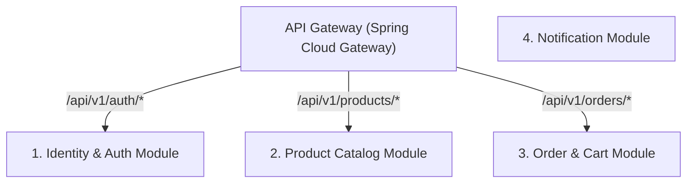

### Thành phần Công nghệ (Technology Stack)
*   **Core Backend**: Java 21, Spring Boot 3.x, Spring Security 6.x.
*   **Database**: PostgreSQL 15 (CSDL quan hệ phân chia Logical Schemas).
*   **Caching & Lock**: Redis 7, Redisson Client.
*   **Message Broker**: RabbitMQ.
*   **Observability**: ELK Stack (Elasticsearch, Logstash, Kibana), Prometheus & Grafana.
*   **CI/CD & Deployment**: Docker, GitHub Actions.

---

## 3. THIẾT KẾ CƠ SỞ DỮ LIỆU CHUẨN HÓA NHẤT QUÂN (UNIFIED POSTGRESQL DATABASE SCHEMA)

Để đảm bảo tính toàn vẹn dữ liệu ở mức cao nhất, tránh hiện tượng bất đồng nhất dữ liệu và tận dụng tối đa sức mạnh liên kết bảng của PostgreSQL, chúng tôi thiết kế một **Cơ sở dữ liệu tập trung duy nhất (`ecommerce_db`)** nhưng phân tách thành 4 **Logical Schemas** độc lập (`auth`, `catalog`, `inventory`, `orders`). Điều này giúp cô lập ranh giới dữ liệu của từng Module/Microservice nhưng vẫn cho phép thiết lập Foreign Keys vật lý.

### 3.1. Sơ đồ Quan hệ Thực thể Vật lý (Physical ERD Diagram)

```mermaid
erDiagram
    "auth.users" {
        bigint id PK
        varchar username
        varchar email
        varchar phone
        varchar password_hash
        varchar full_name
        varchar status
        timestamp created_at
    }
    "auth.roles" {
        bigint id PK
        varchar name UK
        varchar description
    }
    "auth.user_roles" {
        bigint user_id PK,FK
        bigint role_id PK,FK
    }
    "auth.user_addresses" {
        bigint id PK
        bigint user_id FK
        varchar recipient_name
        varchar recipient_phone
        varchar address_line
        varchar province_city
        boolean is_default
    }
    "catalog.categories" {
        bigint id PK
        bigint parent_id FK
        varchar name
        varchar slug UK
    }
    "catalog.brands" {
        bigint id PK
        varchar name
        varchar slug UK
    }
    "catalog.products" {
        bigint id PK
        bigint category_id FK
        bigint brand_id FK
        varchar name
        varchar slug UK
        varchar sku UK
    }
    "catalog.product_variants" {
        bigint id PK
        bigint product_id FK
        varchar sku UK
        varchar name
        decimal price
        integer version
    }
    "catalog.attributes" {
        bigint id PK
        varchar name UK
    }
    "catalog.attribute_values" {
        bigint id PK
        bigint attribute_id FK
        varchar value
    }
    "catalog.variant_attribute_mappings" {
        bigint variant_id PK,FK
        bigint attribute_value_id PK,FK
    }
    "orders.carts" {
        bigint id PK
        bigint user_id FK
        timestamp created_at
    }
    "orders.cart_items" {
        bigint id PK
        bigint cart_id FK
        bigint product_variant_id FK
        integer quantity
    }
    "orders.orders" {
        bigint id PK
        bigint user_id FK
        varchar order_code UK
        decimal total_amount
        decimal discount_amount
        decimal final_amount
        varchar status
        varchar payment_status
        timestamp created_at PK
    }
    "orders.order_items" {
        bigint id PK
        bigint order_id FK
        bigint product_variant_id FK
        decimal unit_price
        integer quantity
        timestamp order_created_at FK
    }
    "inventory.warehouses" {
        bigint id PK
        varchar name
        varchar code UK
    }
    "inventory.warehouse_stocks" {
        bigint id PK
        bigint warehouse_id FK
        bigint product_variant_id FK
        integer physical_qty
        integer reserved_qty
    }
    "inventory.inventory_transactions" {
        bigint id PK
        bigint warehouse_id FK
        bigint product_variant_id FK
        varchar type
        integer quantity
        bigint reference_id
    }
    "orders.return_requests" {
        bigint id PK
        bigint order_id FK
        bigint user_id FK
        varchar reason
        varchar status
        timestamp order_created_at FK
    }
    "orders.return_items" {
        bigint id PK
        bigint return_request_id FK
        bigint order_item_id FK
        integer quantity
    }
    "orders.payment_transactions" {
        bigint id PK
        bigint order_id FK
        varchar transaction_code UK
        varchar status
        timestamp order_created_at FK
    }

    "auth.users" ||--o{ "auth.user_roles" : "has"
    "auth.roles" ||--o{ "auth.user_roles" : "assigned"
    "auth.users" ||--o{ "auth.user_addresses" : "owns"
    "catalog.categories" ||--o{ "catalog.categories" : "parent_of"
    "catalog.categories" ||--o{ "catalog.products" : "contains"
    "catalog.brands" ||--o{ "catalog.products" : "manufactures"
    "catalog.products" ||--o{ "catalog.product_variants" : "has_variants"
    "catalog.attributes" ||--o{ "catalog.attribute_values" : "has_values"
    "catalog.product_variants" ||--o{ "catalog.variant_attribute_mappings" : "defines"
    "catalog.attribute_values" ||--o{ "catalog.variant_attribute_mappings" : "maps_to"
    "auth.users" ||--o{ "orders.carts" : "owns"
    "orders.carts" ||--o{ "orders.cart_items" : "contains"
    "catalog.product_variants" ||--o{ "orders.cart_items" : "added_to"
    "auth.users" ||--o{ "orders.orders" : "places"
    "orders.orders" ||--o{ "orders.order_items" : "contains"
    "catalog.product_variants" ||--o{ "orders.order_items" : "purchased_in"
    "inventory.warehouses" ||--o{ "inventory.warehouse_stocks" : "stores"
    "catalog.product_variants" ||--o{ "inventory.warehouse_stocks" : "stocked_as"
    "inventory.warehouses" ||--o{ "inventory.inventory_transactions" : "logs"
    "catalog.product_variants" ||--o{ "inventory.inventory_transactions" : "logs"
    "orders.orders" ||--o{ "orders.return_requests" : "initiates"
    "auth.users" ||--o{ "orders.return_requests" : "requests"
    "orders.return_requests" ||--o{ "orders.return_items" : "has_items"
    "orders.order_items" ||--o{ "orders.return_items" : "returned_from"
    "orders.orders" ||--o{ "orders.payment_transactions" : "records"
```

### 3.2. Script SQL DDL Hoàn chỉnh (PostgreSQL Dialect)

```sql
-- Khởi tạo các Logical Schemas để phân tách module dữ liệu
CREATE SCHEMA IF NOT EXISTS auth;
CREATE SCHEMA IF NOT EXISTS catalog;
CREATE SCHEMA IF NOT EXISTS inventory;
CREATE SCHEMA IF NOT EXISTS orders;

-- =========================================================================
-- 1. SCHEMA: auth (IDENTITY MODULE)
-- =========================================================================

CREATE TABLE auth.roles (
    id BIGSERIAL PRIMARY KEY,
    name VARCHAR(50) UNIQUE NOT NULL,
    description VARCHAR(255)
);

-- Loại bỏ thuộc tính UNIQUE ở cấp độ cột để tránh xung đột Soft Delete
CREATE TABLE auth.users (
    id BIGSERIAL PRIMARY KEY,
    username VARCHAR(50) NOT NULL,
    email VARCHAR(100) NOT NULL,
    phone VARCHAR(20) NOT NULL,
    password_hash VARCHAR(255) NOT NULL, -- Mã hóa BCrypt
    full_name VARCHAR(100) NOT NULL, -- PII - Cần mã hóa AES-256 ở tầng Application
    avatar_url VARCHAR(255),
    status VARCHAR(20) DEFAULT 'ACTIVE' CHECK (status IN ('ACTIVE', 'BLOCKED', 'PENDING')),
    created_at TIMESTAMP DEFAULT CURRENT_TIMESTAMP,
    updated_at TIMESTAMP DEFAULT CURRENT_TIMESTAMP,
    deleted_at TIMESTAMP
);

CREATE TABLE auth.user_roles (
    user_id BIGINT REFERENCES auth.users(id) ON DELETE CASCADE,
    role_id BIGINT REFERENCES auth.roles(id) ON DELETE CASCADE,
    PRIMARY KEY (user_id, role_id)
);

CREATE TABLE auth.user_addresses (
    id BIGSERIAL PRIMARY KEY,
    user_id BIGINT REFERENCES auth.users(id) ON DELETE CASCADE,
    recipient_name VARCHAR(100) NOT NULL,
    recipient_phone VARCHAR(20) NOT NULL, -- PII - Cần mã hóa AES-256 ở tầng Application
    address_line VARCHAR(255) NOT NULL, -- PII - Cần mã hóa AES-256 ở tầng Application
    province_city VARCHAR(100) NOT NULL,
    district VARCHAR(100) NOT NULL,
    ward VARCHAR(100) NOT NULL,
    postal_code VARCHAR(20),
    country VARCHAR(50) DEFAULT 'Vietnam',
    address_type VARCHAR(20) DEFAULT 'HOME' CHECK (address_type IN ('HOME', 'OFFICE')),
    is_default BOOLEAN DEFAULT FALSE,
    created_at TIMESTAMP DEFAULT CURRENT_TIMESTAMP,
    updated_at TIMESTAMP DEFAULT CURRENT_TIMESTAMP
);

CREATE TABLE auth.user_activity_logs (
    id BIGSERIAL PRIMARY KEY,
    user_id BIGINT REFERENCES auth.users(id) ON DELETE SET NULL,
    action VARCHAR(50) NOT NULL,
    details TEXT, -- Định dạng JSON Metadata hoạt động
    ip_address VARCHAR(45),
    user_agent VARCHAR(255),
    created_at TIMESTAMP DEFAULT CURRENT_TIMESTAMP
);

-- =========================================================================
-- 2. SCHEMA: catalog (CATALOG MODULE)
-- =========================================================================

CREATE TABLE catalog.categories (
    id BIGSERIAL PRIMARY KEY,
    parent_id BIGINT REFERENCES catalog.categories(id) ON DELETE SET NULL,
    name VARCHAR(100) NOT NULL,
    slug VARCHAR(100) UNIQUE NOT NULL,
    description TEXT,
    image_url VARCHAR(255),
    level INT DEFAULT 0,
    sort_order INT DEFAULT 0,
    is_active BOOLEAN DEFAULT TRUE,
    deleted_at TIMESTAMP
);

CREATE TABLE catalog.brands (
    id BIGSERIAL PRIMARY KEY,
    name VARCHAR(100) NOT NULL,
    slug VARCHAR(100) UNIQUE NOT NULL,
    logo_url VARCHAR(255),
    description TEXT,
    is_active BOOLEAN DEFAULT TRUE,
    deleted_at TIMESTAMP
);

CREATE TABLE catalog.products (
    id BIGSERIAL PRIMARY KEY,
    category_id BIGINT REFERENCES catalog.categories(id) ON DELETE RESTRICT,
    brand_id BIGINT REFERENCES catalog.brands(id) ON DELETE RESTRICT,
    name VARCHAR(150) NOT NULL,
    slug VARCHAR(150) UNIQUE NOT NULL,
    sku VARCHAR(50) UNIQUE NOT NULL,
    description TEXT,
    short_description TEXT,
    thumbnail_url VARCHAR(255),
    status VARCHAR(20) DEFAULT 'DRAFT' CHECK (status IN ('DRAFT', 'ACTIVE', 'ARCHIVED')),
    view_count INT DEFAULT 0,
    rating_avg DECIMAL(3, 2) DEFAULT 0.00,
    rating_count INT DEFAULT 0,
    created_at TIMESTAMP DEFAULT CURRENT_TIMESTAMP,
    updated_at TIMESTAMP DEFAULT CURRENT_TIMESTAMP,
    deleted_at TIMESTAMP
);

CREATE TABLE catalog.product_variants (
    id BIGSERIAL PRIMARY KEY,
    product_id BIGINT REFERENCES catalog.products(id) ON DELETE CASCADE,
    sku VARCHAR(50) UNIQUE NOT NULL,
    name VARCHAR(200) NOT NULL,
    price DECIMAL(15, 2) NOT NULL,
    compare_at_price DECIMAL(15, 2),
    low_stock_threshold INT DEFAULT 5,
    weight_grams INT DEFAULT 0,
    length_cm INT DEFAULT 0,
    width_cm INT DEFAULT 0,
    height_cm INT DEFAULT 0,
    status VARCHAR(20) DEFAULT 'ACTIVE' CHECK (status IN ('ACTIVE', 'OUT_OF_STOCK', 'INACTIVE')),
    version INT DEFAULT 0, -- JPA Optimistic Lock Version
    created_at TIMESTAMP DEFAULT CURRENT_TIMESTAMP,
    updated_at TIMESTAMP DEFAULT CURRENT_TIMESTAMP,
    deleted_at TIMESTAMP
);

CREATE TABLE catalog.product_images (
    id BIGSERIAL PRIMARY KEY,
    product_id BIGINT REFERENCES catalog.products(id) ON DELETE CASCADE,
    variant_id BIGINT REFERENCES catalog.product_variants(id) ON DELETE SET NULL,
    image_url VARCHAR(255) NOT NULL,
    sort_order INT DEFAULT 0,
    created_at TIMESTAMP DEFAULT CURRENT_TIMESTAMP
);

CREATE TABLE catalog.attributes (
    id BIGSERIAL PRIMARY KEY,
    name VARCHAR(50) UNIQUE NOT NULL,
    is_filterable BOOLEAN DEFAULT TRUE
);

CREATE TABLE catalog.attribute_values (
    id BIGSERIAL PRIMARY KEY,
    attribute_id BIGINT REFERENCES catalog.attributes(id) ON DELETE CASCADE,
    value VARCHAR(100) NOT NULL
);

CREATE TABLE catalog.variant_attribute_mappings (
    variant_id BIGINT REFERENCES catalog.product_variants(id) ON DELETE CASCADE,
    attribute_value_id BIGINT REFERENCES catalog.attribute_values(id) ON DELETE CASCADE,
    PRIMARY KEY (variant_id, attribute_value_id)
);

CREATE TABLE catalog.reviews (
    id BIGSERIAL PRIMARY KEY,
    product_id BIGINT REFERENCES catalog.products(id) ON DELETE CASCADE,
    variant_id BIGINT REFERENCES catalog.product_variants(id) ON DELETE SET NULL,
    user_id BIGINT REFERENCES auth.users(id) ON DELETE CASCADE,
    rating INT CHECK (rating BETWEEN 1 AND 5),
    title VARCHAR(150),
    comment TEXT,
    image_urls TEXT, -- JSON Array
    is_approved BOOLEAN DEFAULT TRUE,
    created_at TIMESTAMP DEFAULT CURRENT_TIMESTAMP,
    updated_at TIMESTAMP DEFAULT CURRENT_TIMESTAMP
);

-- =========================================================================
-- 3. SCHEMA: inventory (INVENTORY MODULE)
-- =========================================================================

CREATE TABLE inventory.warehouses (
    id BIGSERIAL PRIMARY KEY,
    name VARCHAR(100) NOT NULL,
    code VARCHAR(50) UNIQUE NOT NULL,
    address VARCHAR(255) NOT NULL,
    province_city VARCHAR(100) NOT NULL,
    is_active BOOLEAN DEFAULT TRUE,
    created_at TIMESTAMP DEFAULT CURRENT_TIMESTAMP,
    updated_at TIMESTAMP DEFAULT CURRENT_TIMESTAMP
);

CREATE TABLE inventory.warehouse_stocks (
    id BIGSERIAL PRIMARY KEY,
    warehouse_id BIGINT REFERENCES inventory.warehouses(id) ON DELETE RESTRICT,
    product_variant_id BIGINT REFERENCES catalog.product_variants(id) ON DELETE RESTRICT,
    physical_qty INT DEFAULT 0 CHECK (physical_qty >= 0),
    reserved_qty INT DEFAULT 0 CHECK (reserved_qty >= 0),
    updated_at TIMESTAMP DEFAULT CURRENT_TIMESTAMP,
    CONSTRAINT unique_warehouse_variant UNIQUE (warehouse_id, product_variant_id)
);

CREATE TABLE inventory.inventory_transactions (
    id BIGSERIAL PRIMARY KEY,
    warehouse_id BIGINT REFERENCES inventory.warehouses(id) ON DELETE RESTRICT,
    product_variant_id BIGINT REFERENCES catalog.product_variants(id) ON DELETE RESTRICT,
    type VARCHAR(20) CHECK (type IN ('STOCK_IN', 'STOCK_OUT', 'RESERVE', 'RELEASE')),
    quantity INT NOT NULL CHECK (quantity > 0),
    reference_type VARCHAR(30), -- ORDER, RMA, MANUAL
    reference_id BIGINT,
    created_at TIMESTAMP DEFAULT CURRENT_TIMESTAMP
);

-- =========================================================================
-- 4. SCHEMA: orders (CART, ORDER, PROMOTION & PAYMENT - TỐI ƯU PARTITIONING)
-- =========================================================================

CREATE TABLE orders.carts (
    id BIGSERIAL PRIMARY KEY,
    user_id BIGINT REFERENCES auth.users(id) ON DELETE CASCADE,
    session_token VARCHAR(255) UNIQUE,
    created_at TIMESTAMP DEFAULT CURRENT_TIMESTAMP,
    updated_at TIMESTAMP DEFAULT CURRENT_TIMESTAMP
);

CREATE TABLE orders.cart_items (
    id BIGSERIAL PRIMARY KEY,
    cart_id BIGINT REFERENCES orders.carts(id) ON DELETE CASCADE,
    product_variant_id BIGINT REFERENCES catalog.product_variants(id) ON DELETE CASCADE,
    quantity INT NOT NULL CHECK (quantity > 0),
    created_at TIMESTAMP DEFAULT CURRENT_TIMESTAMP,
    updated_at TIMESTAMP DEFAULT CURRENT_TIMESTAMP
);

CREATE TABLE orders.coupons (
    id BIGSERIAL PRIMARY KEY,
    code VARCHAR(50) UNIQUE NOT NULL,
    discount_type VARCHAR(20) CHECK (discount_type IN ('PERCENTAGE', 'FIXED_AMOUNT')),
    discount_value DECIMAL(15, 2) NOT NULL,
    min_order_value DECIMAL(15, 2) DEFAULT 0.00,
    max_discount_amount DECIMAL(15, 2),
    start_date TIMESTAMP NOT NULL,
    end_date TIMESTAMP NOT NULL,
    usage_limit INT DEFAULT 1,
    used_count INT DEFAULT 0,
    is_active BOOLEAN DEFAULT TRUE,
    created_at TIMESTAMP DEFAULT CURRENT_TIMESTAMP,
    -- Giải quyết triệt để lỗ hổng Double-Spend Coupon ở mức Database bằng CHECK constraint
    CONSTRAINT check_coupon_limit CHECK (used_count <= usage_limit)
);

-- Bảng Orders phân vùng (Partitioned Table) theo phạm vi thời gian (RANGE) của trường created_at
CREATE TABLE orders.orders (
    id BIGINT NOT NULL,
    user_id BIGINT REFERENCES auth.users(id) ON DELETE RESTRICT,
    order_code VARCHAR(50) NOT NULL,
    total_amount DECIMAL(15, 2) NOT NULL,
    shipping_fee DECIMAL(15, 2) NOT NULL,
    discount_amount DECIMAL(15, 2) DEFAULT 0.00,
    final_amount DECIMAL(15, 2) NOT NULL,
    status VARCHAR(50) DEFAULT 'PENDING' CHECK (status IN ('PENDING', 'CONFIRMED', 'SHIPPING', 'COMPLETED', 'CANCELLED', 'REFUNDED')),
    payment_method VARCHAR(30) NOT NULL,
    payment_status VARCHAR(30) DEFAULT 'PENDING' CHECK (payment_status IN ('PENDING', 'PAID', 'FAILED', 'REFUNDED')),
    recipient_name VARCHAR(100) NOT NULL,
    recipient_phone VARCHAR(20) NOT NULL,
    shipping_address TEXT NOT NULL,
    tracking_number VARCHAR(100),
    notes TEXT,
    created_at TIMESTAMP NOT NULL DEFAULT CURRENT_TIMESTAMP,
    updated_at TIMESTAMP DEFAULT CURRENT_TIMESTAMP,
    PRIMARY KEY (id, created_at)
) PARTITION BY RANGE (created_at);

-- Tạo chỉ mục UNIQUE phức hợp có chứa trường phân vùng để định danh đơn hàng
CREATE UNIQUE INDEX uq_orders_code ON orders.orders(order_code, created_at);

-- Bảng Order Items phân vùng theo RANGE để ăn khớp với bảng Orders
CREATE TABLE orders.order_items (
    id BIGINT NOT NULL,
    order_id BIGINT NOT NULL,
    product_variant_id BIGINT REFERENCES catalog.product_variants(id) ON DELETE RESTRICT,
    product_name VARCHAR(200) NOT NULL,
    variant_sku VARCHAR(50) NOT NULL,
    unit_price DECIMAL(15, 2) NOT NULL,
    discount_amount DECIMAL(15, 2) DEFAULT 0.00,
    quantity INT NOT NULL CHECK (quantity > 0),
    total_price DECIMAL(15, 2) NOT NULL,
    order_created_at TIMESTAMP NOT NULL,
    PRIMARY KEY (id, order_created_at),
    FOREIGN KEY (order_id, order_created_at) REFERENCES orders.orders(id, created_at) ON DELETE CASCADE
) PARTITION BY RANGE (order_created_at);

-- Bảng Lịch sử Trạng thái Đơn hàng phân vùng theo RANGE
CREATE TABLE orders.order_status_history (
    id BIGINT NOT NULL,
    order_id BIGINT NOT NULL,
    status VARCHAR(50) NOT NULL,
    changed_by VARCHAR(50) NOT NULL,
    notes TEXT,
    created_at TIMESTAMP NOT NULL DEFAULT CURRENT_TIMESTAMP,
    order_created_at TIMESTAMP NOT NULL,
    PRIMARY KEY (id, order_created_at),
    FOREIGN KEY (order_id, order_created_at) REFERENCES orders.orders(id, created_at) ON DELETE CASCADE
) PARTITION BY RANGE (order_created_at);

-- Bảng liên kết trung gian Đơn hàng - Mã giảm giá phân vùng theo RANGE
CREATE TABLE orders.order_coupons (
    order_id BIGINT NOT NULL,
    coupon_id BIGINT REFERENCES orders.coupons(id) ON DELETE CASCADE,
    order_created_at TIMESTAMP NOT NULL,
    PRIMARY KEY (order_id, coupon_id, order_created_at),
    FOREIGN KEY (order_id, order_created_at) REFERENCES orders.orders(id, created_at) ON DELETE CASCADE
) PARTITION BY RANGE (order_created_at);

CREATE TABLE orders.return_requests (
    id BIGINT NOT NULL,
    order_id BIGINT NOT NULL,
    user_id BIGINT REFERENCES auth.users(id) ON DELETE RESTRICT,
    reason TEXT NOT NULL,
    status VARCHAR(50) DEFAULT 'PENDING' CHECK (status IN ('PENDING', 'APPROVED', 'ITEM_RECEIVED', 'REFUNDED', 'REJECTED')),
    refund_amount DECIMAL(15, 2) NOT NULL,
    refund_status VARCHAR(20) DEFAULT 'PENDING',
    return_tracking_number VARCHAR(100),
    created_at TIMESTAMP NOT NULL DEFAULT CURRENT_TIMESTAMP,
    updated_at TIMESTAMP DEFAULT CURRENT_TIMESTAMP,
    order_created_at TIMESTAMP NOT NULL,
    PRIMARY KEY (id, order_created_at),
    FOREIGN KEY (order_id, order_created_at) REFERENCES orders.orders(id, created_at) ON DELETE RESTRICT
) PARTITION BY RANGE (order_created_at);

-- Bảng Chi tiết đổi trả (Không phân vùng trực tiếp nhưng tham chiếu tới bảng phân vùng)
CREATE TABLE orders.return_items (
    id BIGSERIAL PRIMARY KEY,
    return_request_id BIGINT NOT NULL,
    order_item_id BIGINT NOT NULL,
    quantity INT NOT NULL CHECK (quantity > 0),
    refund_price DECIMAL(15, 2) NOT NULL,
    condition VARCHAR(50) CHECK (condition IN ('UNOPENED', 'OPENED_GOOD', 'DAMAGED')),
    inspected_by BIGINT REFERENCES auth.users(id) ON DELETE SET NULL, -- Nhân viên thực hiện kiểm hàng (Accountability)
    inspection_notes TEXT, -- Ghi chú chi tiết kết quả giám định (Phòng chống Fraud)
    order_created_at TIMESTAMP NOT NULL,
    FOREIGN KEY (return_request_id, order_created_at) REFERENCES orders.return_requests(id, order_created_at) ON DELETE CASCADE,
    FOREIGN KEY (order_item_id, order_created_at) REFERENCES orders.order_items(id, order_created_at) ON DELETE RESTRICT
);

CREATE TABLE orders.payment_transactions (
    id BIGINT NOT NULL,
    order_id BIGINT NOT NULL,
    transaction_code VARCHAR(100) NOT NULL,
    payment_gateway VARCHAR(50) NOT NULL,
    amount DECIMAL(15, 2) NOT NULL,
    currency VARCHAR(10) DEFAULT 'VND',
    status VARCHAR(30) NOT NULL,
    raw_response TEXT,
    created_at TIMESTAMP NOT NULL DEFAULT CURRENT_TIMESTAMP,
    order_created_at TIMESTAMP NOT NULL,
    PRIMARY KEY (id, order_created_at),
    FOREIGN KEY (order_id, order_created_at) REFERENCES orders.orders(id, created_at) ON DELETE RESTRICT
) PARTITION BY RANGE (order_created_at);

-- Tạo chỉ mục UNIQUE phức hợp có chứa trường phân vùng để định danh giao dịch thanh toán
CREATE UNIQUE INDEX uq_payment_transactions_code ON orders.payment_transactions(transaction_code, order_created_at);

-- Bảng Outbox Sự kiện (Đặt ở public schema để quét sự kiện toàn hệ thống)
CREATE TABLE public.outbox_events (
    id BIGSERIAL PRIMARY KEY,
    aggregate_type VARCHAR(100) NOT NULL,
    aggregate_id VARCHAR(100) NOT NULL,
    event_type VARCHAR(100) NOT NULL,
    payload TEXT NOT NULL,
    status VARCHAR(20) DEFAULT 'PENDING' CHECK (status IN ('PENDING', 'PROCESSED', 'FAILED')),
    created_at TIMESTAMP DEFAULT CURRENT_TIMESTAMP
);

-- =========================================================================
-- 5. THIẾT LẬP PHÂN VÙNG VẬT LÝ MẪU & DEFAULT PARTITIONS (PARTITION SAFETY NET)
-- =========================================================================

-- Tạo các phân vùng vật lý thực tế cho bảng Orders và các bảng liên quan cho nửa đầu năm 2026
CREATE TABLE orders.orders_2026_h1 PARTITION OF orders.orders
    FOR VALUES FROM ('2026-01-01 00:00:00') TO ('2026-07-01 00:00:00');

CREATE TABLE orders.order_items_2026_h1 PARTITION OF orders.order_items
    FOR VALUES FROM ('2026-01-01 00:00:00') TO ('2026-07-01 00:00:00');

CREATE TABLE orders.order_status_history_2026_h1 PARTITION OF orders.order_status_history
    FOR VALUES FROM ('2026-01-01 00:00:00') TO ('2026-07-01 00:00:00');

CREATE TABLE orders.order_coupons_2026_h1 PARTITION OF orders.order_coupons
    FOR VALUES FROM ('2026-01-01 00:00:00') TO ('2026-07-01 00:00:00');

CREATE TABLE orders.return_requests_2026_h1 PARTITION OF orders.return_requests
    FOR VALUES FROM ('2026-01-01 00:00:00') TO ('2026-07-01 00:00:00');

CREATE TABLE orders.payment_transactions_2026_h1 PARTITION OF orders.payment_transactions
    FOR VALUES FROM ('2026-01-01 00:00:00') TO ('2026-07-01 00:00:00');

-- 🛑 LỖ HỔNG VÁ: Tạo Default Partitions làm "lưới đỡ an toàn" (Safety Net) để chặn đứng lỗi Crash ghi dữ liệu 
-- khi quá thời gian phân vùng mà hệ thống chưa kịp tạo phân vùng mới.
CREATE TABLE orders.orders_default PARTITION OF orders.orders DEFAULT;
CREATE TABLE orders.order_items_default PARTITION OF orders.order_items DEFAULT;
CREATE TABLE orders.order_status_history_default PARTITION OF orders.order_status_history DEFAULT;
CREATE TABLE orders.order_coupons_default PARTITION OF orders.order_coupons DEFAULT;
CREATE TABLE orders.return_requests_default PARTITION OF orders.return_requests DEFAULT;
CREATE TABLE orders.payment_transactions_default PARTITION OF orders.payment_transactions DEFAULT;

-- =========================================================================
-- 6. THIẾT LẬP CHỈ MỤC TỐI ƯU TRUY VẤN & XỬ LÝ LỖI SOFT DELETE UNIQUE
-- =========================================================================

-- Giải quyết triệt để lỗi Unique Constraint Clash của Soft Delete bằng Partial Unique Index
CREATE UNIQUE INDEX uq_users_username ON auth.users(username) WHERE deleted_at IS NULL;
CREATE UNIQUE INDEX uq_users_email ON auth.users(email) WHERE deleted_at IS NULL;
CREATE UNIQUE INDEX uq_users_phone ON auth.users(phone) WHERE deleted_at IS NULL;

-- 🛑 LỖ HỔNG VÁ: Thiết lập chiến lược Partial Indexing (WHERE deleted_at IS NULL) cho tất cả chỉ mục tìm kiếm thông thường.
-- Ngăn ngừa index phình to (Index Bloat) do lưu các bản ghi đã xóa, tăng tốc độ quét index.
CREATE INDEX idx_user_addresses_user ON auth.user_addresses(user_id);
CREATE INDEX idx_activity_logs_user_action ON auth.user_activity_logs(user_id, action);
CREATE INDEX idx_products_category ON catalog.products(category_id) WHERE deleted_at IS NULL;
CREATE INDEX idx_products_brand ON catalog.products(brand_id) WHERE deleted_at IS NULL;
CREATE INDEX idx_variants_product ON catalog.product_variants(product_id) WHERE deleted_at IS NULL;
CREATE INDEX idx_variant_mappings_value ON catalog.variant_attribute_mappings(attribute_value_id);
CREATE INDEX idx_outbox_status ON public.outbox_events(status, created_at);
CREATE INDEX idx_warehouse_stocks_variant ON inventory.warehouse_stocks(product_variant_id);

-- =========================================================================
-- 7. THIẾT LẬP PHÂN QUYỀN TRUY CẬP CSDL (DATABASE USER ROLE PERMISSIONS - LEAST PRIVILEGE)
-- =========================================================================

-- Tạo các User đại diện cho từng Microservice
-- CREATE USER auth_user WITH PASSWORD 'SecurePassAuth123';
-- CREATE USER catalog_user WITH PASSWORD 'SecurePassCatalog123';
-- CREATE USER order_user WITH PASSWORD 'SecurePassOrder123';

-- Phân quyền cho Auth Service (Chỉ có quyền trên schema auth và outbox)
REVOKE ALL ON DATABASE ecommerce_db FROM auth_user;
GRANT USAGE ON SCHEMA auth TO auth_user;
GRANT SELECT, INSERT, UPDATE, DELETE ON ALL TABLES IN SCHEMA auth TO auth_user;
GRANT USAGE, SELECT ON ALL SEQUENCES IN SCHEMA auth TO auth_user;
GRANT USAGE ON SCHEMA public TO auth_user;
GRANT INSERT ON TABLE public.outbox_events TO auth_user;

-- Phân quyền cho Catalog Service (Chỉ có quyền trên schema catalog và outbox)
REVOKE ALL ON DATABASE ecommerce_db FROM catalog_user;
GRANT USAGE ON SCHEMA catalog TO catalog_user;
GRANT SELECT, INSERT, UPDATE, DELETE ON ALL TABLES IN SCHEMA catalog TO catalog_user;
GRANT USAGE, SELECT ON ALL SEQUENCES IN SCHEMA catalog TO catalog_user;
GRANT USAGE ON SCHEMA public TO catalog_user;
GRANT INSERT ON TABLE public.outbox_events TO catalog_user;

-- Phân quyền cho Order Service (Được thao tác orders, inventory, và đọc catalog/auth để validate)
REVOKE ALL ON DATABASE ecommerce_db FROM order_user;
GRANT USAGE ON SCHEMA orders TO order_user;
GRANT SELECT, INSERT, UPDATE, DELETE ON ALL TABLES IN SCHEMA orders TO order_user;
GRANT USAGE, SELECT ON ALL SEQUENCES IN SCHEMA orders TO order_user;

GRANT USAGE ON SCHEMA inventory TO order_user;
GRANT SELECT, INSERT, UPDATE, DELETE ON ALL TABLES IN SCHEMA inventory TO order_user;
GRANT USAGE, SELECT ON ALL SEQUENCES IN SCHEMA inventory TO order_user;

GRANT USAGE ON SCHEMA catalog TO order_user;
GRANT SELECT ON ALL TABLES IN SCHEMA catalog TO order_user; -- Chỉ cho phép SELECT catalog để check giá/biến thể

GRANT USAGE ON SCHEMA auth TO order_user;
GRANT SELECT ON TABLE auth.users TO order_user; -- Chỉ cho phép SELECT users để check tồn tại/vai trò

GRANT USAGE ON SCHEMA public TO order_user;
GRANT INSERT ON TABLE public.outbox_events TO order_user;
```

> [!NOTE]
> Cột tồn kho `stock_quantity` trong bảng `catalog.product_variants` đã được loại bỏ để tránh tình trạng trôi lệch dữ liệu (Data Drift). Trong thiết kế này, **`inventory.warehouse_stocks`** là nguồn sự thật duy nhất (Single Source of Truth) cho tồn kho. Số lượng sản phẩm khả dụng bán sẽ bằng: `physical_qty` (Tồn thực tế) trừ `reserved_qty` (Số lượng giữ hàng chờ thanh toán).

---

## 4. HỆ THỐNG DỮ LIỆU MINH HỌA (DATABASE VISUALIZATION DATA)

Dưới đây là bảng mẫu mô phỏng dữ liệu (Mock Data Tables) đang được lưu trữ trong hệ thống:

### 4.1. Tầng Xác thực & Người dùng

**Table: `auth.users`**
| id | username | email | phone | password_hash (BCrypt) | status | created_at |
| :--- | :--- | :--- | :--- | :--- | :--- | :--- |
| `1001` | `hoangnam` | `nam@gmail.com` | `0987654321` | `$2a$12$L8qgB...` | `ACTIVE` | `2026-07-06 08:00:00` |
| `1002` | `minhthanh` | `thanh@gmail.com` | `0912345678` | `$2a$12$K1haB...` | `ACTIVE` | `2026-07-06 09:15:30` |

**Table: `auth.user_addresses`**
| id | user_id (FK) | recipient_name | recipient_phone | address_line | province_city | is_default |
| :--- | :--- | :--- | :--- | :--- | :--- | :--- |
| `501` | `1001` | `Nguyễn Hoàng Nam` | `0987654321` | `Số 12 Ngõ 34 Cầu Giấy` | `Hà Nội` | `true` |
| `502` | `1002` | `Trần Minh Thành` | `0912345678` | `88/9 Nguyễn Trãi, Q.5` | `TP Hồ Chí Minh` | `true` |

---

### 4.2. Tầng Danh mục & Sản phẩm

**Table: `catalog.categories`**
| id | parent_id | name | slug | level | sort_order | is_active |
| :--- | :--- | :--- | :--- | :--- | :--- | :--- |
| `10` | `null` | `Thiết Bị Điện Tử` | `thiet-bi-dien-tu` | `0` | `1` | `true` |
| `11` | `10` | `Điện Thoại Di Động` | `dien-thoai-di-dong` | `1` | `1` | `true` |

**Table: `catalog.products`**
| id | category_id (FK) | name | slug | sku | status | rating_avg | rating_count |
| :--- | :--- | :--- | :--- | :--- | :--- | :--- | :--- |
| `2001` | `11` | `iPhone 15 Pro` | `iphone-15-pro` | `IP15P-BASE` | `ACTIVE` | `4.85` | `120` |

**Table: `catalog.product_variants`**
| id | product_id (FK) | sku | name | price | version (Optimistic Lock) |
| :--- | :--- | :--- | :--- | :--- | :--- |
| `9001` | `2001` | `IP15P-BLK-128` | `iPhone 15 Pro - Black - 128GB` | `28000000.00` | `2` |
| `9002` | `2001` | `IP15P-GLD-256` | `iPhone 15 Pro - Gold - 256GB` | `32000000.00` | `5` |

**Table: `catalog.variant_attribute_mappings`**
| variant_id (FK) | attribute_value_id (FK) | (Mô tả mapping thuộc tính) |
| :--- | :--- | :--- |
| `9001` | `50` | Mapping sang Attribute màu sắc: Black |
| `9001` | `52` | Mapping sang Attribute dung lượng: 128GB |
| `9002` | `51` | Mapping sang Attribute màu sắc: Gold |
| `9002` | `53` | Mapping sang Attribute dung lượng: 256GB |

---

### 4.3. Tầng Giỏ hàng & Kho hàng

**Table: `carts`**
| id | user_id (FK) | session_token | created_at |
| :--- | :--- | :--- | :--- |
| `8001` | `1001` | `sess-uuid-889911` | `2026-07-06 10:00:00` |

**Table: `cart_items`**
| id | cart_id (FK) | product_variant_id (FK) | quantity | created_at |
| :--- | :--- | :--- | :--- | :--- |
| `9501` | `8001` | `9001` | `1` | `2026-07-06 10:05:00` |

**Table: `warehouse_stocks`**
| id | warehouse_id (FK) | product_variant_id (FK) | physical_qty | reserved_qty | updated_at |
| :--- | :--- | :--- | :--- | :--- | :--- |
| `801` | `1` (Hà Nội WH) | `9001` | `50` | `5` | `2026-07-06 23:10:00` |
| `802` | `2` (Hồ Chí Minh WH) | `9001` | `30` | `0` | `2026-07-06 23:05:00` |

---

### 4.4. Tầng Đơn hàng & Lịch sử

**Table: `orders`**
| id | user_id (FK) | order_code | total_amount | discount_amount | final_amount | status | payment_status | created_at |
| :--- | :--- | :--- | :--- | :--- | :--- | :--- | :--- | :--- |
| `30001` | `1001` | `ORD-20260706-99A` | `28000000.00` | `1000000.00` | `27000000.00` | `CONFIRMED` | `PAID` | `2026-07-06 23:10:00` |

**Table: `order_items`**
| id | order_id (FK) | product_variant_id (FK) | product_name | variant_sku | unit_price | discount_amount | quantity | total_price | order_created_at |
| :--- | :--- | :--- | :--- | :--- | :--- | :--- | :--- | :--- | :--- |
| `45001` | `30001` | `9001` | `iPhone 15 Pro - Black - 128GB` | `IP15P-BLK-128` | `28000000.00` | `1000000.00` | `1` | `27000000.00` | `2026-07-06 23:10:00` |

---

## 5. THIẾT KẾ SƠ ĐỒ LUỒNG SỰ KIỆN CHI TIẾT TỪNG CHỨC NĂNG (SEQUENCE DIAGRAMS)

Nhằm đảm bảo quá trình phát triển không xảy ra sai lệch về tích hợp hệ thống, dưới đây là sơ đồ tương tác sự kiện cho **tất cả** các nghiệp vụ chính từ tổng quan đến chi tiết các nhánh nhỏ.

### Luồng 1: Đăng ký & Đăng nhập (JWT & Refresh Token Flow với RTR)

Để tăng cường bảo mật cho cơ chế stateless JWT, hệ thống áp dụng kỹ thuật **Refresh Token Rotation (RTR - Quay vòng Refresh Token)**. Mỗi khi client yêu cầu cấp mới Access Token, Refresh Token cũ sẽ bị vô hiệu hóa ngay lập tức và một Refresh Token mới sẽ được tạo ra.

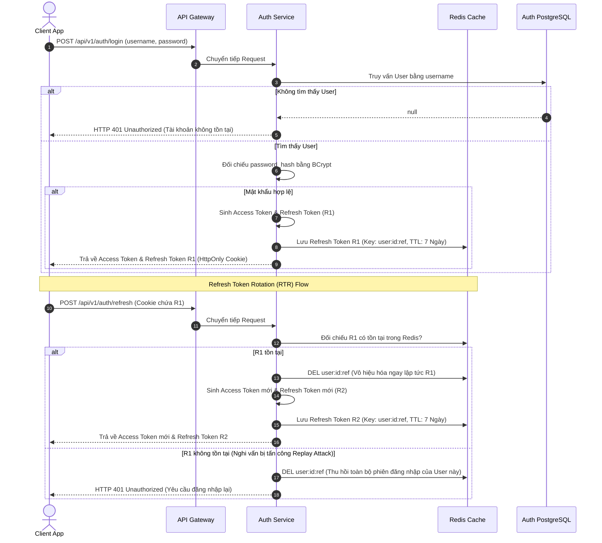

---

### Luồng 2: Lấy cây danh mục phân cấp (Recursive Category Tree)

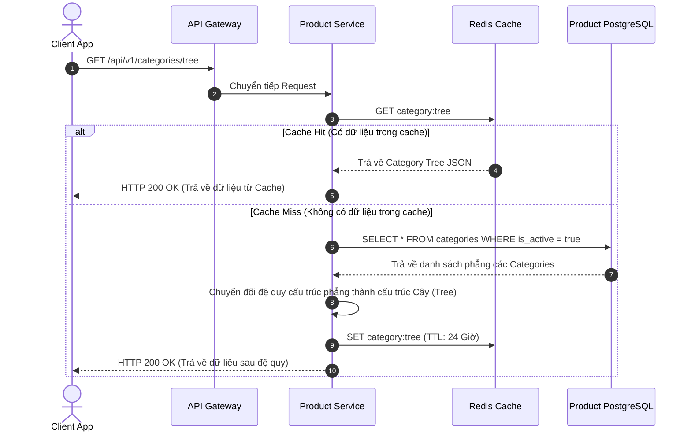

---

### Luồng 3: Tìm kiếm Lọc sản phẩm động & Đồng bộ Elasticsearch

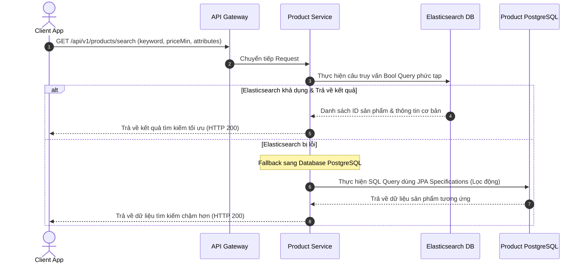

---

### Luồng 4: Thao tác Giỏ hàng (Redis Hash Cart Management)

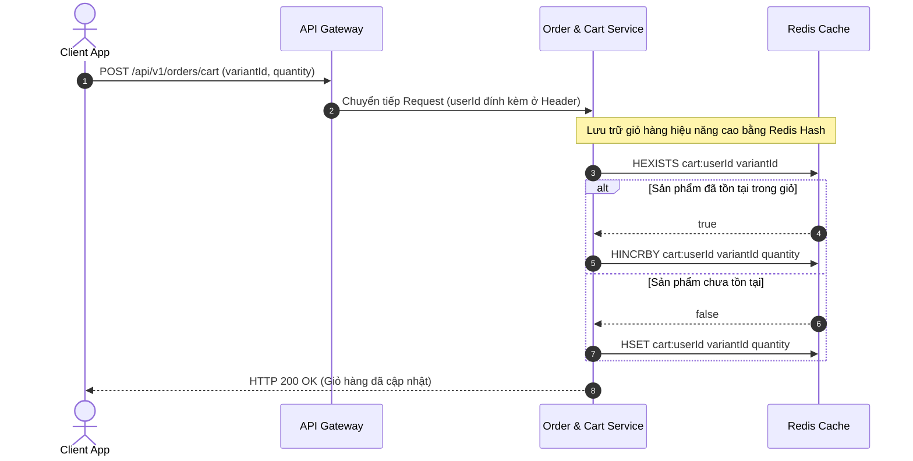

---

### Luồng 5: Checkout Giữ chỗ kho hàng phân tán (Redisson Locks & Redis Pre-deduction)

Để tránh hiện tượng tranh chấp ghi (write lock) quá lớn lên PostgreSQL Database khi có hàng nghìn lượt mua cùng lúc cho các mặt hàng cực hot (Flash Sale), hệ thống áp dụng kỹ thuật **Redis Stock Pre-deduction** (Trừ kho trước trên Redis) trước khi thực hiện giữ chỗ trong DB:

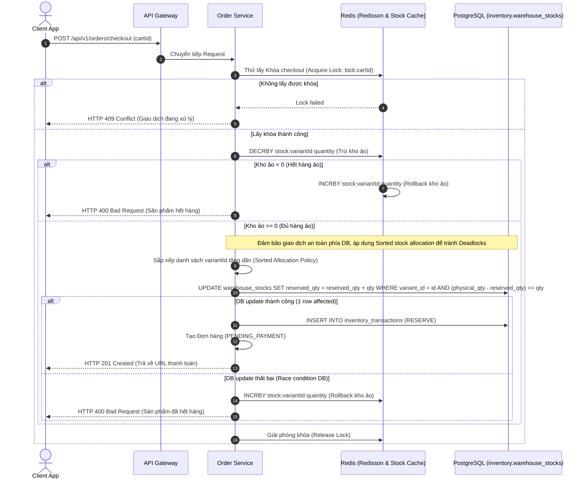

---

### Luồng 6: Webhook Cập nhật Thanh toán & Hoàn tất Đơn hàng

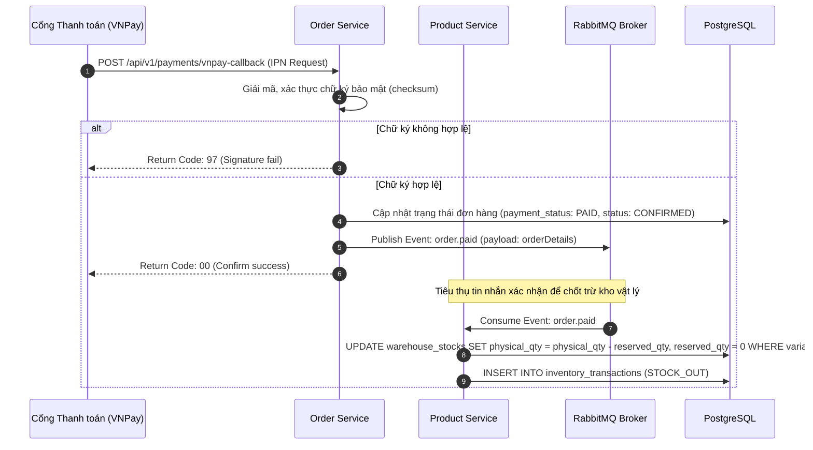

---

### Luồng 7: Saga Pattern - Compensating Transaction (Giao dịch Bù khi Hủy thanh toán)

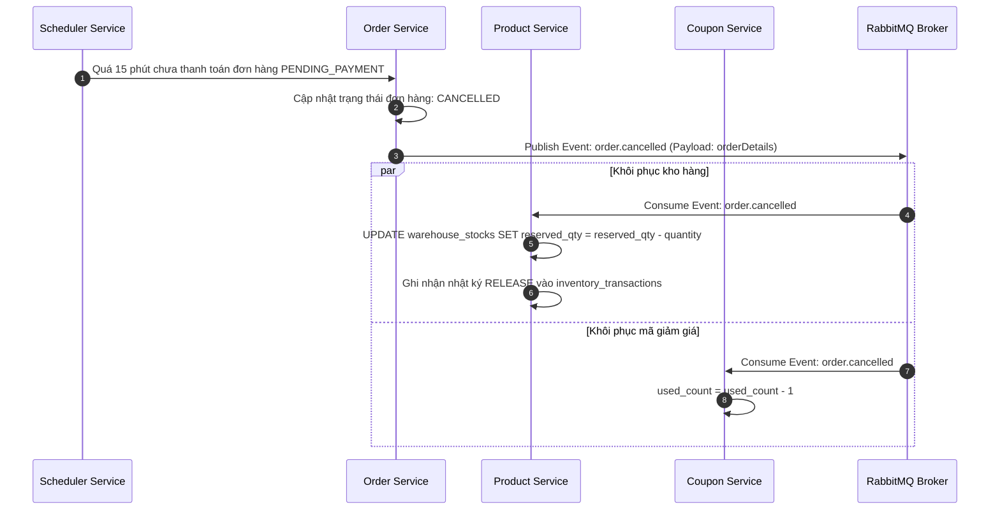

---

### Luồng 8: Yêu cầu đổi trả hàng (RMA Return/Refund Flow)

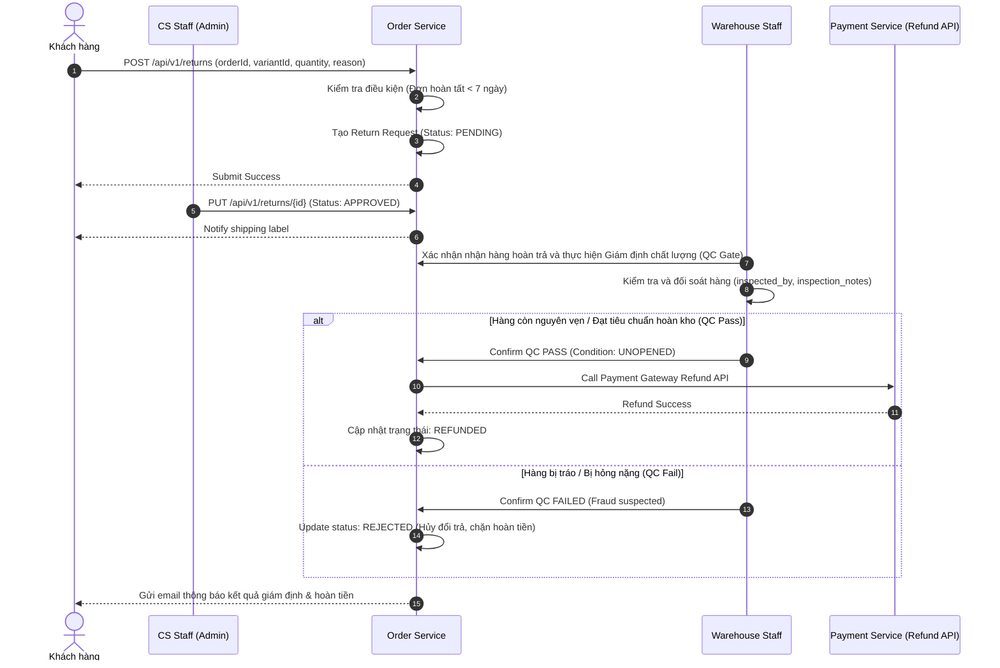

---

### Luồng 9: Transactional Outbox Pattern & Debezium CDC

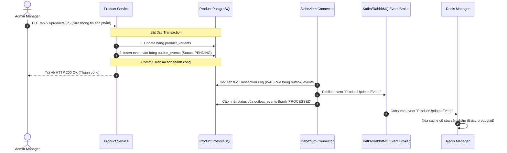

---

## 6. THIẾT KẾ CẢNH BÁO, GIÁM SÁT & LOGGING (OBSERVABILITY & MONITORING)

### A. Mô hình Logging với ELK Stack:
1.  **JSON Structured Logging**: Toàn bộ log của Spring Boot được cấu hình ghi dưới dạng JSON (sử dụng thư viện `logstash-logback-encoder`).
2.  **Trace ID & Correlation ID**: 
    *   API Gateway tự động sinh `Correlation-ID` (UUID) đính kèm vào HTTP Header và truyền qua các service khác bằng Spring Cloud OpenFeign.
    *   Toàn bộ log sinh ra ở các service khác nhau liên quan đến request này sẽ có chung `traceId`, giúp debug trên Kibana bằng cách filter `traceId = xxxxx`.
3.  **PII Log Masking (Bảo mật thông tin logs)**:
    *   Cấu hình một `PatternLayout` custom trong file `logback-spring.xml` của tất cả các services.
    *   Sử dụng regex định vị các trường nhạy cảm trong Payload request/response (`password`, `token`, `recipient_phone`, `address_line`) và thay thế các giá trị này bằng ký tự ẩn danh `******` trước khi ghi file hoặc truyền đi Logstash, tránh rò rỉ PII lên ELK.

### B. Mô hình Metrics & Monitoring (Prometheus & Grafana):
*   Từng service tích hợp `spring-boot-starter-actuator` và `micrometer-registry-prometheus` để phơi endpoint `/actuator/prometheus`.
*   Prometheus cào (scrape) định kỳ và Grafana trực quan hóa chỉ số (JVM RAM, Hikari Connection Pool, API Latency p95/p99).

---

## 7. CHIẾN LƯỢC TỐI ƯU HỆ THỐNG BẰNG REDIS CACHE

1.  **Cache dữ liệu tra cứu sản phẩm**: Cache-Aside Pattern với TTL 1 giờ. Evict cache tự động qua sự kiện Outbox cập nhật sản phẩm.
    *   * CDC Out-of-Order Prevention*: Nhằm tránh việc xử lý lệch thứ tự WAL log (ví dụ event update sản phẩm v1 ghi đè lên v2 do bất đồng bộ mạng), mỗi outbox event đều chứa một thuộc tính phiên bản sản phẩm `version` làm **Logical Clock**. Consumer sẽ từ chối update cache/index nếu nhận được message có version nhỏ hơn hoặc bằng version hiện tại trong cache/ES.
2.  **Rate Limiting**: Thuật toán Token Bucket tích hợp trong API Gateway và Redis để chặn spam IP (Target: max 10 req/s/IP).
3.  **Distributed Lock & Idempotent API**:
    *   Sử dụng thư viện **Redisson** khóa theo Cart ID khi thực hiện thanh toán để chống race condition.
    *   **Idempotency Key Flow**: Sử dụng header `X-Idempotency-Key` gửi từ client. Service kiểm tra tính tồn tại của key trong Redis bằng `SETNX` (TTL: 24h). Nếu key đã tồn tại, từ chối xử lý và trả về phản hồi giao dịch cũ, loại bỏ nguy cơ submit trùng lặp.

---

## 8. KỊCH BẢN KIỂM THỬ TẢI & ĐÁNH GIÁ HIỆU NĂNG (LOAD TESTING PLAN)

| Kịch bản | CCU (Concurrent Users) | Hành vi giả lập | API Mục tiêu | Kết quả mong đợi |
| :--- | :--- | :--- | :--- | :--- |
| **Scenario 1**: Browse & Search | 100 -> 300 Users | Khách tìm kiếm từ khóa, xem chi tiết sản phẩm. | `GET /api/v1/products/search` | Throughput > 1500 req/s, Response Time (p95) < 50ms |
| **Scenario 2**: Heavy Checkout | 50 -> 100 Users | Khách thực hiện đặt hàng đồng thời. | `POST /api/v1/orders/checkout` | 0% Error Rate, Tránh overselling tồn kho. |

---

## 9. LỘ TRÌNH TRIỂN KHAI VÀ PHÂN CHIA 20 TASK LỚN CHI TIẾT (PROJECT WBS MAP)

Hệ thống được tổ chức triển khai cụ thể thông qua **20 Task Lớn** độc lập dưới đây. Mỗi Task lớn được chia nhỏ thành các tiểu mục công việc chi tiết cùng công nghệ áp dụng và kết quả bàn giao rõ ràng:

### **[TASK 1] Cấu hình Dự án Multi-Module Gradle & Thư viện dùng chung (`common-library`)**
*   **Chi tiết công việc**:
    1. Khởi tạo root project, cấu hình file `settings.gradle` khai báo cấu trúc multi-module gồm: `gateway-service`, `auth-service`, `product-service`, `order-service`, `notification-service`, `common-library`.
    2. Viết cấu hình `build.gradle` gốc sử dụng Spring Boot 3.3.x, Spring Cloud 2023.0.x, Java 21, Gradle Kotlin DSL, khai báo dependency management dùng chung.
    3. Thiết lập module `common-library` chứa các DTO dùng chung, Exception Handlers toàn cục, các Utility classes (DateTime, JWT parsing).
    4. Cấu hình Git Repository, xây dựng quy tắc tạo nhánh (`main`, `develop`), viết file `.gitignore` để loại bỏ các file tạm của IDE/Compiler.
*   **Công nghệ**: Java 21, Spring Boot 3.x, Gradle.
*   **Đầu ra bàn giao**: Project template chạy được lệnh `gradle clean build` từ root project không phát sinh lỗi.

### **[TASK 2] Thiết lập Cơ sở hạ tầng Container hóa (Docker Compose & Virtual Network)**
*   **Chi tiết công việc**:
    1. Viết file `docker-compose.yml` khởi tạo cụm PostgreSQL 15, phân vùng dữ liệu qua volumes, chia cổng logic.
    2. Cấu hình container Redis Cache Alpine, bật mật khẩu bảo mật và kích hoạt cơ chế Append Only File (AOF).
    3. Khởi động container RabbitMQ Cluster có bật sẵn giao diện quản trị Management Plugin.
    4. Khởi động cụm Elasticsearch và Kibana đáp ứng việc lưu trữ logs và tìm kiếm dữ liệu.
    5. Tạo mạng ảo Docker Network (`ecommerce-net`) kết nối tất cả các container hạ tầng.
    6. Viết shell script `infra-up.sh` tự động hóa việc khởi chạy cơ sở hạ tầng chỉ bằng một click chuột.
*   **Công nghệ**: Docker, Docker Compose, PostgreSQL 15, Redis 7, RabbitMQ, ELK.
*   **Đầu ra bàn giao**: Thư mục `/docker` chứa file `docker-compose.yml` và script chạy kiểm tra trạng thái container thành công.

### **[TASK 3] Thiết kế & Triển khai di cư CSDL Tự động với Flyway (Flyway Migration Setup)**
*   **Chi tiết công việc**:
    1. Tích hợp Flyway Core vào các module `auth-service`, `product-service`, `order-service`.
    2. Viết SQL di cư `V1__init_auth_tables.sql` để khởi tạo database `ecommerce_auth` (users, roles, addresses).
    3. Viết SQL di cư `V1__init_product_tables.sql` để khởi tạo database `ecommerce_product` (categories, brands, products, variants, attributes).
    4. Viết SQL di cư `V1__init_order_tables.sql` để khởi tạo database `ecommerce_order` (carts, orders, inventory, returns, payments).
    5. Viết script SQL `V2__seed_database.sql` để nạp dữ liệu danh mục phân cấp, nhãn hiệu mẫu, sản phẩm có nhiều biến thể và các vai trò bảo mật mặc định.
*   **Công nghệ**: Flyway Migration, SQL, JPA.
*   **Đầu ra bàn giao**: Các folder `src/main/resources/db/migration` chứa đầy đủ file SQL, tự động chạy migration khi khởi động các Spring Boot Service.

### **[TASK 4] Phát triển Hệ thống Xác thực Spring Security & Cấp phát JWT (Authentication Core)**
*   **Chi tiết công việc**:
    1. Tạo thực thể JPA mapping bảng `users`, `roles`, `user_roles` sử dụng Hibernate trong `auth-service`.
    2. Cấu hình Spring Security 6.x tắt CSRF, thiết lập Session là Stateless, cấu hình AuthenticationManager.
    3. Phát triển class `JwtTokenProvider` mã hóa thông tin người dùng (id, username, roles) thành chuỗi Access Token ký thuật toán HS512.
    4. Phát triển API `/api/v1/auth/register` tự động mã hóa mật khẩu thông qua BCryptPasswordEncoder và lưu trữ thông tin User.
    5. Phát triển API `/api/v1/auth/login` kiểm định thông tin đăng nhập, sinh Access Token và Refresh Token.
*   **Công nghệ**: Spring Security 6.x, Java JWT (jjwt), BCrypt.
*   **Đầu ra bàn giao**: API Register và Login hoạt động, trả về mã trạng thái HTTP 200/201 kèm chuỗi Token mã hóa.

### **[TASK 5] Xây dựng Quản lý Phiên Đăng nhập & Thu hồi Token trên Redis (Session Management)**
*   **Chi tiết công việc**:
    1. Tích hợp Spring Data Redis vào `auth-service`, cấu hình RedisTemplate kết nối đến cụm Redis hạ tầng.
    2. Ghi nhận Refresh Token của từng user lên Redis với Key format `user:{userId}:refresh_token` và TTL là 7 ngày khi đăng nhập thành công.
    3. Phát triển API `/api/v1/auth/refresh` đọc Refresh Token trong Cookie, đối soát tính tồn tại trên Redis để cấp lại Access Token mới.
    4. Phát triển API `/api/v1/auth/logout` xóa Refresh Token tương ứng trên Redis, đồng thời ghi Access Token cũ vào blacklist Redis (Key: `blacklist:{token}`, TTL bằng hạn sinh mệnh còn lại của token).
*   **Công nghệ**: Spring Data Redis, Redis.
*   **Đầu ra bàn giao**: Cơ chế lưu/hủy refresh token hoạt động tốt, chặn đứng các Access Token bị log out trước thời hạn.

### **[TASK 6] Cấu hình Spring Cloud Gateway & Dynamic Routing (API Gateway Core)**
*   **Chi tiết công việc**:
    1. Tạo module `gateway-service` tích hợp các routes tĩnh dẫn tới các service nội bộ: `auth-service`, `product-service`, `order-service`.
    2. Phát triển custom `AuthenticationFilter` kế thừa từ Gateway Global Filter. Filter này có nhiệm vụ chặn đứng request, đọc JWT token ở Header, giải mã chữ ký bảo mật.
    3. Trích xuất thông tin `userId` và danh sách `roles` từ JWT payload, gán ngược vào Header `X-User-Id` và `X-User-Roles` trước khi route request xuống service con.
    4. Cấu hình xử lý tập trung khi gateway không kết nối được dịch vụ (Gateway Timeout) và trả về cấu trúc lỗi JSON đồng nhất.
*   **Công nghệ**: Spring Cloud Gateway, Reactive Streams.
*   **Đầu ra bàn giao**: Gateway chuyển tuyến API trơn tru, đính kèm thông tin user được giải mã vào request nội bộ.

### **[TASK 7] Tích hợp Redis Token Bucket Rate Limiting tại Gateway (Rate Limiting)**
*   **Chi tiết công việc**:
    1. Bật tính năng RequestRateLimiter có sẵn trong Spring Cloud Gateway kết hợp Redis.
    2. Viết class `KeyResolver` cấu hình định danh phân loại người dùng (giới hạn theo IP của Client hoặc theo Token người dùng đăng nhập).
    3. Cấu hình chỉ số Rate Limiter trong `application.yml` của gateway: `replenishRate: 10` (tốc độ nạp 10 token/giây) và `burstCapacity: 20` (dung lượng chứa tối đa 20 token).
    4. Viết unit test giả lập gửi 30 request/giây để xác nhận gateway trả về mã lỗi HTTP 429 Too Many Requests khi vượt ngưỡng.
*   **Công nghệ**: Redis Rate Limiter, Spring Cloud Gateway.
*   **Đầu ra bàn giao**: Cơ chế rate limit hoạt động, trả về HTTP 429 khi spam request liên tiếp.

### **[TASK 8] Phát triển Danh mục phân cấp dạng cây (Recursive Hierarchy Category API)**
*   **Chi tiết công việc**:
    1. Tạo project `product-service`, map thực thể JPA `Category` có liên kết self-reference `parent_id`.
    2. Viết JPA Repository truy vấn toàn bộ danh sách danh mục đang kích hoạt (`is_active = true`).
    3. Phát triển thuật toán đệ quy trong Category Service chuyển đổi danh sách phẳng nhận được từ CSDL thành cấu trúc phân cấp dạng Cây (Hierarchical Tree) gồm nhiều nút con.
    4. Phát triển API `/api/v1/categories/tree` trả về cấu trúc JSON cây hoàn chỉnh.
*   **Công nghệ**: Spring Data JPA, Java Streams, Recursive Algorithm.
*   **Đầu ra bàn giao**: API Category Tree trả về cấu trúc JSON đa cấp chuẩn (Root -> Sub Category -> Leaf Category).

### **[TASK 9] Phát triển CRUD Sản phẩm & Dynamic Attribute Mapping (Product Management)**
*   **Chi tiết công việc**:
    1. Map thực thể JPA cho các bảng: `products`, `product_variants`, `attributes`, `attribute_values`, `variant_attribute_mappings`.
    2. Phát triển API dành cho Admin thêm mới sản phẩm và định nghĩa động các biến thể đi kèm (ví dụ: iPhone 15 có biến thể Gold-128GB, Black-256GB).
    3. Phát triển cơ chế mapping thuộc tính động: lưu trữ chính xác thông tin biến thể tương ứng với những giá trị thuộc tính nào để phục vụ việc hiển thị ở giao diện.
    4. Phát triển API xem chi tiết biến thể sản phẩm theo ID tại `/api/v1/variants/{id}`.
*   **Công nghệ**: Spring Data JPA, Dynamic Attribute Architecture.
*   **Đầu ra bàn giao**: Bộ API CRUD sản phẩm hoạt động, lưu trữ đúng thông tin biến thể vào cơ sở dữ liệu PostgreSQL.

### **[TASK 10] Tích hợp Redis Cache-Aside & Eviction Strategy cho Product Detail (Caching)**
*   **Chi tiết công việc**:
    1. Cấu hình Redis Cache Manager trong `product-service` định nghĩa cấu trúc cache serializer dạng JSON.
    2. Áp dụng annotation `@Cacheable` cho API xem chi tiết sản phẩm (`GET /api/v1/products/{id}`) với key format `product:detail:{id}` và TTL là 1 giờ.
    3. Áp dụng cơ chế **Cache-Aside**: Nếu cache hit thì trả về luôn dữ liệu từ Redis; nếu cache miss thì truy vấn PostgreSQL rồi nạp lại vào Redis.
    4. Cấu hình cơ chế giải phóng cache tự động (Cache Eviction) bằng `@CacheEvict` khi admin cập nhật thông tin sản phẩm, tránh lỗi dữ liệu bị bất nhất (Stale Data).
*   **Công nghệ**: Spring Cache Redis, Redis.
*   **Đầu ra bàn giao**: Tốc độ phản hồi API chi tiết sản phẩm giảm xuống dưới 10ms khi cache hit.

### **[TASK 11] Xây dựng Search Engine nâng cao với Elasticsearch & Spring Data (Search Engine)**
*   **Chi tiết công việc**:
    1. Tích hợp thư viện Spring Data Elasticsearch vào dự án `product-service`.
    2. Khai báo Document mapping cấu trúc sản phẩm đồng bộ trên Elasticsearch index (`products_index`).
    3. Xây dựng class `ElasticsearchQueryBuilder` hỗ trợ tìm kiếm mờ (Fuzzy Search) theo tên, mô tả sản phẩm và lọc chính xác theo khoảng giá, danh mục.
    4. Phát triển API `/api/v1/products/search` thực hiện tìm kiếm qua Elasticsearch.
    5. Cấu hình cơ chế Fallback sử dụng Spring Data JPA Specification truy vấn trực tiếp DB nếu kết nối Elasticsearch bị gián đoạn (Fault Tolerance).
*   **Công nghệ**: Elasticsearch 8.x, Spring Data Elasticsearch.
*   **Đầu ra bàn giao**: API Search tìm kiếm từ khóa không dấu hoặc sai ký tự vẫn trả về kết quả chính xác.

### **[TASK 12] Xây dựng Giỏ hàng hiệu năng cao trên Redis Hash (Redis Cart Service)**
*   **Chi tiết công việc**:
    1. Tạo module `order-service` liên kết thư viện Spring Data Redis.
    2. Thiết kế cấu trúc lưu trữ giỏ hàng: Lưu mỗi giỏ hàng của user dưới một Redis Hash có Key là `cart:{userId}`, trong đó Fields là `variantId` và Values là số lượng `quantity`.
    3. Phát triển API `/api/v1/orders/cart/add` thêm sản phẩm vào giỏ (sử dụng lệnh `HINCRBY` tăng số lượng nếu đã tồn tại).
    4. Phát triển API `/api/v1/orders/cart/get` đọc toàn bộ giỏ hàng, liên kết thông tin chi tiết biến thể qua Feign Client gọi sang Product Service.
    5. Phát triển API xóa sản phẩm khỏi giỏ hàng sử dụng lệnh `HDEL`.
*   **Công nghệ**: Spring Data Redis, Redis Hash.
*   **Đầu ra bàn giao**: Tốc độ tương tác thêm/sửa/xóa giỏ hàng đạt latency < 5ms nhờ lưu trữ trực tiếp trên RAM.

### **[TASK 13] Phát triển Luồng Checkout & Đặt hàng với Distributed Lock Redisson (Checkout Locks)**
*   **Chi tiết công việc**:
    1. Tích hợp thư viện **Redisson** vào `order-service` để cấu hình Distributed Lock.
    2. Phát triển API `/api/v1/orders/checkout` thực hiện đặt hàng.
    3. Viết logic lấy khóa phân tán dựa trên ID người dùng khi bắt đầu luồng checkout: `RLock lock = redissonClient.getLock("lock:checkout:" + userId)`.
    4. Thiết lập thời gian chờ lấy khóa là 3 giây và tự giải phóng khóa (lease time) sau 10 giây để tránh tình trạng deadlock nếu luồng xử lý bị crash đột ngột.
    5. Trả về mã lỗi HTTP 409 Conflict nếu người dùng click đặt hàng liên tiếp tạo ra nhiều luồng trùng lặp.
*   **Công nghệ**: Redisson, Redis Distributed Lock.
*   **Đầu ra bàn giao**: Hệ thống chặn hoàn toàn các request checkout trùng lặp (Idempotent API), loại bỏ nguy cơ tạo 2 đơn hàng giống hệt nhau trong 1 giây.

### **[TASK 14] Phát triển Quản lý Đa Kho & Bảo vệ chống Bán âm kho (Multi-warehouse & Optimistic Locking)**
*   **Chi tiết công việc**:
    1. Map thực thể JPA các bảng: `warehouses`, `warehouse_stocks`, `inventory_transactions`.
    2. Viết logic kiểm tra tồn kho phân tán qua Feign Client gọi từ Order Service sang Product Service.
    3. Bật tính năng khóa lạc quan **JPA Optimistic Locking** bằng cách gắn `@Version` kiểu integer vào Entity `ProductVariant`.
    4. Viết logic giữ chỗ tồn kho (Stock Reservation): Khi tạo đơn hàng thành công (chưa thanh toán), tăng cột `reserved_qty` lên tương ứng và tạo bản ghi nhật ký `RESERVE` ở `inventory_transactions`.
    5. Cấu hình bắt ngoại lệ `ObjectOptimisticLockingFailureException` bằng cách thiết lập **Spring Retry `@Retryable`** tại lớp Service Caller hoặc Controller (bên ngoài ranh giới `@Transactional` của DB Transaction) để kích hoạt một giao dịch DB hoàn toàn mới cho mỗi lượt thử lại (tối đa 3 lần).
*   **Công nghệ**: JPA Optimistic Lock, Spring Retry, AOP.
*   **Đầu ra bàn giao**: Xử lý xung đột ghi đồng thời ổn định, retry thành công mà không gây ô nhiễm (pollute) ngữ cảnh transaction Spring.

### **[TASK 15] Tích hợp Cổng thanh toán bên thứ ba & Webhook Callback (Payment Gateway Integration)**
*   **Chi tiết công việc**:
    1. Tích hợp SDK tạo mã thanh toán của cổng VNPay (hoặc Stripe/Momo).
    2. Viết API tạo URL chuyển hướng thanh toán VNPay dựa trên mã đơn hàng và số tiền cuối cùng cần trả.
    3. Phát triển API Webhook nhận kết quả thanh toán từ VNPay (IPN Endpoint) tại `/api/v1/payments/vnpay-ipn`.
    4. Viết thuật toán kiểm tra tính toàn vẹn của dữ liệu nhận về thông qua mã hóa Hash HMAC-SHA512 đối chiếu chữ ký (Secure Hash) của VNPay.
    5. Cập nhật trường `payment_status = 'PAID'` và `status = 'CONFIRMED'` của đơn hàng trong DB nếu thanh toán thành công, ghi log transaction phản hồi thô vào bảng `payment_transactions`.
*   **Công nghệ**: Payment Gateway SDK, HMAC-SHA512 cryptography.
*   **Đầu ra bàn giao**: Người dùng thanh toán trên trang cổng VNPay thành công, hệ thống tự động nhận kết quả callback cập nhật trạng thái đơn hàng.

### **[TASK 16] Triển khai Saga Pattern & Compensating Transactions (Saga Rollback Engine)**
*   **Chi tiết công việc**:
    1. Xây dựng dịch vụ Scheduler trong `order-service` quét các đơn hàng có trạng thái `PENDING_PAYMENT` quá 15 phút.
    2. Chuyển đổi trạng thái đơn hàng quá hạn thành `CANCELLED`.
    3. Kích hoạt giao dịch bù (Compensating Transactions) để giải phóng tồn kho: Gửi message hủy đơn sang RabbitMQ.
    4. Product Service lắng nghe message sự kiện hủy đơn, giảm lượng tồn kho đặt trước (`reserved_qty = reserved_qty - quantity`) và tạo bản ghi nhật ký `RELEASE` trong `inventory_transactions`.
    5. Coupon Service lắng nghe sự kiện, giảm giá trị `used_count` của mã giảm giá để khôi phục quyền sử dụng voucher cho khách hàng.
*   **Công nghệ**: Saga Compensating Transaction pattern, RabbitMQ.
*   **Đầu ra bàn giao**: Cơ chế giải phóng kho tự động hoạt động trơn tru khi khách hàng hủy thanh toán hoặc thanh toán quá hạn.

### **[TASK 17] Phát dịch vụ RMA, QC Gate & Hoàn tiền tự động (QC Validation RMA)**
*   **Chi tiết công việc**:
    1. Viết API gửi yêu cầu đổi trả `/api/v1/returns` kiểm tra điều kiện đơn hàng hoàn tất dưới 7 ngày.
    2. Viết API phê duyệt đổi trả dành cho Admin và tạo mã vận đơn trả hàng.
    3. Viết API xác nhận nhận hàng tại kho kèm theo biên bản giám định chất lượng (QC Gate). Ghi nhận thông tin `inspected_by` và `inspection_notes`.
    4. Phát triển logic hoàn tiền tự động: Nếu QC Pass, call API hoàn tiền của VNPay/Stripe; nếu QC Fail, từ chối yêu cầu và chặn thanh toán.
*   **Công nghệ**: RMA Business Logic, Quality Control Validation API.
*   **Đầu ra bàn giao**: Bộ API RMA hoàn chỉnh có bộ phận kiểm tra chất lượng chống gian lận trả hàng.

### **[TASK 18] Xây dựng Idempotent Message Consumer gửi Email qua RabbitMQ & DLX (Reliable Event Messaging)**
*   **Chi tiết công việc**:
    1. Cấu hình RabbitMQ ConnectionFactory và Jackson JSON MessageConverter trong `common-library`.
    2. Cấu hình **Message Idempotency tại Consumer**: Đọc thuộc tính `messageId` trong RabbitMQ Message Header và lưu vào Redis dạng `msg:processed:{messageId}` với TTL 10 phút. Nếu key đã có trong Redis, bỏ qua việc xử lý để tránh gửi email trùng lặp.
    3. Cấu hình giới hạn retry tối đa là 3 lần. Nếu quá 3 lần lỗi do hạ tầng mạng, di chuyển message sang **Dead Letter Queue (DLQ)** để chờ nhân viên vận hành can thiệp thủ công (chặn đứng lỗi Poison Pill làm nghẽn queue).
    4. Tích hợp thư viện `spring-boot-starter-mail` cấu hình SMTP gửi email thông báo hóa đơn dạng template HTML.
*   **Công nghệ**: AMQP, RabbitMQ, Spring Mail, DLX, Redis Message Deduplication.
*   **Đầu ra bàn giao**: Luồng gửi email hóa đơn hoạt động ổn định, không trùng lặp và không bị tắc nghẽn queue khi gặp lỗi logic.

### **[TASK 19] Thiết lập Hệ thống Phân tích Logs & Observability (ELK Stack & Correlation ID Tracing)**
*   **Chi tiết công việc**:
    1. Cấu hình logback cho mọi service sử dụng Logstash encoder để xuất log dưới dạng JSON.
    2. Viết `TraceIdFilter` trong API Gateway để tự động sinh `traceId` khi có request đi vào hệ thống.
    3. Cấu hình OpenFeign `RequestInterceptor` để tự động truyền Header `Correlation-ID` qua tất cả các cuộc gọi HTTP nội bộ giữa các microservices.
    4. Cấu hình Logback ghi nhận `traceId` vào MDC (Mapped Diagnostic Context) để mọi dòng log in ra console hoặc gửi đi đều đính kèm `traceId`.
    5. Cấu hình Logstash pipeline để lắng nghe log qua giao thức TCP từ các container và ghi dữ liệu về Elasticsearch.
    6. Tạo Kibana dashboards hiển thị và tra cứu nhật ký logs theo mã Correlation ID.
*   **Công nghệ**: ELK Stack (Elasticsearch, Logstash, Kibana), MDC, Slf4j.
*   **Đầu ra bàn giao**: Hệ thống phân tích log tập trung hoạt động; Kibana hiển thị toàn bộ luồng log của các dịch vụ liên kết theo cùng một Correlation ID.

### **[TASK 20] Thiết lập Hệ thống Giám sát Real-time & CI/CD Pipelines (Prometheus, Grafana & GitHub Actions)**
*   **Chi tiết công việc**:
    1. Enable Spring Boot Actuator endpoint `/actuator/prometheus` trên tất cả dịch vụ.
    2. Viết file cấu hình `prometheus.yml` khai báo danh sách các services và tần suất cào dữ liệu (scrape interval: 15s).
    3. Setup Grafana Dashboard, nhập (import) các template dashboard JVM dashboard nổi tiếng để theo dõi Heap Memory, Thread pool, Garbage Collection của Java 21.
    4. Cấu hình giám sát kết nối cơ sở dữ liệu (HikariCP metrics) để theo dõi số lượng kết nối đang hoạt động và đang chờ.
    5. Viết tệp cấu hình CI/CD tự động bằng GitHub Actions: Tự động chạy unit test khi có pull request và tự động build/push Docker Image lên Docker Hub khi merge code.
*   **Công nghệ**: Prometheus, Grafana, GitHub Actions, Docker Registry.
*   **Đầu ra bàn giao**: Dashboard Grafana trực quan hóa thời gian thực các chỉ số phần cứng; hệ thống tự động build Docker image khi đẩy code thành công.

---

## 11. ĐIỂM NHẤN CÔNG NGHỆ CHINH PHỤC NHÀ TUYỂN DỤNG (SENIOR INTERVIEW HIGHLIGHTS)

Khi trình bày đồ án này trước các nhà tuyển dụng hoặc hội đồng chấm điểm, đây là các "từ khóa thắt nút" (Keywords) cần nhấn mạnh để chứng minh trình độ Principal:

1.  **Idempotency & Request Keys**:
    *   "Tôi đã thiết kế API đặt hàng có cơ chế chống trùng lặp (Idempotent API) bằng cách sử dụng `X-Idempotency-Key` đính kèm từ Client và kiểm tra giao dịch qua Redis `SETNX` với TTL 24 giờ."
2.  **Logical Schema Isolation & Least Privilege**:
    *   "Để tối ưu hóa bảo mật và độ tách biệt trong CSDL PostgreSQL dùng chung, tôi thiết lập Logical Schema cho từng service và phân quyền database user theo nguyên tắc Least Privilege (Role-Based Permissions). Service con chỉ có quyền thao tác trên schema nội bộ."
3.  **Outbox CDC & Event Versioning**:
    *   "Tôi tích hợp Transactional Outbox kết hợp Debezium CDC để đồng bộ dữ liệu phi quan hệ. Để ngăn chặn lỗi Out-of-Order của WAL log, tôi thiết kế Logical Clock (Event Versioning) để consumer bỏ qua các message cũ."
4.  **PII Masking & Compliance**:
    *   "Nhằm tuân thủ GDPR và PCI-DSS, hệ thống mã hóa PII ở tầng Spring Boot bằng AES-256, đồng thời cấu hình Logback Filter để tự động che mờ (masking) các thông tin nhạy cảm trước khi logstash đẩy lên ELK."

---
*Tài liệu này được biên soạn bởi Senior Backend Architect, định hướng cấu trúc dự án chuẩn doanh nghiệp, tối ưu hóa khả năng chinh phục hội đồng chuyên môn.*
