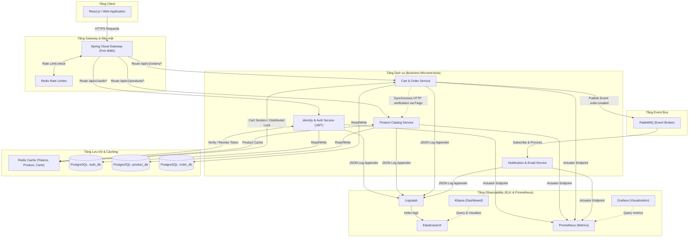
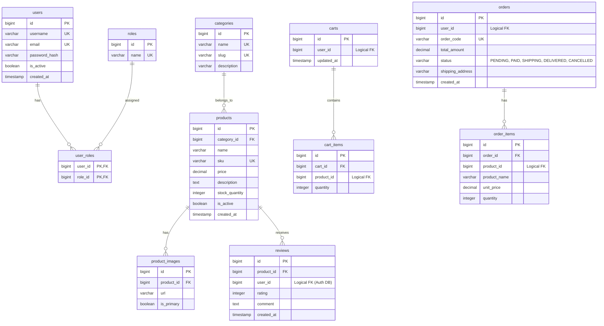
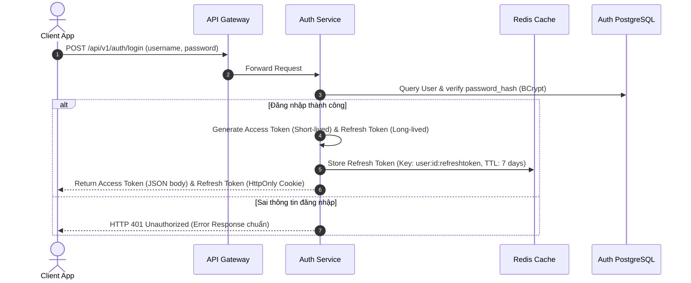
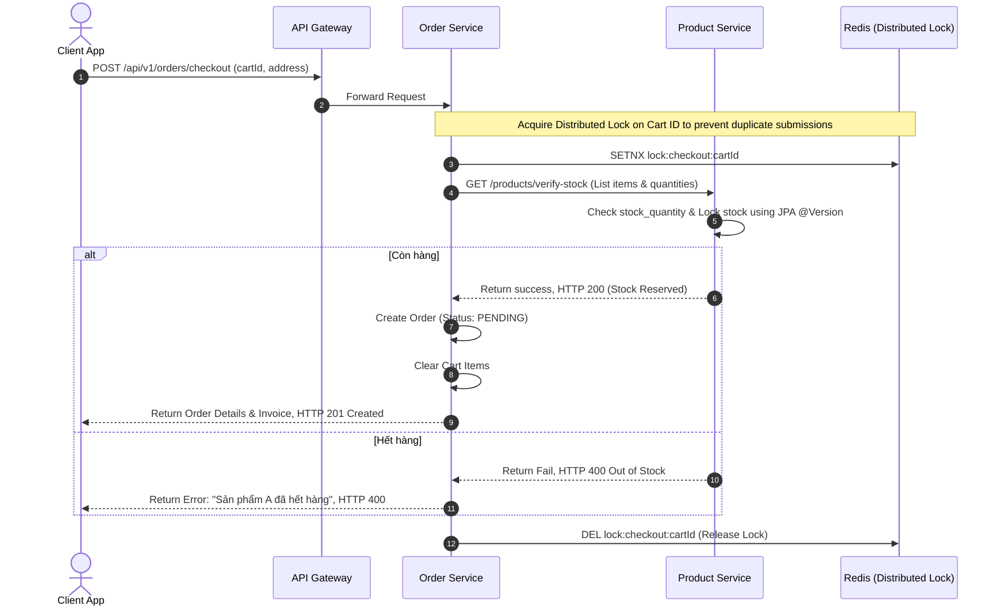
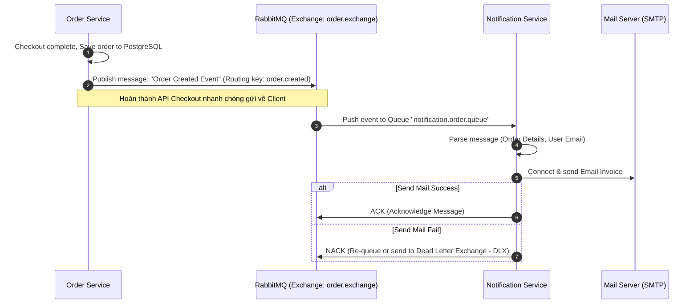
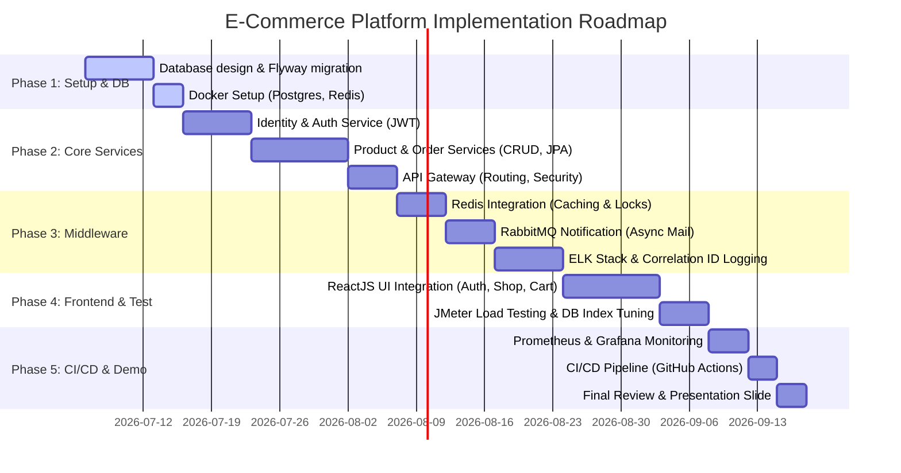

# TÀI LIỆU THIẾT KẾ HỆ THỐNG VÀ LỘ TRÌNH TRIỂN KHAI
## DỰ ÁN: HỆ THỐNG THƯƠNG MẠI ĐIỆN TỬ (E-COMMERCE PLATFORM)
**Vị trí thiết kế**: Senior Backend Engineer / System Architect

---

## 1. MỤC TIÊU VÀ TẦM NHÌN HỆ THỐNG

Dự án **E-Commerce Platform** được thiết kế nhằm mục đích xây dựng một hệ thống bán hàng trực tuyến có tính khả thi cao trong thực tế, chịu tải tốt, bảo mật tuyệt đối và có khả năng mở rộng dễ dàng. 

Hệ thống được thiết kế để giải quyết các bài toán lớn của thương mại điện tử:
*   **High Availability (Tính sẵn sàng cao)**: Hệ thống luôn hoạt động ổn định ngay cả khi một số thành phần gặp sự cố.
*   **High Performance (Hiệu năng cao)**: Thời gian phản hồi API thấp (Target: Avg < 100ms cho các API tra cứu), tối ưu hóa bằng Caching tầng tầng lớp lớp (Multi-level Caching).
*   **Data Integrity (Toàn vẹn dữ liệu)**: Bảo đảm tính chính xác của số lượng hàng tồn kho (Inventory) và trạng thái đơn hàng (Order Status) trong môi trường có tính đồng thời cao (High Concurrency).
*   **Scalability (Khả năng mở rộng)**: Thiết kế theo hướng Microservices (hoặc Modular Monolith có định hướng chuyển đổi) để dễ dàng scale theo chiều ngang (Horizontal Scaling) các dịch vụ có lượng truy cập đột biến như Product Catalog và Checkout.

---

## 2. LỰA CHỌN KIẾN TRÚC HỆ THỐNG

Hệ thống được đề xuất triển khai theo mô hình **Microservices Architecture** (Kiến trúc vi dịch vụ). 

### Bảng so sánh và Lý do lựa chọn (Senior Perspective)

| Tiêu chí | Monolithic Architecture (Đơn khối) | Microservices Architecture (Vi dịch vụ) | Lựa chọn tại dự án này |
| :--- | :--- | :--- | :--- |
| **Khả năng mở rộng (Scalability)** | Scale toàn bộ ứng dụng, lãng phí tài nguyên. | Chỉ scale các service chịu tải cao (ví dụ: Product, Cart). | **Microservices** (Để tối ưu chi phí hạ tầng và hiệu năng). |
| **Tính độc lập phát triển** | Một team lớn code trên cùng một repo, dễ xung đột. | Các service độc lập, deploy riêng biệt, sử dụng công nghệ khác nhau nếu cần. | **Microservices** (Giúp chia việc và CI/CD độc lập dễ dàng). |
| **Khả năng chống chịu lỗi (Fault Tolerance)** | Một module crash (ví dụ: memory leak ở module Payment) kéo theo sập toàn bộ app. | Service này chết, các service khác vẫn chạy (ví dụ: Service Inventory sập thì khách vẫn xem được sản phẩm). | **Microservices** (Tận dụng Circuit Breaker để cô lập lỗi). |
| **Độ phức tạp vận hành** | Thấp (chỉ 1 database, 1 app package). | Cao (yêu cầu API Gateway, Service Discovery, ELK, Distributed Tracing). | **Chấp nhận độ phức tạp** để chứng minh năng lực thiết kế hệ thống phân tán của một Senior. |

### Sơ đồ kiến trúc tổng thể (System Architecture Diagram)

Dưới đây là mô hình kiến trúc vi dịch vụ hoàn chỉnh của hệ thống E-Commerce, bao gồm các thành phần từ Client, API Gateway, các Business Services, Message Queue, Caching cho đến hệ thống Giám sát & Logging (ELK Stack).

---

## 3. THIẾT KẾ CƠ SỞ DỮ LIỆU CHUẨN HÓA (DATABASE SCHEMA DESIGN)

Để hệ thống hoạt động ổn định và tránh lỗi bất nhất dữ liệu, cơ sở dữ liệu của từng service sẽ được thiết kế độc lập (Database-per-Service pattern). Dưới đây là ERD chi tiết cho 3 Service chính: **Auth DB**, **Product DB**, và **Order DB**.

### Sơ đồ ERD (Entity Relationship Diagram)

### Chiến lược Quản lý Database & Migration:
*   **Công cụ sử dụng**: **Flyway** được tích hợp thẳng vào dự án Spring Boot.
*   **Cách thức hoạt động**: Mỗi Service sẽ có một thư mục `src/main/resources/db/migration/` riêng biệt. Các file sql dạng `V1__init_db.sql`, `V2__add_index.sql` sẽ được tự động thực thi khi Docker Container của Service đó start, đảm bảo tính đồng bộ giữa code và schema.
*   **Tách biệt Database**: Mặc dù chạy trên cùng 1 PostgreSQL instance để tiết kiệm RAM trên local docker, ta vẫn sử dụng 3 Database logic khác nhau: `ecommerce_auth`, `ecommerce_product`, và `ecommerce_order` để cô lập dữ liệu.

---

## 4. PHÂN TÍCH NGHIỆP VỤ & SƠ ĐỒ LUỒNG (BUSINESS WORKFLOWS)

Dưới đây là phân tích chi tiết cho 3 luồng nghiệp vụ cốt lõi thể hiện trình độ xử lý hệ thống phân tán của một Senior.

### Nghiệp vụ 1: Đăng nhập & Xác thực (JWT & Refresh Token Flow)
Hệ thống sử dụng cơ chế bảo mật stateless bằng JWT token. Để đảm bảo an toàn, hệ thống cung cấp 2 loại token:
1.  **Access Token**: Hết hạn nhanh (ví dụ: 15 phút), lưu ở Memory phía Client.
2.  **Refresh Token**: Hết hạn lâu (ví dụ: 7 ngày), lưu ở HttpOnly Cookie phía Client để chống tấn công XSS, và lưu ở Redis phía Server để có khả năng thu hồi (Revoke) ngay lập tức khi phát hiện rủi ro.

---

### Nghiệp vụ 2: Thêm vào giỏ hàng & Đặt hàng (Cart & Checkout Flow)
Luồng nghiệp vụ quan trọng nhất, liên quan đến trừ kho (Inventory Lock) và đảm bảo tính nhất quán dữ liệu. Ta sử dụng cơ chế **Optimistic Locking** (Khóa lạc quan `@Version` của JPA) ở bảng Product để chống ghi đè dữ liệu kho khi có hàng nghìn lượt mua cùng lúc.

---

### Nghiệp vụ 3: Xử lý Tác vụ Bất đồng bộ (Async Notification via Message Queue)
Khi một đơn hàng được tạo thành công, hệ thống cần gửi Email hóa đơn cho khách hàng. Nếu gửi đồng bộ trong luồng Checkout, thời gian phản hồi API sẽ bị chậm thêm từ 2-5 giây do kết nối SMTP. 

Giải pháp: Đẩy sự kiện sang **RabbitMQ** và xử lý bất đồng bộ.

---

## 5. THIẾT KẾ CẢNH BÁO, GIÁM SÁT & LOGGING (OBSERVABILITY & MONITORING)

Một hệ thống phân tán không thể hoạt động hiệu quả nếu thiếu khả năng hiển thị (Observability). Chúng ta xây dựng một hệ thống Logging và Monitoring chuẩn chỉ:

### A. Mô hình Logging với ELK Stack:
1.  **JSON Structured Logging**: Toàn bộ log của Spring Boot được cấu hình ghi dưới dạng JSON (sử dụng thư viện `logstash-logback-encoder`). Mỗi dòng log sẽ chứa đầy đủ Metadata (timestamp, thread, class, log level, log message).
2.  **Trace ID & Correlation ID**: 
    *   Khi có request đi vào API Gateway, Gateway sẽ tự động sinh một chuỗi ngẫu nhiên duy nhất gọi là `Correlation-ID` (hoặc `traceId`).
    *   Mã này được đính kèm vào HTTP Header và truyền qua các service khác bằng Spring Cloud OpenFeign.
    *   Toàn bộ log sinh ra ở các service khác nhau liên quan đến request này sẽ có chung `traceId`, giúp việc debug cực kỳ dễ dàng trên Kibana bằng cách filter `traceId = xxxxx`.
3.  **Hạ tầng**: Logstash lắng nghe log từ File/Docker, đẩy về Elasticsearch, và người quản trị xem trên Kibana Dashboard.

### B. Mô hình Metrics & Monitoring (Prometheus & Grafana):
*   Từng service tích hợp `spring-boot-starter-actuator` và `micrometer-registry-prometheus` để phơi (expose) ra endpoint `/actuator/prometheus`.
*   **Prometheus** được cài đặt để định kỳ cào (scrape) dữ liệu từ endpoint này.
*   **Grafana** kết nối với nguồn dữ liệu của Prometheus để vẽ biểu đồ giám sát:
    *   Tỉ lệ CPU/RAM của từng Java Virtual Machine (JVM).
    *   Tình trạng Connection Pool của PostgreSQL (HikariCP active connections, idle, waiting).
    *   Latency và Throughput của các API endpoints.
    *   Redis Cache Hit Rate / Miss Rate.

---

## 6. CHIẾN LƯỢC TỐI ƯU HỆ THỐNG BẰNG REDIS CACHE

Sử dụng Redis không chỉ để "lấy điểm cộng" mà thực sự giải quyết các bài toán thắt nút cổ chai (Bottlenecks):

1.  **Cache dữ liệu tra cứu sản phẩm (Product Catalog Cache)**:
    *   Dữ liệu trang chi tiết sản phẩm rất ít khi thay đổi nhưng tần suất truy cập cực cao.
    *   *Strategy*: Cache-Aside Pattern.
    *   *TTL*: 1 giờ. Khi admin cập nhật thông tin sản phẩm, hệ thống tự động gọi hàm xóa Cache tương ứng để đảm bảo dữ liệu cập nhật tiếp theo lấy từ DB và nạp lại vào Cache (Cache Eviction).
2.  **Rate Limiting**:
    *   Áp dụng thuật toán **Token Bucket** tích hợp trong Spring Cloud Gateway phối hợp cùng Redis để chặn spam request vào hệ thống. Target tối đa: 10 request/giây trên một IP/User Token.
3.  **Distributed Lock (Khóa phân tán)**:
    *   Sử dụng Redis với thư viện **Redisson** để khóa giao dịch đặt hàng theo từng Cart ID, tránh lỗi tranh chấp tài nguyên (race condition) hoặc bấm nút đặt hàng liên tiếp từ Client tạo đơn trùng lặp.

---

## 7. KỊCH BẢN KIỂM THỬ TẢI & ĐÁNH GIÁ HIỆU NĂNG (LOAD TESTING PLAN)

Để chứng minh năng lực tối ưu hệ thống, chúng ta lập kế hoạch chạy Load Test cụ thể bằng **Apache JMeter**:

### Kịch bản tải (Load Test Scenarios)

| Kịch bản | Số lượng CCU (Concurrent Users) | Hành vi giả lập | API Mục tiêu | Kết quả mong đợi |
| :--- | :--- | :--- | :--- | :--- |
| **Scenario 1**: Browse & Search | 100 -> 300 Users | Khách hàng truy cập trang chủ, tìm kiếm từ khóa, xem chi tiết sản phẩm. | `GET /api/v1/products/search`   `GET /api/v1/products/{id}` | - Throughput > 1500 req/s   - Response Time (p95) < 50ms (Nhờ Redis Cache). |
| **Scenario 2**: Heavy Checkout | 50 -> 100 Users | Khách hàng thực hiện đặt hàng đồng thời. | `POST /api/v1/orders/checkout` | - No Error (0% Error Rate)   - Tránh được tình trạng Over-selling (Bán quá số lượng tồn kho). |

### Chỉ số cần thu thập (KPIs):
*   **Throughput (TPS)**: Số lượng request xử lý thành công trong 1 giây.
*   **Response Time (Avg, Median, p90, p95, p99)**: Trọng tâm là p95 và p99 để đo lường trải nghiệm người dùng tệ nhất.
*   **Database Connection Pool Metrics**: Theo dõi xem HikariCP có bị cạn kiệt kết nối hay không.
*   **Redis Hit Rate**: Tỉ lệ phần trăm lấy dữ liệu thành công từ Cache mà không cần truy vấn PostgreSQL.

---

## 8. LỘ TRÌNH TRIỂN KHAI CHI TIẾT (PROJECT ROADMAP - WBS)

Lộ trình được thiết kế theo mô hình cuốn chiếu (Agile/Scrum), chia làm 5 Phase trong vòng 8-10 tuần để đảm bảo dự án luôn có sản phẩm chạy được qua từng giai đoạn.

### Chi tiết các gói công việc (Work Packages Breakdown)

#### PHASE 1: THIẾT KẾ CƠ SỞ DỮ LIỆU & KHỞI TẠO MÔI TRƯỜNG DOCKER (Tuần 1)
*   **Task 1.1**: Thiết kế sơ đồ quan hệ thực thể (ERD) chi tiết trên SQL, chuẩn hóa dạng 3NF.
*   **Task 1.2**: Viết script khởi tạo cơ sở dữ liệu mẫu (`db_seed.sql`) và tổ chức các script này thông qua **Flyway Migration**.
*   **Task 1.3**: Xây dựng file `docker-compose.yml` chứa các container nền tảng: **PostgreSQL (15+)** và **Redis (7+)**, thiết kế Network và Volume để lưu giữ dữ liệu an toàn.

#### PHASE 2: PHÁT TRIỂN CÁC DỊCH VỤ CỐT LÕI (CORE BUSINESS SERVICES) (Tuần 2 - 4)
*   **Task 2.1**: **Identity & Auth Service**:
    *   Tích hợp Spring Security 6.x và Java 21.
    *   Viết API Đăng ký, Đăng nhập, sinh chuỗi Access Token (JWT) và cơ chế lưu trữ/thu hồi Refresh Token trên Redis.
*   **Task 2.2**: **Product Catalog Service**:
    *   Viết các API CRUD Sản phẩm, Danh mục.
    *   Tích hợp phân trang (Spring Data Pageable) và tìm kiếm/lọc sản phẩm đa tiêu chí.
*   **Task 2.3**: **Cart & Order Service**:
    *   Xây dựng API quản lý Giỏ hàng (lưu tạm trạng thái ở Redis).
    *   Viết API Checkout tạo hóa đơn, trừ kho dùng `@Version` để tránh xung đột dữ liệu.
*   **Task 2.4**: **API Gateway (Spring Cloud Gateway)**:
    *   Cấu hình Routing động dựa trên Service Discovery (hoặc Static Route định danh cổng dịch vụ).
    *   Tích hợp JWT filter để giải mã, xác thực token ở Gateway trước khi route vào các service nội bộ.

#### PHASE 3: TÍCH HỢP HỆ THỐNG TRUNG GIAN & KHẢ NĂNG QUAN SÁT (Tuần 5 - 7)
*   **Task 3.1**: Cấu hình **Redis Caching** cho API Catalog Sản phẩm và triển khai Redisson Distributed Lock để khóa luồng đặt hàng.
*   **Task 3.2**: Thiết lập **RabbitMQ**:
    *   Cấu hình Exchange, Queue và Binding Key trên Order Service và Notification Service.
    *   Viết logic gửi mail hóa đơn bất đồng bộ khi nhận được Event đặt hàng thành công.
*   **Task 3.3**: Triển khai hệ thống **ELK Stack & Tracing**:
    *   Tích hợp logback encoder đẩy log JSON.
    *   Cấu hình Logstash đọc log và lưu trữ vào Elasticsearch.
    *   Viết Filter propagate `traceId` thông qua Gateway và các service bằng OpenFeign.
    *   Tạo Dashboard Kibana cơ bản để filter log theo `traceId` và `level: ERROR`.

#### PHASE 4: PHÁT TRIỂN GIAO DIỆN (FRONTEND) & KIỂM THỬ HIỆU NĂNG (Tuần 8 - 9)
*   **Task 4.1**: Xây dựng giao diện Web bằng **ReactJS** (sử dụng TailwindCSS/Vite để giao diện trực quan và chuyên nghiệp):
    *   Trang chủ hiển thị danh mục, danh sách sản phẩm (có phân trang/search).
    *   Màn hình Đăng nhập / Đăng ký (Lưu Access Token ở Memory, Refresh Token tự động đính kèm qua HTTP Cookie).
    *   Trang giỏ hàng và màn hình Checkout.
*   **Task 4.2**: **Load Testing**:
    *   Tạo kịch bản JMeter test các API `GET Product Detail` (chứng minh tốc độ phản hồi có cache và không cache).
    *   Tạo kịch bản JMeter giả lập 100 người dùng bấm checkout đồng thời để xác minh không bị lỗi âm kho hoặc trùng đơn.
    *   Tổng hợp kết quả so sánh trước/sau tối ưu để đưa vào slide báo cáo.

#### PHASE 5: HOÀN THIỆN ĐỒ ÁN, MONITORING & CI/CD (Tuần 10)
*   **Task 5.1**: Thiết lập dashboard giám sát thời gian thực bằng **Prometheus & Grafana**:
    *   Cào dữ liệu JVM và HTTP requests từ các microservices.
    *   Import Dashboard mẫu cho Spring Boot để theo dõi Heap Memory, active threads, Hikari connection pool.
*   **Task 5.2**: Xây dựng luồng **CI/CD** đơn giản bằng **GitHub Actions**:
    *   Tự động chạy Unit Test khi dev tạo Pull Request.
    *   Tự động build Docker Image và đẩy lên Docker Hub khi merge code vào nhánh `main`.
*   **Task 5.3**: Soạn thảo tài liệu bàn giao dự án (`README.md`, slide thuyết trình, script cài đặt nhanh bằng 1 lệnh `docker compose up -d`).

---

## 9. ĐIỂM NHẤN CÔNG NGHỆ CHINH PHỤC NHÀ TUYỂN DỤNG (SENIOR INTERVIEW HIGHLIGHTS)

Khi trình bày đồ án này trước các nhà tuyển dụng hoặc hội đồng chấm điểm, đây là các "từ khóa đắt giá" (Keywords) cần nhấn mạnh để chứng minh trình độ Senior:

1.  **Idempotency (Tính bất biến)**:
    *   "Tôi đã thiết kế API đặt hàng có cơ chế chống trùng lặp (Idempotent API) bằng cách sử dụng `RequestId` đính kèm từ Client và lưu vết xử lý tạm thời trên Redis."
2.  **Optimistic Locking vs Pessimistic Locking**:
    *   "Đối với bài toán trừ tồn kho khi lượng mua lớn, tôi chọn khóa lạc quan (Optimistic Locking) vì các phiên mua hàng diễn ra song song và tỉ lệ xung đột trực tiếp trên cùng một SKU tại một thời điểm là trung bình. Điều này giúp hệ thống đạt throughput cao hơn so với việc lock database vật lý bằng Pessimistic Lock."
3.  **Graceful Shutdown**:
    *   "Trong cấu hình Docker và Spring Boot, tôi cài đặt cơ chế Graceful Shutdown để khi nâng cấp hoặc khởi động lại các dịch vụ, các request dở dang vẫn được xử lý hoàn tất trước khi service dừng hẳn, đảm bảo không lỗi đơn hàng của khách hàng."
4.  **Distributed Tracing**:
    *   "Để debug lỗi trong kiến trúc Microservice, tôi cài đặt Correlation ID thông qua API Gateway, chuyển tiếp qua Feign Client. Toàn bộ log của 1 hành vi người dùng được map chung dưới một Trace ID trên Kibana, giúp rút ngắn thời gian xử lý sự cố từ vài giờ xuống còn vài giây."
5.  **Distributed Lock**:
    *   "Để giải quyết triệt để tình trạng hai luồng xử lý cùng một giỏ hàng dẫn đến lỗi dữ liệu, tôi áp dụng khóa phân tán thông qua thư viện Redisson (Redis), khóa tài nguyên ở mức granularity nhỏ nhất (Cart ID hoặc User ID)."

---
*Tài liệu này được biên soạn bởi Senior Backend Architect, định hướng cấu trúc dự án chuẩn doanh nghiệp, tối ưu hóa khả năng chinh phục hội đồng chuyên môn.*
