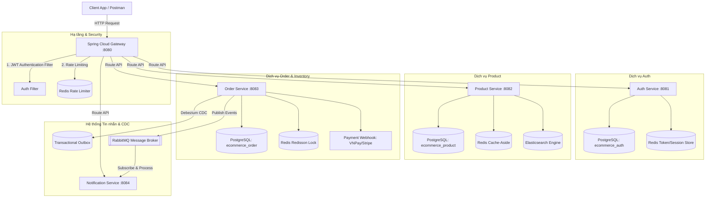

# 🛒 E-Commerce Platform (Hệ thống bán hàng doanh nghiệp)

[](https://openjdk.org/)
[](https://spring.io/projects/spring-boot)
[](https://spring.io/projects/spring-cloud)
[](https://www.postgresql.org/)
[](https://redis.io/)
[](https://www.rabbitmq.com/)
[](https://www.elastic.co/)

Dự án **E-Commerce Platform** là một hệ thống thương mại điện tử cấp doanh nghiệp (Enterprise) được xây dựng theo kiến trúc **Microservices** hướng sự kiện (Event-Driven), tối ưu hóa hiệu năng cao (High Throughput), khả năng chịu tải (Scalability), và độ tin cậy về dữ liệu ở cấp độ cao nhất.

Hệ thống được thiết kế hướng tới khả năng phục vụ hơn **2,000 TPS** cho luồng checkout và **10,000 req/s** cho luồng tra cứu sản phẩm thông qua các cơ chế tối ưu đa tầng (Multi-level Caching, Distributed Locking, Search Engine, Rate Limiting).

---

## 🔗 Liên kết Dự án & Tài liệu
*   **GitHub Repository**: [https://github.com/ThanhluanGif/E-Commerce-Platform.git](https://github.com/ThanhluanGif/E-Commerce-Platform.git)
*   **Tài liệu Thiết kế Kiến trúc chi tiết (SLA, ERD, Sequence, WBS)**: [E_COMMERCE_SYSTEM_DESIGN.md](E_COMMERCE_SYSTEM_DESIGN.md)

---

## 🏗️ Sơ đồ Kiến trúc Hệ thống (System Architecture)



---

## 🛠️ Công nghệ Sử dụng & Thành phần Hệ thống

| Thành phần | Công nghệ áp dụng | Vai trò |
| :--- | :--- | :--- |
| **Framework chính** | Java 21, Spring Boot 3.3.x, Spring Cloud 2023.0.x | Khung phát triển ứng dụng Microservices |
| **API Gateway** | Spring Cloud Gateway, Reactive Streams | Chuyển hướng routing, chặn lọc bảo mật, xử lý CORS |
| **Xác thực & Bảo mật** | Spring Security 6.x, JWT (JJWT HS512), Token Blacklist | Xác thực phi trạng thái (Stateless), phân quyền Role-Based |
| **Cơ sở dữ liệu** | PostgreSQL 15 | Cơ sở dữ liệu quan hệ chính (tách biệt logical schema) |
| **Migration** | Flyway Migration | Quản lý phân bản và tự động di cư cấu trúc CSDL |
| **Caching & Session** | Redis 7 (Spring Data Redis, Redisson client) | Lưu trữ phiên đăng nhập, Rate limiting, Giỏ hàng, Khóa phân tán |
| **Tìm kiếm & Lọc** | Elasticsearch 8.x, Spring Data Elasticsearch | Tìm kiếm full-text search sản phẩm với tốc độ milisecond |
| **Message Broker** | RabbitMQ (với Dead Letter Exchange - DLX) | Xử lý hàng đợi bất đồng bộ gửi email, thông báo |
| **CDC & Outbox** | Debezium / Transactional Outbox Pattern | Đảm bảo tính nhất quán dữ liệu cuối (Eventual Consistency) |
| **Giám sát & Tracing** | ELK Stack (Logstash, Kibana), Prometheus, Grafana | Quản lý logs tập trung qua Correlation-ID và hiển thị metrics JVM |

---

## 📂 Cấu trúc Thư mục Dự án (Gradle Multi-Module)

Dự án được tổ chức theo mô hình **Multi-Module Gradle** giúp dễ dàng quản lý code và chia sẻ tài nguyên dùng chung:

```text
E-CommercePlatform/
├── settings.gradle                # Định nghĩa các microservice modules
├── build.gradle                   # Cấu hình build gốc & dependencies dùng chung
├── docker/
│   ├── docker-compose.yml         # Thiết lập PostgreSQL, Redis, RabbitMQ, Elasticsearch, Kibana
│   └── infra-up.sh                # Script khởi chạy hạ tầng nhanh
├── common-library/                # Thư viện dùng chung (DTOs, Exceptions, Utils)
├── gateway-service/               # Spring Cloud Gateway (8080)
├── auth-service/                  # Dịch vụ quản lý Người dùng & Xác thực (8081)
├── product-service/               # Dịch vụ Quản lý Sản phẩm, Danh mục & Cache (8082)
├── order-service/                 # Dịch vụ Giỏ hàng, Đặt hàng & Thanh toán (8083)
├── notification-service/          # Dịch vụ gửi thông báo, SMS, Email bất đồng bộ (8084)
└── E_COMMERCE_SYSTEM_DESIGN.md    # Tài liệu đặc tả kỹ thuật chi tiết
```

---

## 🚀 Hướng dẫn Cài đặt & Chạy Dự án chi tiết

Để tái sử dụng hoặc chạy dự án này trên môi trường local của bạn, hãy thực hiện theo các bước hướng dẫn dưới đây.

### 📋 Yêu cầu tiên quyết (Prerequisites)
*   **Java SDK**: Phiên bản 21 trở lên.
*   **Gradle**: Phiên bản 8.x trở lên.
*   **Docker & Docker Compose**: Đã được cài đặt và đang chạy daemon.
*   **Git**: Phục vụ quản lý source code.

---

### Bước 1: Clone mã nguồn dự án
```bash
git clone https://github.com/ThanhluanGif/E-Commerce-Platform.git
cd E-Commerce-Platform
```

### Bước 2: Khởi chạy Cơ sở hạ tầng (PostgreSQL, Redis, RabbitMQ, ELK)
Chúng tôi đã cung cấp sẵn script tự động hóa trong thư mục `docker`. Bạn chỉ cần cấp quyền và chạy:
```bash
chmod +x docker/infra-up.sh
./docker/infra-up.sh
```
*Hoặc khởi chạy thủ công bằng Docker Compose:*
```bash
docker-compose -f docker/docker-compose.yml up -d
```
> [!IMPORTANT]
> Hãy đợi khoảng 15-30 giây để Elasticsearch, PostgreSQL và RabbitMQ khởi động hoàn toàn trước khi chạy các Spring Boot Service.

---

### Bước 3: Di cư cấu trúc Cơ sở dữ liệu (Flyway Migration)
Khi bạn chạy các Spring Boot Service, Flyway sẽ tự động quét thư mục `db/migration` trong từng service tương ứng và tạo bảng.
Tuy nhiên, nếu muốn cấu hình thủ công hoặc kiểm tra kết nối database, các cơ sở dữ liệu sau sẽ được khởi tạo trong PostgreSQL:
*   `ecommerce_auth` (chạy trên cổng `5432`)
*   `ecommerce_product` (chạy trên cổng `5432`)
*   `ecommerce_order` (chạy trên cổng `5432`)

Xem cấu trúc SQL chi tiết tại mục **[3.2. Script SQL DDL Hoàn chỉnh](E_COMMERCE_SYSTEM_DESIGN.md#32-script-sql-ddl-hoan-chinh-postgresql-dialect)**.

---

### Bước 4: Thiết lập biến môi trường (Environment Variables)
Mỗi microservice đều có file `application.yml`. Dưới đây là các cấu hình môi trường chính bạn cần thiết lập (thông qua Environment variables hoặc cấu hình trực tiếp trên IDE của bạn):

#### 1. Hệ thống Cơ sở dữ liệu & Cache
```env
SPRING_DATASOURCE_URL=jdbc:postgresql://localhost:5432/ecommerce_db
SPRING_DATASOURCE_USERNAME=postgres
SPRING_DATASOURCE_PASSWORD=your_secure_password
SPRING_DATA_REDIS_HOST=localhost
SPRING_DATA_REDIS_PORT=6379
SPRING_DATA_REDIS_PASSWORD=redis_secure_pass
```

#### 2. Cấu hình bảo mật JWT (Cho Auth Service & Gateway)
```env
JWT_SECRET=9a61d624a9d70168b4492bfd7254563... (Khóa bảo mật HS512 tối thiểu 64 ký tự)
JWT_ACCESS_EXPIRATION=900000 (15 phút tính bằng milisecond)
JWT_REFRESH_EXPIRATION=604800000 (7 ngày tính bằng milisecond)
```

#### 3. Cấu hình Message Broker & Elasticsearch
```env
SPRING_RABBITMQ_HOST=localhost
SPRING_RABBITMQ_PORT=5672
SPRING_RABBITMQ_USERNAME=guest
SPRING_RABBITMQ_PASSWORD=guest
SPRING_ELASTICSEARCH_URIS=http://localhost:9200
```

---

### Bước 5: Build và Chạy dự án

#### 1. Build toàn bộ dự án từ thư mục gốc:
```bash
./gradlew clean build -x test
```

#### 2. Khởi chạy từng Microservice theo thứ tự:
Khuyến khích chạy các dịch vụ theo trình tự sau để tránh lỗi mất liên kết:
1.  **`gateway-service`** (Cổng 8080)
2.  **`auth-service`** (Cổng 8081)
3.  **`product-service`** (Cổng 8082)
4.  **`order-service`** (Cổng 8083)
5.  **`notification-service`** (Cổng 8084)

Lệnh chạy trực tiếp qua Terminal:
```bash
./gradlew :gateway-service:bootRun
./gradlew :auth-service:bootRun
./gradlew :product-service:bootRun
./gradlew :order-service:bootRun
./gradlew :notification-service:bootRun
```

---

## 🔑 Giải pháp Kỹ thuật cốt lõi (Core Implementations)

Để phục vụ phát triển nâng cao, dự án tích hợp các thiết kế chuyên sâu sau:

### 1. Cơ chế chống bán quá số lượng kho (Distributed Lock với Redisson)
*   **Vấn đề**: Khi hàng ngàn người dùng tranh mua một SKU sản phẩm tại cùng một thời điểm, cơ chế trừ kho bình thường sẽ gây ra hiện tượng bán âm (Over-selling).
*   **Giải pháp**: Tích hợp khóa phân tán thông qua Redisson. Trước khi thực hiện trừ kho, hệ thống khóa tài nguyên với key `lock:product:variant:{variantId}`.
*   **Code mẫu**:
    ```java
    RLock lock = redissonClient.getLock("lock:product:variant:" + variantId);
    try {
        // Chờ tối đa 3 giây để lấy khóa, tự động giải phóng sau 10 giây
        if (lock.tryLock(3, 10, TimeUnit.SECONDS)) {
            // Kiểm tra số lượng tồn kho và thực hiện trừ kho vật lý
            inventoryService.deductStock(variantId, quantity);
        }
    } finally {
        if (lock.isHeldByCurrentThread()) {
            lock.unlock();
        }
    }
    ```

### 2. Quản lý Đăng xuất & Thu hồi Token qua Redis Blacklist
*   Khi người dùng gọi API `/logout`, Access Token vẫn còn hạn sử dụng sẽ được ghi vào Redis Blacklist với TTL bằng thời gian sống còn lại của token đó.
*   Tại `gateway-service`, mỗi request đi qua sẽ được đối soát với Redis Blacklist. Nếu token nằm trong blacklist, Gateway lập tức từ chối và trả về lỗi `401 Unauthorized`.

### 3. Đảm bảo Idempotency (Chống trùng lặp tin nhắn) khi nhận Message
*   Khi `notification-service` nhận message từ RabbitMQ để gửi email hóa đơn, nó sẽ lưu `messageId` vào Redis dưới dạng `msg:processed:{messageId}` với TTL 10 phút.
*   Nếu nhận lại message trùng lặp do mạng chập chờn (At-least-once delivery), consumer sẽ kiểm tra Redis và bỏ qua ngay lập tức để tránh gửi trùng email cho khách hàng.

---

## 🛣️ Quy trình Đóng góp & Phát triển Nhánh (Git Workflows)

Dự án này sử dụng quy trình quản lý phân nhánh Git nghiêm ngặt để đảm bảo sự phối hợp trơn tru giữa các thành viên:

*   **`main`**: Nhánh chính thức, chứa mã nguồn ổn định nhất. Không commit trực tiếp lên nhánh này. Mọi thay đổi đều phải được review qua Pull Request từ các nhánh con.
*   **`Luân`**: Nhánh làm việc và phát triển tính năng của dev Luân.
*   **`Hưng`**: Nhánh làm việc và phát triển tính năng của dev Hưng.

### Cách tạo nhánh tính năng mới từ nhánh làm việc cá nhân:
1.  Chuyển sang nhánh cá nhân và kéo code mới nhất về:
    ```bash
    git checkout Luân
    git pull origin Luân
    ```
2.  Tạo nhánh tính năng nhỏ (`feature/name`):
    ```bash
    git checkout -b feature/cart-redis-impl
    ```
3.  Sau khi hoàn tất công việc, merge ngược lại nhánh cá nhân và push:
    ```bash
    git checkout Luân
    git merge feature/cart-redis-impl
    git push origin Luân
    ```

---

## 📜 Giấy phép phát triển (License)
Dự án được phân phối dưới giấy phép **MIT License**. Vui lòng tham khảo tệp `LICENSE` để biết thêm thông tin chi tiết về việc tái sử dụng thương mại hoặc cá nhân.
