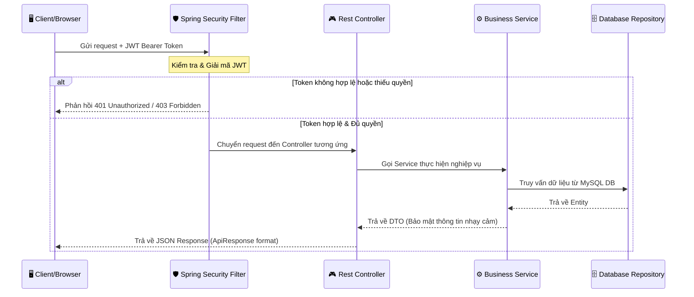
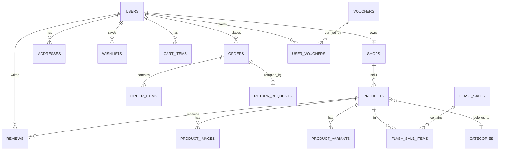
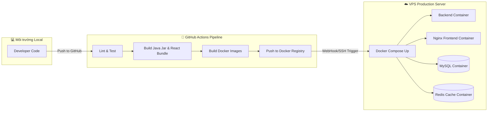

# 📦 E-Commerce Platform — Development Documentation & Continuation Plan

> **Project:** ecommerce-api + ecommerce-frontend  
> **Backend:** Spring Boot 4.1.0 · Java 17 · MySQL · JWT · Spring Security  
> **Frontend:** React 19 · React Router 7 · Context API  
> **Architecture:** Monolithic (hướng tới Modular Monolith)  
> **Cập nhật lần cuối:** 2026-07-05  
> **Trạng thái:** 🟢 Core MVP & Phases 10-20 đã hoàn thành — Lên Kế hoạch cho các tính năng nâng cao mới (Phase 21+)

---

## 📑 Mục lục

1. [Phân Tích Hiện Trạng Hệ Thống](#1-phân-tích-hiện-trạng-hệ-thống)
2. [Báo Cáo Audit Code & Lỗ Hổng Bảo Mật](#2-báo-cáo-audit-code--lỗ-hổng-bảo-mật)
3. [Kiến Trúc Hệ Thống & Phân Quyền API](#3-kiến-trúc-hệ-thống--phân-quyền-api)
4. [Database Schema Mục Tiêu](#4-database-schema-mục-tiêu)
5. [Kế Hoạch Khắc Phục Lỗ Hổng (Phase 10A)](#5-kế-hoạch-khắc-phục-lỗ-hổng-phase-10a)
6. [Kế Hoạch Nâng Cấp Tính Năng (Phase 10B - 10D)](#6-kế-hoạch-nâng-cấp-tính-năng-phase-10b---10d)
7. [Kế Hoạch Triển Khai DevOps & Production (Phase 11)](#7-kế-hoạch-triển-khai-devops--production-phase-11)
8. [Cấu Trúc Thư Mục Chuẩn Hóa](#8-cấu-trúc-thư-mục-chuẩn-hóa)
9. [Các Giai Đoạn Đã Hoàn Thành (Phase 12 - 17)](#9-các-giai-đoạn-đã-hoàn-thành-phase-12---17)
10. [Kế Hoạch Phát Triển Tiếp Theo (Phases 18 - 25)](#10-kế-hoạch-phát-triển-tiếp-theo-phases-18---25)
11. [Hướng Dẫn Tích Hợp PostgreSQL](#11-hướng-dẫn-tích-hợp--cấu-hình-postgresql-postgresql-integration-guide)

---

## 1. Phân Tích Hiện Trạng Hệ Thống

Dự án đã trải qua các Phase phát triển từ 1 đến 9, xây dựng được bộ khung nghiệp vụ tương tự như mô hình Shopee. Dưới đây là bảng phân tích những gì thực tế đã có và hoạt động:

### ✅ Nghiệp vụ cốt lõi đã chạy (Phases 1–9)

| Nghiệp vụ | Backend (Spring Boot) | Frontend (React) | Trải nghiệm & Trạng thái |
|-----------|-----------------------|------------------|-------------------------|
| **Xác thực & Bảo mật** | JWT Filter, SecurityConfig, UserRoleConverter | AuthContext (lưu token, userId, username, userRole) | Đăng nhập/Đăng ký chạy tốt. Đã mã hóa mật khẩu. |
| **Sản phẩm & Danh mục** | CRUD API, cây danh mục cha-con, lọc & tìm kiếm | ProductList, ProductDetail, Categories | Hiển thị sản phẩm theo lưới, hỗ trợ phân trang & lọc theo sidebar. |
| **Giỏ hàng (Cart)** | CartItem entity, CartService, CartController | CartContext + Cart Page | Hỗ trợ dual-mode (LocalStorage cho khách vãng lai và DB cho user đã login). Tự động merge giỏ hàng khi login. |
| **Đơn hàng (Order)** | Order, OrderItem, OrderStatus, OrderService | Orders list, OrderDetail, Checkout | Tạo đơn hàng, tự động sinh mã code `ORD-YYYYMMDD-XXXX`, hủy đơn, quản lý trạng thái. |
| **Đánh giá (Review)** | Review, ReviewService | Review form tại trang chi tiết sản phẩm | Chỉ cho phép người dùng đã nhận hàng (DELIVERED) viết đánh giá. |
| **Thông tin cá nhân** | UserController, Profile update | Profile page, Change Password | Cập nhật thông tin cá nhân, đổi mật khẩu, upload ảnh đại diện. |
| **Admin Dashboard** | AdminDashboardController/Service | AdminDashboard page | Xem thống kê tổng quan (doanh thu, đơn hàng, user, sản phẩm), biểu đồ cột doanh thu ngày, quản lý thực thể. |
| **Thanh toán giả lập** | API giả lập MoMo & VNPay | PaymentSimulation page | Mô phỏng cổng thanh toán ngân hàng/ví điện tử, tự động cập nhật trạng thái đơn hàng. |
| **Seller Center** | Shop entity, ShopService, Seller controllers | SellerDashboard page | Đăng ký gian hàng (Shop), người bán CRUD sản phẩm riêng, quản lý đơn hàng của shop, xem báo cáo doanh thu riêng. |
| **Vouchers & Flash Sale**| Voucher, UserVoucher, FlashSale | FlashSale countdown, Voucher checkout | Tạo mã giảm giá (phần trăm/cố định/phí ship), thiết lập sự kiện Flash Sale đếm ngược. |
| **Chat Realtime** | ChatConversation, ChatMessage, ChatService | Messages page (conversation list + chat window) | Hỗ trợ chat buyer ↔ seller. |
| **Địa chỉ & Yêu thích** | Address, Wishlist entities & services | Addresses page, Wishlist page | Quản lý sổ địa chỉ (Address book), lưu sản phẩm yêu thích (Wishlist). |
| **Biến thể & Hoàn trả** | ProductVariant, ReturnRequest, ReturnService | Product Detail variant select, Returns page | Chọn màu/size với giá và tồn kho riêng; gửi yêu cầu trả hàng/hoàn tiền. |

---

## 2. Báo Cáo Audit Code & Lỗ Hổng Bảo Mật

Qua quá trình audit sâu cả codebase Backend và Frontend, chúng tôi đã phát hiện một số lỗ hổng bảo mật nghiêm trọng cùng các lỗi logic nghiệp vụ cần được xử lý ngay lập tức:

### 🔴 Lỗ hổng nghiêm trọng (Critical Vulnerabilities)

#### 2.1 Lỗ hổng phân quyền đăng ký (Privilege Escalation)
* **Vấn đề:** Trong file `AuthService.java` (phương thức `register()`), hệ thống kiểm tra `request.getRole() != null ? request.getRole() : UserRole.CUSTOMER`. File `RegisterRequest.java` cho phép truyền thuộc tính `role` từ client.
* **Hậu quả:** Kẻ tấn công có thể dễ dàng gửi request đăng ký kèm `"role": "ADMIN"` hoặc `"role": "SELLER"` để tự cấp quyền quản trị cao nhất mà không cần phê duyệt.
* **Biện pháp khắc phục:** Loại bỏ trường `role` khỏi `RegisterRequest`, ép buộc giá trị `UserRole.CUSTOMER` trong code xử lý đăng ký của `AuthService`. Muốn lên SELLER hoặc ADMIN phải qua endpoint nâng cấp riêng hoặc trang phê duyệt của Admin.

#### 2.2 Lỗi phục hồi kho hàng biến thể (Variant Stock Defect)
* **Vấn đề:** Trong `OrderService.java` (phương thức `returnStockForOrder()`), khi hủy đơn hàng, hệ thống chỉ hoàn trả lại số lượng kho cho sản phẩm cha (`Product`) mà hoàn toàn bỏ qua thực thể biến thể (`ProductVariant`).
* **Hậu quả:** Tồn kho của biến thể sản phẩm (SKU như Size M, Màu Đỏ) bị mất vĩnh viễn, trong khi số lượng tồn kho của sản phẩm cha lại bị tăng khống một cách vô lý.
* **Biện pháp khắc phục:** Kiểm tra nếu đơn hàng chứa `variantId` thì phải cộng lại tồn kho cho `ProductVariantRepository`, ngược lại mới cộng cho `ProductRepository`.

#### 2.3 JWT Secret Hardcoded trong Source Code
* **Vấn đề:** Trong `JwtProvider.java`, chuỗi ký tự bí mật dùng để ký token JWT (`"ChuoidebaoMatSieuCapVipProNhatDinhKhongDuocDeLo123456789"`) đang bị viết trực tiếp vào mã nguồn.
* **Hậu quả:** Nếu mã nguồn bị rò rỉ (ví dụ lộ repository trên GitHub), kẻ xấu có thể ký giả mạo bất kỳ JWT token nào để đăng nhập với tư cách ADMIN.
* **Biện pháp khắc phục:** Chuyển khóa bí mật này ra biến môi trường hoặc file cấu hình ẩn: `@Value("${jwt.secret}")` với cấu hình fallback an toàn.

#### 2.4 Lộ thông tin & Sai phân quyền Endpoint Đơn hàng (Security Bypass)
* **Vấn đề:** Trong `SecurityConfig.java`, endpoint `GET /api/orders/**` được cấu hình là `permitAll()`.
* **Hậu quả:** Mặc dù Service có lấy userId từ JWT để truy vấn dữ liệu, việc mở hoàn toàn endpoint này ở tầng filter bảo mật là một lỗ hổng thiết kế lớn. Đồng thời, `/api/admin/**` chưa được phân quyền tường minh ở SecurityConfig mà đang rơi vào catch-all `authenticated()`.
* **Biện pháp khắc phục:** Cấu hình lại SecurityConfig, chỉ cho phép các request đến `/api/orders/**` khi đã xác thực (`authenticated()`), và `/api/admin/**` phải yêu cầu `hasRole('ADMIN')`.

---

### 🟡 Lỗ hổng trung bình & Lỗi kiến trúc (Medium & Architecture Issues)

#### 2.5 Bỏ qua Axios Interceptor trên Frontend
* **Vấn đề:** Các trang quan trọng như `Login.jsx`, `Register.jsx`, `SellerDashboard.jsx`, và `Messages.jsx` đang sử dụng hàm `fetch()` thô hoặc instance `axios` mới tự định nghĩa với URL hardcode `http://localhost:8080`.
* **Hậu quả:** Bỏ qua hoàn toàn cấu hình Interceptor tập trung tại `services/api.js`. Khi token hết hạn, các trang này không thể tự động xử lý lỗi 401 hoặc đính kèm token JWT đúng cách. Đồng thời gây khó khăn khi triển khai dự án lên domain production.
* **Biện pháp khắc phục:** Thay thế toàn bộ bằng instance `api` từ `services/api.js`.

#### 2.6 File Monolith quá lớn (Chất lượng Code kém)
* **Vấn đề:** `AdminDashboard.jsx` (49KB, ~1500 dòng) và `SellerDashboard.jsx` (39KB, ~1200 dòng) đang là các file đơn cực lớn chứa toàn bộ UI, State, và logic gọi API của hàng chục tab chức năng khác nhau.
* **Hậu quả:** Code cực kỳ khó bảo trì, dễ phát sinh lỗi khi thay đổi giao diện, hiệu năng render bị ảnh hưởng nghiêm trọng.
* **Biện pháp khắc phục:** Tách các màn hình quản lý này thành các thư mục component con (Ví dụ: `admin/ProductsTable.jsx`, `admin/UsersTable.jsx`, v.v.) và dùng React Router sub-routes thay vì quản lý bằng tab state `activeTab`.

#### 2.7 Chat Realtime thực tế đang dùng Polling
* **Vấn đề:** Mặc dù backend đã tích hợp WebSocket STOMP, trang `Messages.jsx` ở frontend lại đang dùng hàm `setInterval` gọi API REST liên tục mỗi 3 giây để lấy tin nhắn mới (HTTP Polling).
* **Hậu quả:** Tạo ra lượng request cực lớn làm nghẽn server (nhiều user chat cùng lúc), không đạt được trải nghiệm chat tức thời (realtime) đúng nghĩa.
* **Biện pháp khắc phục:** Kết nối WebSocket STOMP client trên frontend và subscribe kênh `/topic/chat/{conversationId}` để nhận tin nhắn realtime.

#### 2.8 Lỗi logic điều hướng URL tìm kiếm
* **Vấn đề:** Trong `ProductList.jsx`, state `searchTerm` không nằm trong danh sách dependency của `useEffect` kích hoạt fetch sản phẩm.
* **Hậu quả:** Khi người dùng truy cập trực tiếp bằng đường dẫn URL dạng `/products?name=Laptop`, trang web sẽ không tự động kích hoạt tìm kiếm mà hiển thị toàn bộ sản phẩm cho tới khi họ click nút Tìm kiếm.
* **Biện pháp khắc phục:** Thêm logic phân tích `location.search` và đưa tham số URL vào dependency array của fetch API.

#### 2.9 Thiếu Repository và xử lý Cascade cho ProductImage
* **Vấn đề:** Entity `ProductImage` tồn tại nhưng không có `ProductImageRepository`. Các thao tác lưu ảnh phụ thuộc hoàn toàn vào cơ chế Cascade của `Product`.
* **Hậu quả:** Không thể xóa hoặc sắp xếp lại thứ tự hình ảnh (`sortOrder`) một cách linh hoạt mà phải cập nhật lại toàn bộ Product.
* **Biện pháp khắc phục:** Tạo `ProductImageRepository` và xây dựng API quản lý ảnh độc lập.

---

## 3. Kiến Trúc Hệ Thống & Phân Quyền API

Hệ thống E-Commerce hiện tại hoạt động theo luồng sau:



### Bản Đồ Phân Quyền API (API Security Map)

| Đường dẫn API | Phương thức | Quyền truy cập tối thiểu | Lý do / Chức năng |
|---|---|---|---|
| `/api/auth/**` | ALL | `permitAll()` | Đăng nhập, đăng ký tài khoản |
| `/api/products/**` | GET | `permitAll()` | Xem danh sách & chi tiết sản phẩm |
| `/api/categories/**` | GET | `permitAll()` | Xem danh sách danh mục sản phẩm |
| `/api/shops/{slug}/**` | GET | `permitAll()` | Xem thông tin gian hàng người bán |
| `/api/flash-sales/active` | GET | `permitAll()` | Xem sản phẩm đang chạy Flash Sale |
| `/uploads/**` | GET | `permitAll()` | Phục vụ file ảnh tĩnh từ ổ đĩa local |
| `/api/cart/**` | ALL | `authenticated()` | Thêm, sửa, xóa giỏ hàng cá nhân |
| `/api/orders/**` | ALL | `authenticated()` | Đặt hàng, xem đơn hàng cá nhân, hủy đơn |
| `/api/users/profile` | GET, PUT | `authenticated()` | Cập nhật thông tin profile cá nhân |
| `/api/wishlist/**` | ALL | `authenticated()` | Quản lý danh sách sản phẩm yêu thích |
| `/api/addresses/**` | ALL | `authenticated()` | Quản lý sổ địa chỉ giao hàng cá nhân |
| `/api/chat/**` | ALL | `authenticated()` | Gửi tin nhắn, load danh sách hội thoại |
| `/api/seller/**` | ALL | `hasRole('SELLER')` | Quản lý sản phẩm, đơn hàng của shop |
| `/api/admin/**` | ALL | `hasRole('ADMIN')` | Dashboard tổng quan hệ thống, duyệt shop |
| `/api/products/**` | POST, PUT, DELETE | `hasRole('ADMIN')` | Quản trị viên cập nhật danh mục hệ thống |

---

## 4. Database Schema Mục Tiêu

Hệ thống quản lý dữ liệu thông qua cơ sở dữ liệu quan hệ MySQL, lược đồ các bảng chính được liên kết như sau:



---

## 5. Kế Hoạch Khắc Phục Lỗ Hổng (Phase 10A) - ✅ HOÀN THÀNH

> **Mục tiêu chính:** Vá triệt để các lỗ hổng bảo mật nghiêm trọng (Critical) và cấu trúc lại mã nguồn lỗi (Refactor) để đảm bảo hệ thống vận hành an toàn và ổn định.
> **Thời gian dự kiến:** 3 - 4 ngày.

### 🔖 Task 1: Vá lỗ hổng phân quyền & rò rỉ JWT Secret
* **Backend:**
  - Cập nhật `AuthService.register()` để ép cứng quyền `UserRole.CUSTOMER` cho mọi tài khoản đăng ký mới. Loại bỏ hoặc bỏ qua giá trị `role` từ request body của client.
  - Sửa đổi `JwtProvider.java` để nạp khóa bí mật bằng `@Value("${jwt.secret}")` thay vì hardcode chuỗi.
  - Thêm cấu hình JWT Secret an toàn vào file `application.properties`:
    ```properties
    jwt.secret=${JWT_SECRET:ChuoidebaoMatSieuCapVipProNhatDinhKhongDuocDeLo123456789}
    ```
* **Frontend:**
  - Sửa đổi `Login.jsx` và `Register.jsx`: Chuyển sang sử dụng `authService.js` (hoặc instance `api` dùng chung) thay thế cho hàm `fetch()` với URL tĩnh.
  - Đảm bảo logic login gọi qua `authContext.login(...)` để cập nhật đồng bộ React State thay vì ghi đè thô lên `localStorage`.

### 🔖 Task 2: Khắc phục lỗi Stock & Order Logic
* **Backend:**
  - Cập nhật phương thức hoàn kho `returnStockForOrder()` trong `OrderService.java`. Thêm logic kiểm tra xem sản phẩm được hủy có phải là biến thể (`ProductVariant`) hay không. Nếu có, cộng lại tồn kho cho biến thể; nếu không, mới cộng cho sản phẩm cha.
  - Cấu hình lại `SecurityConfig.java` để bảo vệ endpoint `/api/orders/**` (yêu cầu xác thực `authenticated()`).
  - Sửa lỗi logic so sánh chuỗi phân quyền ADMIN trong `OrderService.getOrderById` (chuyển `"Admin"` thành `"ADMIN"` khớp với tên Enum của `UserRole`).
  - Sử dụng khóa bi quan (Pessimistic Locking) bằng cách thêm `@Lock(LockModeType.PESSIMISTIC_WRITE)` vào phương thức truy vấn sản phẩm của repository để tránh lỗi Race Condition khi nhiều khách hàng cùng thanh toán một mặt hàng có số lượng tồn kho ít.

### 🔖 Task 3: Tách cấu trúc file Monolith khổng lồ
* **Frontend:**
  - Tách file `SellerDashboard.jsx` thành thư mục `src/pages/seller/` chứa các component nhỏ hơn:
    - `SellerOverview.jsx` (Thống kê doanh số, biểu đồ cột)
    - `SellerProducts.jsx` (Bảng quản lý sản phẩm, nút thêm/sửa/xóa sản phẩm)
    - `SellerOrders.jsx` (Bảng xác nhận & quản lý trạng thái đơn hàng của shop)
    - `SellerReturns.jsx` (Xử lý các yêu cầu hoàn trả hàng)
  - Tách file `AdminDashboard.jsx` thành thư mục `src/pages/admin/` chứa các component nhỏ tương tự cho quyền Admin hệ thống.
  - Cấu hình sub-routes trong React Router (React Router DOM v7) thay vì sử dụng state `activeTab` để thay đổi giao diện. Ví dụ: `/seller/products`, `/seller/orders`, `/admin/users`.
  - Thay thế toàn bộ các API call trực tiếp bằng instance `api.js` đã được cấu hình interceptor đính kèm JWT token.

### 🔖 Task 4: Chuyển đổi Chat sang WebSocket Realtime
* **Frontend:**
  - Thay thế cơ chế HTTP Polling (gọi API mỗi 3 giây một lần) trong `Messages.jsx` bằng kết nối WebSocket STOMP.
  - Tích hợp thư viện `@stomp/stompjs` và `sockjs-client`. Khi mở cửa sổ chat, tiến hành kết nối đến endpoint `/ws` và subscribe kênh `/topic/chat/{conversationId}` để nhận tin nhắn mới ngay lập tức.
  - Khắc phục lỗi hiển thị vòng xoay tải trang (loading spinner) trong `Messages.jsx` bằng cách đưa lệnh gọi API async vào block `await` trước khi tắt trạng thái tải trang.

---

## 6. Kế Hoạch Nâng Cấp Tính Năng (Phase 10B - 10D)

> **Mục tiêu:** Nâng cấp các tính năng phụ trợ quan trọng giúp hệ thống tiệm cận hơn với tiêu chuẩn trải nghiệm của các sàn TMĐT lớn.
> **Thời gian dự kiến:** 5 - 7 ngày.

### Phase 10B: Tìm kiếm nâng cao & Tối ưu hóa trải nghiệm tìm kiếm - ✅ HOÀN THÀNH
* **Backend:**
  - Triển khai giải pháp MySQL Full-Text Search hoặc sử dụng `Specification` của JPA để hỗ trợ tìm kiếm nâng cao theo nhiều tiêu chí kết hợp (khoảng giá, danh mục con, đánh giá sao, nhãn sản phẩm).
  - Tạo bảng lưu lịch sử tìm kiếm của người dùng (`SearchHistory`) để phục vụ tính năng cá nhân hóa gợi ý sản phẩm.
* **Frontend:**
  - Thêm tính năng gợi ý từ khóa (Autocomplete) khi người dùng gõ trên thanh tìm kiếm của Navbar (áp dụng kỹ thuật `debounce` 300ms để tránh spam request lên server).
  - Xây dựng giao diện trang `/search` hiển thị kết quả kèm bộ lọc chi tiết dạng sidebar.

### Phase 10C: Xây dựng Design System & Thư viện Component dùng chung - ✅ HOÀN THÀNH
* **Frontend:**
  - Tập hợp toàn bộ CSS Variables định nghĩa màu sắc chủ đạo, khoảng cách (spacing), font chữ, độ bo góc vào file `src/styles/tokens.css` để dễ dàng bảo trì hoặc chuyển đổi giao diện Dark/Light mode sau này.
  - Xây dựng thư mục component dùng chung `src/components/ui/` bao gồm:
    - `Button.jsx` (Hỗ trợ nhiều kiểu dáng: primary, secondary, danger, outline; tích hợp hiệu ứng loading spinner)
    - `Input.jsx` / `Select.jsx` (Giao diện chuẩn hóa, hiển thị thông báo validate lỗi)
    - `Modal.jsx` (Hộp thoại xác nhận hành động có hiệu ứng chuyển cảnh mượt mà)
    - `Toast.jsx` (Hệ thống thông báo đẩy góc màn hình thay thế cho hàm `alert()` mặc định của trình duyệt)

### Phase 10D: Tích hợp Token Refresh & Quy trình Vận chuyển Thực tế
* **Backend & Frontend:**
  - **Token Rotation:** Triển khai cơ chế Refresh Token lưu trữ trong database. Khi Token JWT hết hạn (24h), client sẽ tự động gọi API `/api/auth/refresh-token` gửi kèm Refresh Token để nhận cặp token mới một cách âm thầm (Silent Refresh) mà không cần bắt người dùng đăng nhập lại từ đầu.
  - **Trạng thái giao hàng:** Bổ sung thực thể `OrderStatusHistory` ghi lại mốc thời gian của từng bước giao nhận. Hiển thị thanh tiến trình (Stepper Timeline) trực quan trên giao diện chi tiết đơn hàng của người dùng.

---

## 7. Kế Hoạch Triển Khai DevOps & Production (Phase 11) - ✅ HOÀN THÀNH

> **Mục tiêu:** Chuẩn bị môi trường sản xuất (Production Ready) cho toàn bộ hệ thống giúp quá trình vận hành lâu dài ổn định, an toàn và dễ bảo trì.
> **Thời gian dự kiến:** 5 ngày.



### 🐳 Container hóa với Docker
* Viết file `Dockerfile` tối ưu hóa đa giai đoạn (Multi-stage build) cho dự án backend (JDK 17 Maven) và frontend (sử dụng Nginx để phục vụ file React tĩnh và cấu hình proxy chuyển tiếp request).
* Tạo file `docker-compose.yml` định nghĩa toàn bộ hạ tầng gồm các dịch vụ liên kết:
  1. `ecommerce-api` (Spring Boot App)
  2. `ecommerce-frontend` (Nginx + React App)
  3. `mysql-db` (Cơ sở dữ liệu chính)
  4. `redis-cache` (Dùng để lưu phiên đăng nhập, bộ đếm số lượng Flash Sale và danh sách danh mục để tăng tốc độ phản hồi API)

### 🚀 Thiết lập CI/CD & Cấu hình Production
* Cài đặt GitHub Actions workflow tự động chạy kiểm thử đơn vị (Unit Tests), tự động đóng gói ứng dụng thành Docker Image và đẩy lên Docker Registry mỗi khi có commit mới merge vào nhánh `main`.
* Cấu hình phân tách môi trường phát triển (Development) và sản xuất (Production):
  - Chuyển `spring.jpa.hibernate.ddl-auto` sang chế độ `validate` trong file `application-prod.properties`.
  - Tắt logs câu lệnh SQL: `spring.jpa.show-sql=false`.
  - Thiết lập chứng chỉ bảo mật HTTPS SSL tự động gia hạn với Let's Encrypt trên VPS.

---

## 8. Cấu Trúc Thư Mục Chuẩn Hóa

Để hệ thống dễ quản lý và mở rộng theo mô hình Modular Monolith, chúng tôi sẽ tái cấu trúc thư mục dự án theo định dạng sau:

### Backend Structure
```
src/main/java/com/ecommerce/ecommerceapi/
├── EcommerceApiApplication.java
├── config/                  ← Các file cấu hình hệ thống
│   ├── WebConfig.java        ← Serve static uploads
│   ├── WebSocketConfig.java  ← WebSocket Broker
│   └── RateLimitConfig.java  ← Rate limiting
├── controller/              ← REST API controllers (được phân tách an toàn)
├── dto/                     ← Data Transfer Objects
├── entity/                  ← JPA Entities đại diện cho bảng DB
├── exception/               ← Xử lý lỗi toàn cục
├── repository/              ← Tương tác với cơ sở dữ liệu
├── security/                ← Xử lý bảo mật, bộ lọc JWT
└── service/                 ← Xử lý nghiệp vụ chính của các domain
```

### Frontend Structure
```
ecommerce-frontend/src/
├── App.js                   ← Định nghĩa routes và layouts chính
├── index.js                 ← Điểm khởi đầu ứng dụng
├── index.css                ← CSS toàn cục
├── components/
│   ├── ui/                  ← Thư viện component dùng chung (Button, Toast, Modal)
│   ├── layout/              ← Layouts (MainLayout, AuthLayout, UserLayout, SellerLayout)
│   └── common/              ← Component nghiệp vụ (ProductCard, Breadcrumb)
├── pages/
│   ├── home/                ← Trang chủ hiển thị Flash Sale & danh mục
│   ├── product/             ← Màn hình danh sách & chi tiết sản phẩm
│   ├── cart/                ← Quản lý giỏ hàng
│   ├── checkout/            ← Thanh toán đơn hàng & xác nhận
│   ├── auth/                ← Màn hình đăng nhập & đăng ký tài khoản
│   ├── user/                ← Profile, Sổ địa chỉ, Wishlist
│   ├── seller/              ← Thư mục chứa component con của Seller Dashboard
│   ├── admin/               ← Thư mục chứa component con của Admin Dashboard
│   └── chat/                ← Màn hình hội thoại buyer - seller
├── services/                ← API client services cho từng domain riêng biệt
│   ├── api.js               ← Axios client trung tâm với Interceptors
│   ├── authService.js
│   ├── productService.js
│   ├── sellerService.js     ← [MỚI] API tương tác cho người bán
│   ├── chatService.js       ← [MỚI] API tin nhắn chat
│   └── ...
├── context/                 ← Trạng thái toàn cục (Auth, Cart, Notification)
└── utils/                   ← Hàm bổ trợ dùng chung (VND formatter, date formatter)
```

---

## 9. Các Giai Đoạn Đã Hoàn Thành (Phase 12 - 17)

Dưới đây là chi tiết kỹ thuật các tính năng và cải tiến đã được hiện thực hóa từ Giai đoạn 12 đến Giai đoạn 17, bao gồm cả hai phía Backend (Spring Boot) và Frontend (React).

---

### 🔔 Phase 12: Notification System & Session Management (8 ngày) - ✅ HOÀN THÀNH

> **Mục tiêu:** Xây dựng hệ thống thông báo đa kênh (Realtime WebSocket, Database Notification, và Async Email) kết hợp cơ chế Refresh Token Rotation để bảo vệ phiên đăng nhập lâu dài của người dùng.

#### 🔧 Backend (Spring Boot)
1. **Xây dựng Mô hình Dữ liệu Thông báo:**
   - Tạo thực thể `Notification` trong package `com.ecommerce.ecommerceapi.entity`:
     - Các trường: `id` (Long, PK), `recipient` (User, `@ManyToOne`), `type` (NotificationType Enum), `title` (String), `message` (Text), `actionUrl` (String - deep link), `isRead` (boolean), `createdAt` (LocalDateTime).
     - Định nghĩa `NotificationType` Enum: `ORDER_UPDATE`, `PROMOTION`, `CHAT`, `SYSTEM`, `REVIEW`.
   - Tạo `NotificationRepository` kế thừa `JpaRepository` với các truy vấn phân trang:
     - `Page<Notification> findByRecipientIdOrderByCreatedAtDesc(Long userId, Pageable pageable)`
     - `long countByRecipientIdAndIsReadFalse(Long userId)`
2. **Thiết lập WebSocket Notification Broker:**
   - Mở rộng cấu hình `WebSocketConfig.java` để bổ sung endpoint cho notifications:
     - `/topic/notifications/{userId}`
   - Khi tạo thông báo mới trong Database, sử dụng `SimpMessagingTemplate` để gửi đồng thời thông báo realtime qua WebSocket đến client tương ứng.
3. **Áp dụng Design Pattern - Spring Events (`@EventListener`):**
   - Viết class event cụ thể: `OrderStatusChangedEvent`, `NewReviewEvent`, `VoucherExpiredEvent`.
   - Trong `OrderService` hoặc `ReviewService`, phát hành sự kiện bằng `ApplicationEventPublisher`.
   - Viết `NotificationEventListener` để nghe các sự kiện này, tự động lưu thông báo vào Database và phát qua WebSocket. Điều này giúp giảm sự phụ thuộc lẫn nhau (loose coupling) giữa các service.
4. **Tích hợp Email Service bất đồng bộ (Async Email):**
   - Thêm dependency `spring-boot-starter-mail` và template engine `thymeleaf` trong `pom.xml`.
   - Tạo `EmailService` và triển khai với `JavaMailSender`:
     - Sử dụng `@Async` để tránh nghẽn thread xử lý chính khi gửi email.
     - Thiết lập các email template HTML phong phú cho:
       - Đăng ký tài khoản thành công (Welcome Email).
       - Xác nhận đơn hàng thành công (Order Invoice).
       - Khôi phục mật khẩu (Password Reset Link).
5. **Cơ chế Token Rotation & Session Management:**
   - Tạo thực thể `RefreshToken` liên kết `1-1` với `User`, chứa `token` (chuỗi UUID ngẫu nhiên), `expiryDate` (7 ngày), `deviceInfo` (User-Agent), `ipAddress`.
   - Khi đăng nhập thành công, sinh Access Token (JWT - hạn 15 phút) và Refresh Token (UUID - lưu DB).
   - Viết API `/api/auth/refresh-token`:
     - Nhận `refreshToken` từ request.
     - Kiểm tra tính hợp lệ và thời gian hết hạn trong DB.
     - Áp dụng **Token Rotation**: Tạo mới một cặp Access Token + Refresh Token mới, thu hồi (xóa/vô hiệu hóa) token cũ nhằm chống lại cuộc tấn công Replay Attack.
     - Trả về cặp token mới cho client.
   - Viết API `/api/auth/logout` và `/api/auth/logout-all` để thu hồi token.

#### 🎨 Frontend (React)
1. **Xây dựng Notification Context & Service:**
   - Tạo file `services/notificationService.js` chứa các hàm gọi API: `getNotifications()`, `getUnreadCount()`, `markAsRead()`, `markAllAsRead()`.
   - Tạo `NotificationContext.jsx` để quản lý state toàn cục: `notifications` list, `unreadCount`, kết nối WebSocket lắng nghe thông báo mới khi ứng dụng khởi chạy.
2. **Thiết kế giao diện Notification UI Components:**
   - **`NotificationBell.jsx`**: Nằm trên Header/Navbar, hiển thị icon quả chuông có badge màu đỏ (số thông báo chưa đọc). Khi click sẽ hiển thị dropdown chứa 5 thông báo mới nhất, có nút "Xem tất cả".
   - **Trang `Notifications.jsx`**: Trang quản lý tất cả thông báo với chức năng cuộn vô hạn (infinite scroll) hoặc phân trang, cho phép lọc thông báo theo loại (Đơn hàng, Khuyến mãi, Hệ thống).
3. **Tích hợp Axios Interceptor tự động Refresh Token:**
   - Nâng cấp `services/api.js` sử dụng interceptor `response`:
     - Khi nhận mã lỗi `401 Unauthorized` từ API → chặn request lại.
     - Tự động gọi API `/api/auth/refresh-token` gửi kèm `refreshToken` từ LocalStorage.
     - Nếu refresh thành công: Cập nhật lại token mới vào LocalStorage, cập nhật header `Authorization` của request bị lỗi và gửi lại request đó.
     - Nếu refresh thất bại (Refresh token hết hạn): Gọi hàm logout, xóa dữ liệu và chuyển hướng người dùng về trang đăng nhập `/login`.
4. **Xây dựng luồng Quên mật khẩu:**
   - Tạo trang `ForgotPassword.jsx` (Form nhập email để nhận mã khôi phục).
   - Tạo trang `ResetPassword.jsx` (Form nhập mật khẩu mới, lấy token từ URL query).

---

### 💳 Phase 13: Payment Gateways, Shipping & Invoicing (12 ngày) - ✅ HOÀN THÀNH

> **Mục tiêu:** Tích hợp các cổng thanh toán phổ biến tại Việt Nam (VNPay, MoMo) với cơ chế bảo mật checksum/IPN, kết hợp tính toán phí vận chuyển tự động và sinh hóa đơn PDF chuyên nghiệp.

#### 🔧 Backend (Spring Boot)
1. **Thiết kế Kiến trúc Thanh toán (Payment Strategy Pattern):**
   - Tạo interface `PaymentGateway` định nghĩa các phương thức: `createPaymentUrl()`, `verifyCallback()`, `processRefund()`.
   - Implement cho các cổng thanh toán: `VNPayGateway`, `MoMoGateway` và `CODPayment`.
2. **Tạo Mô hình Giao dịch:**
   - Tạo thực thể `PaymentTransaction` lưu lịch sử giao dịch: `id`, `order` (Liên kết `@ManyToOne`), `transactionCode` (Mã giao dịch từ cổng thanh toán), `amount`, `paymentMethod`, `status` (PENDING, SUCCESS, FAILED, REFUNDED), `rawResponse` (Log JSON nhận được để phục vụ audit/debug).
3. **Tích hợp VNPay & MoMo Sandbox:**
   - Cấu hình các tham số môi trường trong `application.properties` (Secure Hash Secret, Merchant Code, Endpoint URLs).
   - **API tạo URL thanh toán:** Khi người dùng chọn thanh toán online, BE tính toán mã hóa checksum HmacSHA512 và tạo liên kết chuyển hướng đến cổng thanh toán tương ứng.
   - **Xử lý API Callback (IPN Endpoint):**
     - Endpoint nhận dữ liệu ngầm từ cổng thanh toán gửi qua (IPN/Webhook).
     - Xác thực chữ ký số (Checksum) để đảm bảo dữ liệu không bị sửa đổi trên đường truyền.
     - Cập nhật trạng thái đơn hàng (`OrderStatus.CONFIRMED` / `OrderStatus.CANCELLED`) và trạng thái giao dịch (`PaymentStatus.SUCCESS` / `PaymentStatus.FAILED`) trong một Transaction quản lý dữ liệu chặt chẽ.
4. **Xây dựng Module Vận chuyển (Logistics Strategy):**
   - Tạo thực thể `ShippingOrder` lưu thông tin vận chuyển: `id`, `order` (`@OneToOne`), `trackingCode` (Mã vận đơn), `carrierName` (Đơn vị vận chuyển như GHN, GHTK, ViettelPost), `shippingFee`, `status` (CREATED, PICKED_UP, IN_TRANSIT, DELIVERED, RETURNED), `estimatedDeliveryDate`.
   - Tạo thực thể `OrderStatusHistory` để ghi nhận các mốc lịch sử giao nhận đơn hàng (vẽ Timeline sau này).
   - Tạo class giả lập API của đơn vị vận chuyển hoặc tích hợp SDK của bên thứ ba để tính phí ship theo Tỉnh/Thành phố dựa trên cân nặng/kích thước gói hàng.
5. **Xuất hóa đơn PDF tự động:**
   - Tích hợp thư viện `OpenPDF` hoặc `iText` trong backend.
   - Viết `InvoiceService` tự động sinh hóa đơn mua hàng PDF chuyên nghiệp khi trạng thái giao dịch chuyển sang thành công.
   - Hóa đơn bao gồm thông tin chi tiết: Logo cửa hàng, Tên người mua/bán, chi tiết các mặt hàng, thuế VAT, tiền giảm giá của voucher, mã QR kiểm tra thông tin.
   - Viết API `/api/orders/{orderId}/invoice` cho phép người dùng download hóa đơn.

#### 🎨 Frontend (React)
1. **Thiết kế UI Chọn Phương thức Thanh toán:**
   - Nâng cấp trang `/checkout` hiển thị danh sách các phương thức thanh toán trực quan (kèm logo VNPay, MoMo, COD).
   - Khi người dùng bấm đặt hàng bằng VNPay/MoMo, hiển thị màn hình loading chờ chuyển hướng sang cổng thanh toán.
2. **Xây dựng Trang Kết quả Giao dịch (`PaymentResult.jsx`):**
   - Lắng nghe các query parameters trả về từ cổng thanh toán (ví dụ: `vnp_ResponseCode`, `vnp_TxnRef`).
   - Gọi API của Backend để đối chiếu trạng thái giao dịch.
   - Hiển thị kết quả trực quan đẹp mắt (Thành công/Thất bại), chi tiết đơn hàng đã mua và mã vận đơn nếu có.
3. **Tích hợp Shipping Fee & Carrier UI:**
   - Trong trang checkout, sau khi người dùng điền hoặc chọn Địa chỉ giao hàng → Tự động gọi API tính toán phí vận chuyển từ Backend.
   - Hiển thị các gói vận chuyển kèm giá tiền tương ứng (Hỏa tốc, Tiêu chuẩn, Tiết kiệm) để người dùng chủ động lựa chọn.
4. **Hiển thị Stepper Tiến trình Đơn hàng:**
   - Thiết kế component `OrderTimeline.jsx` dạng thanh tiến trình (Stepper) dọc hoặc ngang hiển thị các mốc thời gian giao hàng từ Database (`OrderStatusHistory`), giúp người dùng dễ dàng theo dõi hành trình đơn hàng.

---

### 🚀 Phase 14: Redis Caching, UX & Mobile (13 ngày) - ✅ HOÀN THÀNH

> **Mục tiêu:** Tăng tốc độ phản hồi hệ thống (giảm tải DB bằng Redis), cải tiến trải nghiệm người dùng frontend (Skeleton, Error Boundary, a11y) và tối ưu hóa hiển thị trên di động dưới dạng PWA.

#### 🔧 Backend (Spring Boot)
1. **Tích hợp Redis làm Cache Layer:**
   - Thêm dependency `spring-boot-starter-data-redis` trong file `pom.xml`.
   - Cấu hình Redis Connection Pool trong `application.properties` (hoặc thông qua Docker compose).
   - Sử dụng `@EnableCaching` để bật tính năng caching.
2. **Thiết lập Chiến lược Caching (Cache-aside & Write-through):**
   - **Danh mục sản phẩm:** Cache key `categories::tree`, TTL 2 giờ. Thu hồi (`@CacheEvict`) khi Admin tạo/sửa/xóa danh mục.
   - **Chi tiết sản phẩm:** Cache key `product::[id]`, TTL 30 phút. Thu hồi khi có cập nhật sản phẩm.
   - **Flash Sale Active:** Cache key `flashsales::active`, TTL 5 phút.
   - Cấu hình Redis Cache Manager sử dụng `GenericJackson2JsonRedisSerializer` để lưu dữ liệu dưới dạng JSON giúp dễ dàng đọc/ghi hơn định dạng Binary mặc định.
3. **Tối ưu hóa Database Query & Phân trang:**
   - Rà soát các câu lệnh JPA, áp dụng `@EntityGraph` hoặc `JOIN FETCH` để loại bỏ triệt để lỗi N+1 Query nguy hiểm khi tải thông tin Product kèm theo Variants hoặc Images.
   - Thêm Database Index trên các cột tìm kiếm thường xuyên như `slug`, `category_id`, `shop_id`, `created_at`.
4. **Triển khai API Rate Limiting:**
   - Tích hợp thư viện `Bucket4j` hoặc triển khai bằng Redis để giới hạn tần suất gửi request từ client.
   - Giới hạn: API đăng nhập/đăng ký (10 req/phút/IP), API xem sản phẩm (100 req/phút/IP) để chống lại các cuộc tấn công Brute Force và DDoS.

#### 🎨 Frontend (React)
1. **Nâng cấp UX với Skeleton Loading & Lazy Loading:**
   - Thiết kế component `Skeleton.jsx` động hỗ trợ nhiều hình dáng (circle, rectangle) có hiệu ứng chuyển màu shimmer mượt mà.
   - Thay thế toàn bộ spinner tải trang thô sơ bằng Skeleton Loading tương ứng với bố cục trang (Product Card Skeleton, Details Skeleton).
   - Sử dụng React Lazy (`React.lazy()` và `Suspense`) để chia nhỏ mã nguồn (code-splitting) cho các route lớn như AdminDashboard, SellerDashboard giúp giảm dung lượng bundle ban đầu khi người dùng tải trang.
   - Thực hiện lazy load hình ảnh bằng cách áp dụng thuộc tính `loading="lazy"` hoặc Intersection Observer API.
2. **Xây dựng Error Boundary & Empty States:**
   - Tạo component `ErrorBoundary.jsx` để bao bọc các thành phần giao diện chính. Nếu một component con gặp lỗi runtime, Error Boundary sẽ chặn lại và hiển thị giao diện thông báo lỗi thân thiện thay vì làm trắng toàn bộ màn hình.
   - Thiết kế các màn hình Empty State (Giỏ hàng trống, Không tìm thấy sản phẩm, Không có đơn hàng) sinh động kèm hình vẽ minh họa và các nút kêu gọi hành động (Call-to-Action).
3. **Tối ưu hóa khả năng truy cập (a11y) & Hỗ trợ Di động:**
   - Đảm bảo toàn bộ ứng dụng có thể điều hướng dễ dàng bằng bàn phím (phím Tab, Enter, Escape).
   - Bổ sung đầy đủ các thẻ `aria-label`, `role` cho các phần tử tương tác phức tạp (Modal, Dropdown).
   - Xây dựng Layout Responsive hoàn chỉnh: Sidebar của Admin/Seller tự động rút gọn thành Hamburger menu hoặc Bottom Navigation trên màn hình điện thoại (<768px).
4. **Thiết lập Progressive Web App (PWA):**
   - Tạo file cấu hình `manifest.json` định nghĩa màu chủ đạo, icon và chế độ hiển thị standalone giống ứng dụng gốc.
   - Viết Service Worker để lưu trữ cache cho các tài nguyên tĩnh (HTML, CSS, JS, các font chữ Google Fonts) giúp ứng dụng vẫn hiển thị giao diện cơ bản ngay cả khi người dùng bị mất kết nối internet (Offline mode).

---

### 🧠 Phase 15: Recommendation Engine, Analytics & Loyalty System (12 ngày) - ✅ HOÀN THÀNH

> **Mục tiêu:** Áp dụng thuật toán gợi ý sản phẩm thông minh dựa trên hành vi người dùng, cung cấp các biểu đồ báo cáo trực quan cho Admin/Seller, và giữ chân khách hàng bằng hệ thống Điểm thưởng & Hạng thành viên.

#### 🔧 Backend (Spring Boot)
1. **Theo dõi và Phân tích Hành vi Người dùng:**
   - Tạo thực thể `UserActivity` lưu lại các hành động của khách hàng: `id`, `user` (nếu đã đăng nhập), `product` (nếu liên quan đến sản phẩm), `activityType` (VIEW, ADD_TO_CART, PURCHASE, WISHLIST, SEARCH), `duration` (nếu là xem sản phẩm), `timestamp`.
   - Viết API tracking bất đồng bộ để frontend gửi dữ liệu hành vi lên mà không làm chậm trải nghiệm của khách hàng.
2. **Phát triển Công cụ Gợi ý Sản phẩm (Recommendation Engine):**
   - Viết `RecommendationService` cung cấp các thuật toán gợi ý:
     - **Content-Based:** Tìm sản phẩm có cùng danh mục, nhãn hàng, cùng khoảng giá với sản phẩm đang xem.
     - **Collaborative Filtering đơn giản:** Phân tích các đơn hàng cũ để gợi ý sản phẩm liên quan ("Những người mua sản phẩm này cũng mua sản phẩm kia").
     - **Trending Products:** Các sản phẩm có lượt xem hoặc lượt mua tăng đột biến trong 7 ngày qua.
     - **Recently Viewed:** Lấy danh sách sản phẩm người dùng vừa click xem gần đây.
3. **Xây dựng Hệ thống Báo cáo & Thống kê:**
   - Viết các câu lệnh native query/aggregation trong `OrderRepository` để tổng hợp số liệu: Doanh thu theo khoảng thời gian, Tỷ lệ đơn hàng thành công/bị hủy, Phễu chuyển đổi khách hàng (xem -> thêm giỏ hàng -> thanh toán thành công).
   - Phân tích địa lý đơn hàng dựa trên Địa chỉ giao nhận để vẽ bản đồ phân bố khách hàng.
   - API phân tích chuyên sâu cho Shop/Seller: Tỷ lệ quay lại mua hàng, sản phẩm có nhiều đánh giá tiêu cực nhất.
4. **Hệ thống Khách hàng Thân thiết (Loyalty & Points System):**
   - Tạo thực thể `UserPoints` lưu điểm tích lũy hiện tại và hạng thành viên (`MembershipTier` Enum: BRONZE, SILVER, GOLD, PLATINUM, DIAMOND).
   - Tạo thực thể `PointTransaction` lưu lịch sử cộng/trừ điểm kèm lý do (ví dụ: mua hàng được cộng điểm, dùng điểm để giảm giá đơn hàng).
   - Viết logic tự động cộng điểm khi đơn hàng chuyển sang trạng thái `DELIVERED` (ví dụ: mỗi 10,000 VND nhận 1 điểm). Tự động trừ điểm khi có giao dịch trả hàng hoàn tiền.
   - Xây dựng quy tắc tự động nâng/hạ hạng thành viên dựa trên tổng điểm tích lũy được trong vòng 1 năm. Mỗi hạng thành viên sẽ nhận được tỷ lệ chiết khấu hoặc ưu đãi miễn phí vận chuyển khác nhau.

#### 🎨 Frontend (React)
1. **Tích hợp các Section Gợi ý Thông minh:**
   - Thêm băng chuyền sản phẩm (Carousel) "Sản phẩm tương tự" ở chân trang chi tiết sản phẩm.
   - Thêm mục gợi ý "Có thể bạn quan tâm" ở trang Giỏ hàng và trang chủ dựa trên lịch sử mua sắm của người dùng.
   - Thiết kế phần hiển thị danh sách "Sản phẩm đã xem gần đây" tiện lợi.
2. **Nâng cấp Dashboard Báo cáo Đồ thị:**
   - Tích hợp thư viện biểu đồ nhẹ và mạnh mẽ như `recharts` hoặc `chart.js`.
   - **Đối với Admin Dashboard:** Thiết kế biểu đồ đường (Line chart) doanh thu theo ngày/tháng, biểu đồ tròn (Pie chart) tỷ lệ thanh toán (VNPAY vs MOMO vs COD), biểu đồ phễu chuyển đổi.
   - **Đối với Seller Dashboard:** Biểu đồ cột thể hiện sản phẩm bán chạy nhất, danh sách đơn hàng cần xử lý gấp.
   - Tích hợp tính năng xuất tệp tin báo cáo Excel/CSV trực tiếp trên giao diện.
3. **Xây dựng Trang Quản lý Hạng Thành viên (Loyalty UI):**
   - Thiết kế giao diện thẻ thành viên ảo độc đáo thay đổi màu sắc và hiệu ứng dựa trên hạng thành viên của người dùng (Bronze, Silver, Gold...).
   - Hiển thị thanh tiến trình (Progress bar) cho biết người dùng cần tích lũy thêm bao nhiêu điểm nữa để đạt thứ hạng kế tiếp.
   - Tích hợp tính năng đổi điểm lấy mã giảm giá hoặc trừ tiền trực tiếp ở bước checkout đơn hàng.

---

### 🛡️ Phase 16: Testing, Quality Assurance & Security Hardening (11 ngày) - ✅ HOÀN THÀNH

> **Mục tiêu:** Viết các bài kiểm thử tự động, chuẩn bị tài liệu API đầy đủ, thiết lập hệ thống giám sát lỗi sản xuất, và vá các lỗ hổng bảo mật chuyên sâu.

#### 🔧 Backend (Spring Boot)
1. **Viết Bộ kiểm thử Tự động (Unit & Integration Tests):**
   - Đạt tối thiểu **80% Code Coverage** cho các dịch vụ cốt lõi.
   - Sử dụng JUnit 5 kết hợp Mockito để viết Unit Test cho `AuthService`, `OrderService`, `PaymentService`.
   - Sử dụng thư viện `@SpringBootTest` kết hợp cơ sở dữ liệu ảo H2 (In-memory database) để chạy Test tích hợp (Integration Test) kiểm tra toàn bộ luồng mua hàng thực tế mà không ảnh hưởng dữ liệu thật.
2. **Tự động hóa Tài liệu API với Swagger/OpenAPI:**
   - Tích hợp thư viện `springdoc-openapi-starter-webmvc-ui` vào cấu hình dự án.
   - Bổ sung đầy đủ các chú thích `@Operation`, `@ApiResponse`, `@Schema` trên các controller và DTO để ghi nhận rõ ràng kiểu dữ liệu, các tham số đầu vào/ra.
   - Xuất tệp tin cấu hình OpenAPI định dạng JSON để cung cấp tài liệu chính xác cho Frontend.
3. **Thiết lập Logging cấu trúc & Công cụ Giám sát (Monitoring):**
   - Định cấu hình Logback (`logback-spring.xml`) để ghi log dưới dạng cấu trúc JSON, giúp dễ dàng tích hợp và tìm kiếm log trên các hệ thống quản lý log tập trung sau này.
   - Tích hợp Spring Boot Actuator (`spring-boot-starter-actuator`) và cấu hình xuất chỉ số đo lường định dạng Prometheus thông qua endpoint `/actuator/prometheus`.
   - Tạo các chỉ số kiểm tra tình trạng sức khỏe kết nối (Health Check Indicators) của MySQL database và Redis.
4. **Vá Lỗ hổng Bảo mật & Chống Tấn công:**
   - Áp dụng các annotations validate dữ liệu đầu vào (`@NotBlank`, `@Size`, `@Pattern`) trên toàn bộ các DTO nhận dữ liệu từ client gửi lên.
   - Tích hợp thư viện **JSoup HTML Sanitizer** để làm sạch dữ liệu đầu vào của các trường văn bản tự do (như mô tả sản phẩm của người bán, bình luận đánh giá của người mua) nhằm ngăn chặn tuyệt đối lỗi tấn công tiêm mã độc Cross-Site Scripting (XSS).
   - Thiết lập cấu hình CORS chặt chẽ: Chỉ cho phép các tên miền Frontend chính thức được quyền truy xuất tài nguyên hệ thống ở môi trường Production.
   - Thêm các cấu hình tiêu chuẩn an toàn cho tiêu đề HTTP (Security Headers) như Content-Security-Policy (CSP), X-Frame-Options (chống Clickjacking) và X-Content-Type-Options.

#### 🎨 Frontend (React)
1. **Viết Kiểm thử Giao diện (Frontend Testing):**
   - Sử dụng thư viện `@testing-library/react` kết hợp với `Jest` để viết unit test cho các component dùng chung quan trọng: `Button.jsx`, `Modal.jsx`, `Input.jsx`.
   - Viết các test case kiểm tra tính chính xác của các Context chứa logic nghiệp vụ như `CartContext.jsx` (đảm bảo việc cộng, trừ số lượng sản phẩm, tính toán giá tiền chuẩn xác).
   - Cài đặt công cụ kiểm thử tự động toàn diện (E2E Testing) sử dụng `Cypress` hoặc `Playwright` để mô phỏng hành vi của người dùng thực hiện đăng nhập và mua hàng trên trình duyệt.
2. **Khắc phục Lỗ hổng rò rỉ Dữ liệu nhạy cảm:**
   - Rà soát toàn bộ mã nguồn Frontend, loại bỏ việc ghi log nhạy cảm (như in mật khẩu, thông tin JWT token ra Console log).
   - Cấu hình thẻ `<meta>` Content Security Policy (CSP) trong tệp tin `index.html` của Frontend để ngăn chặn việc tải mã độc từ các nguồn bên ngoài không đáng tin cậy.
3. **Cài đặt Tự động Đăng xuất do Không hoạt động (Session Idle Timeout):**
   - Thiết lập một sự kiện lắng nghe các hoạt động tương tác của người dùng trên trang web (di chuột, nhấn phím).
   - Nếu trong vòng 30 phút người dùng không có bất kỳ hành động nào tương tác với trang web, ứng dụng sẽ tự động xóa token và chuyển hướng về màn hình đăng nhập để đảm bảo an toàn tài khoản phòng trường hợp người dùng quên khóa máy.

---

### 🎨 Phase 17: Premium Theme, i18n & Cloud Storage Abstraction (5 ngày) - ✅ HOÀN THÀNH

> **Mục tiêu:** Cung cấp tính năng đa ngôn ngữ, chuyển đổi giao diện sáng/tối cao cấp và trừu tượng hóa dịch vụ lưu trữ file để sẵn sàng tích hợp với Cloud Storage.

#### 🔧 Backend (Spring Boot)
1. **Trừu tượng hóa Storage Service:**
   - Tạo interface `StorageService` với các phương thức: `store(MultipartFile file)`, `load(String filename)`, `delete(String filename)`.
   - Implement `LocalStorageService` cho môi trường local để phục vụ tệp tĩnh qua thư mục upload hiện có.
   - Implement `S3StorageService` tích hợp Amazon S3 SDK để lưu trữ file trực tiếp lên đám mây (AWS S3 hoặc các dịch vụ tương thích S3).
   - Cấu hình chuyển đổi linh hoạt qua `StorageConfig.java` và biến môi trường trong `application.properties`.
2. **Cải tiến UploadController:**
   - Refactor lại `UploadController` để gọi qua interface `StorageService` chung thay vì logic lưu file cứng trong code controller.

#### 🎨 Frontend (React)
1. **Xây dựng Global State cho Theme & i18n:**
   - Tạo `AppContext.jsx` chứa trạng thái cho Ngôn ngữ (`language`) và Giao diện (`theme`).
   - Cấu hình lưu trạng thái theme/language vào LocalStorage để giữ tùy chọn của người dùng qua các phiên làm việc.
2. **Giao diện Chuyển đổi và Tích hợp:**
   - Thêm dropdown chọn ngôn ngữ (Tiếng Việt / Tiếng Anh) và nút gạt Light/Dark mode trên `Navbar.jsx` bằng các icons sinh động.
   - Định nghĩa các thuộc tính CSS variables tương thích với thuộc tính `data-theme="dark"` trong `index.css` để giao diện tự động đổi màu mượt mà.

---

## 10. Kế Hoạch Phát Triển Tiếp Theo (Phases 18 - 25)

Dưới đây là kế hoạch chi tiết cho các Phase tiếp theo để nâng cấp các tính năng thương mại điện tử chuyên sâu và tích hợp công nghệ hiện đại.

---

### 🔔 Phase 18: Công Cụ Tiếp Thị (Marketing & Promotion Engine) nâng cao (7 ngày)

> **Mục tiêu:** Tăng tỷ lệ chuyển đổi đơn hàng và tăng trải nghiệm mua sắm thông qua các chiến dịch Flash Sale chủ động, phục hồi giỏ hàng bỏ quên và tiếp thị liên kết.

#### 🔧 Backend (Spring Boot)
1. **Quản lý Lịch trình Flash Sale tự động:**
   - Xây dựng Scheduler kiểm tra thời gian bắt đầu/kết thúc các Flash Sale Campaign.
   - Gửi thông báo đẩy (WebSocket/Email) cho người dùng đăng ký nhận tin trước khi Flash Sale bắt đầu 5 phút.
2. **Tự động Phục hồi Giỏ hàng (Abandoned Cart Recovery):**
   - Chạy job định kỳ tìm kiếm các CartItem đã được thêm nhưng không checkout sau 2 giờ.
   - Gửi email kèm mã giảm giá đặc biệt để khuyến khích người dùng hoàn tất thanh toán.
3. **Module Tiếp thị Liên kết (Affiliate/Referral System):**
   - Tạo thực thể `ReferralCode` và API sinh mã giới thiệu cá nhân.
   - Ghi nhận `referrer_id` khi user mới đăng ký qua link giới thiệu.
   - Logic cộng điểm Loyalty cho người giới thiệu khi đơn hàng đầu tiên của người được giới thiệu thành công.

#### 🎨 Frontend (React)
1. **Tương tác Flash Sale & Nhận Tin:**
   - Thêm nút "Nhắc tôi" tại danh sách sản phẩm sắp Flash Sale.
2. **Trang Quản lý Affiliate cá nhân:**
   - Tạo màn hình quản lý/chia sẻ mã giới thiệu, thống kê số lượt đăng ký thành công và hoa hồng/điểm thưởng đã nhận.

---

### 📦 Phase 19: Logictics & Quản Lý Kho Đa Chi Nhánh (Multi-Warehouse & Advanced Logistics) (8 ngày)

> **Mục tiêu:** Hỗ trợ quy trình vận hành phức tạp của các sàn thương mại điện tử nhiều kho bãi, giảm thiểu chi phí vận chuyển và thời gian giao hàng.

#### 🔧 Backend (Spring Boot)
1. **Thiết kế Cơ sở Dữ liệu Kho Hàng:**
   - Tạo thực thể `Warehouse` lưu thông tin địa chỉ kho.
   - Tạo thực thể liên kết `WarehouseInventory` chứa tồn kho thực tế của từng sản phẩm biến thể theo từng kho.
2. **Thuật toán Chọn Kho Tối ưu:**
   - Khi đặt hàng, hệ thống tự động chọn kho gần địa chỉ giao hàng của khách hàng nhất có đủ hàng để xử lý đóng gói.
3. **Hệ thống Cảnh báo Hết Hàng (Stock Alert):**
   - Gửi email cảnh báo cho Seller/Admin khi tồn kho của một biến thể xuống dưới ngưỡng tối thiểu (`InventoryThreshold`, vị dụ: < 5).

#### 🎨 Frontend (React)
1. **Theo dõi Hành trình Realtime (Order Tracking Map):**
   - Tích hợp Map API (Google Maps/Mapbox) vẽ bản đồ hiển thị vị trí đơn hàng/tài xế trong chi tiết đơn hàng.
2. **Giao diện Quản lý Kho cho Seller:**
   - Thêm tab "Quản lý kho hàng" trong SellerDashboard để thêm mới kho, cập nhật số lượng tồn kho theo từng địa điểm cụ thể.

---

### 🧠 Phase 20: Tích hợp AI & Big Data nâng cao (10 ngày)

> **Mục tiêu:** Mang lại trải nghiệm cá nhân hóa tối đa và trợ giúp thông minh cho cả người mua và người bán thông qua AI.

#### 🔧 Backend (Spring Boot)
1. **Tạo mô tả sản phẩm bằng AI (AI Product Copywriter):**
   - Viết API kết nối với LLM để tạo bài viết mô tả sản phẩm hấp dẫn dựa trên từ khóa, tên sản phẩm và thông số kỹ thuật.
2. **Tìm kiếm bằng hình ảnh (Visual Search):**
   - Sử dụng mô hình Machine Learning/Computer Vision để phân tích đặc trưng ảnh và tìm các sản phẩm tương thích nhất từ cơ sở dữ liệu.
3. **Chatbot Hỗ trợ Khách hàng AI:**
   - Tích hợp AI Chatbot có thể trả lời các câu hỏi về chính sách đổi trả, thời gian giao hàng, tra cứu mã đơn hàng tự động và chuyển hướng cho nhân viên hỗ trợ khi cần thiết.

#### 🎨 Frontend (React)
1. **Tích hợp tính năng AI cho Seller & Buyer:**
   - Nút "Viết bằng AI" trong giao diện đăng sản phẩm của Seller.
   - Thêm nút tải ảnh lên (hình Camera) cạnh ô Search để tìm kiếm sản phẩm bằng hình ảnh.
   - Widget Chatbot AI cố định góc dưới bên phải màn hình để người mua có thể chat trực tiếp bất cứ lúc nào.

---

### 🛡️ Phase 21: Bảo Mật Nâng Cao & Hỗ Trợ Đa Doanh Nghiệp (Multi-tenant Marketplace) (9 ngày)

> **Mục tiêu:** Bảo vệ tài khoản người dùng an toàn tối đa và chuyển đổi hệ thống sang kiến trúc Multi-tenant SaaS để cung cấp gian hàng độc lập.

#### 🔧 Backend (Spring Boot)
1. **Tích hợp xác thực 2 lớp (2FA):**
   - Hỗ trợ OTP qua SMS hoặc tích hợp Google Authenticator (TOTP) cho Admin và Seller.
2. **Quyền riêng tư & Tuân thủ Bảo mật:**
   - Tạo API cho phép người dùng tự xuất dữ liệu cá nhân (JSON/PDF) hoặc gửi yêu cầu xóa tài khoản vĩnh viễn (GDPR compliance).
3. **Kiến trúc Multi-tenant:**
   - Tách biệt dữ liệu và cấu hình domain để mỗi gian hàng lớn có thể trỏ tên miền riêng hoặc sử dụng subdomain riêng biệt (ví dụ: `shop1.ecommerce.com`).

#### 🎨 Frontend (React)
1. **Cấu hình bảo mật tài khoản:**
   - Giao diện bật/tắt 2FA, quét mã QR kích hoạt Google Authenticator trong trang Profile.
   - Nút yêu cầu xóa tài khoản và xuất dữ liệu cá nhân.

---

### ⚡ Phase 22: Tối ưu hóa hiệu năng & Caching nâng cao (7 ngày)

> **Mục tiêu:** Cải thiện tốc độ tải trang, tối ưu hóa câu lệnh SQL và phản hồi dữ liệu nhanh dưới 100ms thông qua việc tận dụng tối đa hệ thống Caching.

#### 🔧 Backend (Spring Boot)
1. **Redis Caching Strategy**:
   - Cấu hình `@Cacheable` cho các danh mục sản phẩm, danh sách sản phẩm bán chạy và thông tin chi tiết sản phẩm.
   - Cơ chế tự động xóa/cập nhật cache (Eviction) khi sản phẩm hoặc danh mục bị thay đổi (CRUD).
2. **Database Indexing**:
   - Thêm index trên các trường tìm kiếm và lọc thường xuyên như: `sku`, `price`, `created_at`, `status` trong database PostgreSQL.
3. **Connection Pooling**:
   - Tối ưu tham số HikariCP trong `application.properties` để tối đa số kết nối đồng thời.

#### 🎨 Frontend (React)
1. **Lazy Loading & Code Splitting**:
   - Sử dụng `React.lazy` và `Suspense` cho các Route để giảm dung lượng file bundle tải lần đầu.
2. **Image Optimization**:
   - Áp dụng kỹ thuật Lazy loading cho hình ảnh hiển thị trên trang danh sách sản phẩm.

---

### 📊 Phase 23: Phân tích dữ liệu & Báo cáo nâng cao (Advanced Analytics & Reporting) (8 ngày)

> **Mục tiêu:** Cung cấp cho người bán (Seller) và Quản trị viên (Admin) các công cụ báo cáo trực quan, chi tiết về tình hình kinh doanh để đưa ra chiến lược tối ưu.

#### 🔧 Backend (Spring Boot)
1. **Báo cáo tài chính chi tiết**:
   - Viết API thống kê doanh thu theo ngày/tuần/tháng/năm, tính toán tỷ lệ lợi nhuận dựa trên giá gốc sản phẩm.
   - Thống kê tỷ lệ chuyển đổi (Conversion Rate) từ lượt xem sản phẩm sang lượt mua hàng.
2. **Xuất file báo cáo**:
   - Viết API xuất dữ liệu đơn hàng và doanh thu ra file Excel (sử dụng Apache POI) hoặc PDF cho kế toán.

#### 🎨 Frontend (React)
1. **Advanced Charting Dashboard**:
   - Tích hợp thư viện biểu đồ chuyên nghiệp (như Chart.js hoặc Recharts) để vẽ biểu đồ doanh số dạng đường, biểu đồ tròn phân tích cơ cấu ngành hàng bán chạy.
2. **Bộ lọc thời gian linh hoạt**:
   - Cho phép người bán chọn khoảng thời gian custom (ví dụ: 7 ngày qua, 30 ngày qua, hoặc khoảng ngày tự chọn) để xem báo cáo tương ứng.

---

### 🎡 Phase 24: Hệ thống Khách hàng thân thiết & Gamification (9 ngày)

> **Mục tiêu:** Tăng mức độ gắn bó của người dùng (Customer Retention) bằng cách tích hợp các tính năng chơi game nhận quà và nâng hạng thành viên.

#### 🔧 Backend (Spring Boot)
1. **Lucky Wheel (Vòng quay may mắn)**:
   - Tạo API cho phép người dùng quay vòng quay hàng ngày bằng cách tiêu hao Xu thành viên (Loyalty Points).
   - Thiết lập tỷ lệ trúng thưởng Voucher giảm giá hoặc Xu ngẫu nhiên.
2. **Phân hạng Thành viên (Membership Tiering)**:
   - Cơ chế tự động phân hạng: Đồng (Bronze), Bạc (Silver), Vàng (Gold), Kim cương (Platinum) dựa trên tổng số tiền đã chi tiêu trong năm.
   - Logic áp dụng đặc quyền riêng (ví dụ: Vàng được giảm thêm 2% đơn hàng, Kim cương được free ship mọi đơn hàng).

#### 🎨 Frontend (React)
1. **Trang Vòng Quay May Mắn (Lucky Wheel UI)**:
   - Giao diện vòng quay Canvas xoay tròn sinh động với âm thanh vui nhộn khi trúng thưởng.
2. **Hệ thống Nhiệm Vụ Hàng Ngày (Daily Quests)**:
   - Màn hình hiển thị các nhiệm vụ nhận xu (ví dụ: đăng nhập mỗi ngày, xem sản phẩm 5 phút, chia sẻ liên kết giới thiệu).

---

### 🌐 Phase 25: Trải nghiệm đa quốc gia & Đa tiền tệ (6 ngày)

> **Mục tiêu:** Mở rộng thị trường ứng dụng, giúp hệ thống sẵn sàng cho tệp người dùng quốc tế.

#### 🔧 Backend (Spring Boot)
1. **Đổi tỷ giá tiền tệ động (Dynamic Exchange Rate)**:
   - Tích hợp API cập nhật tỷ giá tự động (ví dụ: ExchangeRate-API) để chuyển đổi từ VND sang USD, EUR.
   - Lưu trữ giá sản phẩm theo gốc VND và tự động quy đổi khi có request từ client quốc tế.
2. **Cơ chế Đa ngôn ngữ (i18n)**:
   - Xây dựng database hỗ trợ lưu trữ tên sản phẩm và mô tả bằng nhiều ngôn ngữ khác nhau (ví dụ: bảng `product_translations`).

#### 🎨 Frontend (React)
1. **Bộ chọn Đơn vị Tiền tệ & Ngôn ngữ toàn cục**:
   - Thêm dropdown chọn tiền tệ (VND/USD) và đồng bộ hiển thị định dạng tiền tương ứng trên toàn bộ các trang (Giỏ hàng, Checkout, Chi tiết sản phẩm).

---

## 11. Hướng Dẫn Tích Hợp & Cấu Hình PostgreSQL (PostgreSQL Integration Guide)

Để chuyển đổi dự án từ sử dụng **MySQL** sang **PostgreSQL** (hoặc hỗ trợ chạy song song), hãy thực hiện theo các bước chi tiết dưới đây. Hướng dẫn này bao gồm cấu trúc cấu hình dự án, Docker, và các lưu ý kỹ thuật khi mapping kiểu dữ liệu.

### 11.1 Cấu trúc thay đổi chính trong dự án

Khi tích hợp PostgreSQL, các file sau trong dự án sẽ được cập nhật hoặc tham chiếu:
- **[pom.xml](file:///Users/admin/IdeaProjects/e-commerce/pom.xml)**: Thay đổi dependency database driver (từ MySQL sang PostgreSQL).
- **[application.properties](file:///Users/admin/IdeaProjects/e-commerce/src/main/resources/application.properties)**: Thay đổi URL kết nối, username, password và Hibernate Dialect.
- **[docker-compose.yml](file:///Users/admin/IdeaProjects/e-commerce/docker-compose.yml)**: Chuyển đổi service database từ MySQL sang PostgreSQL container.

---

### 11.2 Chi tiết các bước thực hiện

#### 🚀 Bước 1: Cập nhật dependency trong `pom.xml`

Mở file `pom.xml` và tìm đến phần khai báo dependency của MySQL:

```xml
        <dependency>
            <groupId>com.mysql</groupId>
            <artifactId>mysql-connector-j</artifactId>
            <scope>runtime</scope>
        </dependency>
```

Thay thế bằng dependency PostgreSQL JDBC Driver dưới đây:

```xml
        <dependency>
            <groupId>org.postgresql</groupId>
            <artifactId>postgresql</artifactId>
            <scope>runtime</scope>
        </dependency>
```

#### ⚙️ Bước 2: Cấu hình `application.properties` cho PostgreSQL

Thay đổi các cấu hình database trong file `src/main/resources/application.properties` để Spring Boot JPA nhận diện và làm việc với PostgreSQL:

```properties
# ==========================================
# DATABASE CONFIGURATION (PostgreSQL)
# ==========================================
spring.datasource.url=jdbc:postgresql://${DB_HOST:localhost}:${DB_PORT:5432}/${DB_NAME:ecommerce_db}
spring.datasource.username=${DB_USERNAME:postgres}
spring.datasource.password=${DB_PASSWORD:root}
spring.datasource.driver-class-name=org.postgresql.Driver

# JPA & Hibernate Configurations
spring.jpa.hibernate.ddl-auto=update
spring.jpa.show-sql=true
spring.jpa.properties.hibernate.format_sql=true

# Sử dụng PostgreSQL Dialect để tối ưu hóa SQL do Hibernate sinh ra
spring.jpa.database-platform=org.hibernate.dialect.PostgreSQLDialect
```

#### 🐳 Bước 3: Cấu hình Container trong `docker-compose.yml`

Thay đổi service `db` và cập nhật các biến môi trường của service `backend` trong file `docker-compose.yml`:

```yaml
version: '3.8'

services:
  db:
    image: postgres:15-alpine
    container_name: ecommerce-db
    restart: always
    environment:
      POSTGRES_DB: ecommerce_db
      POSTGRES_USER: postgres
      POSTGRES_PASSWORD: root
    ports:
      - "5432:5432"
    volumes:
      - pg-data:/var/lib/postgresql/data

  backend:
    build:
      context: .
      dockerfile: Dockerfile
    container_name: ecommerce-api
    restart: always
    ports:
      - "8080:8080"
    environment:
      SPRING_DATASOURCE_URL: jdbc:postgresql://db:5432/ecommerce_db
      SPRING_DATASOURCE_USERNAME: postgres
      SPRING_DATASOURCE_PASSWORD: root
      JWT_SECRET: ChuoidebaoMatSieuCapVipProNhatDinhKhongDuocDeLo123456789
    depends_on:
      - db

  frontend:
    # ... giữ nguyên cấu hình cũ ...
    build:
      context: ./ecommerce-frontend
      dockerfile: Dockerfile
    container_name: ecommerce-frontend
    restart: always
    ports:
      - "80:80"
    environment:
      REACT_APP_API_URL: http://localhost:8080
    depends_on:
      - backend

volumes:
  pg-data:
```

---

### 11.3 Những lưu ý quan trọng khi chuyển đổi từ MySQL sang PostgreSQL

1. **Auto-Increment ID (Khóa chính tự tăng)**:
   - MySQL sử dụng cơ chế `AUTO_INCREMENT`.
   - PostgreSQL sử dụng `SEQUENCE` hoặc `IDENTITY` (thường map qua `@GeneratedValue(strategy = GenerationType.IDENTITY)`). Hibernate sẽ tự động sinh ra cột dạng `SERIAL` hoặc `BIGSERIAL` trên Postgres khi chạy chế độ `ddl-auto=update`.

2. **Đặt tên bảng và tên cột trùng từ khóa (Keywords)**:
   - PostgreSQL rất nhạy cảm với các từ khóa đặt trước như `user`, `order`, `group`.
   - Trong ứng dụng e-commerce, thực thể `User` và `Order` là rất phổ biến. Đảm bảo các Entity class được chú thích rõ ràng bằng `@Table` để tránh xung đột cú pháp SQL trong Postgres:
     - `@Table(name = "users")` thay vì mặc định `user`.
     - `@Table(name = "orders")` thay vì mặc định `order`.

3. **Cột kiểu dữ liệu Text/JSON**:
   - Nếu dự án có sử dụng lưu trữ cấu trúc JSON động (ví dụ: thông tin chi tiết kỹ thuật sản phẩm, lịch sử chat), MySQL sử dụng kiểu dữ liệu `JSON`. PostgreSQL hỗ trợ kiểu dữ liệu cực kỳ mạnh mẽ là `JSONB`.

4. **Phân biệt Chữ hoa - Chữ thường**:
   - PostgreSQL phân biệt chữ hoa/thường đối với tên bảng/cột nếu chúng được đặt trong dấu ngoặc kép. Khi viết câu lệnh SQL thuần (`@Query(nativeQuery = true)`), khuyến nghị viết tất cả tên bảng và tên cột bằng **chữ thường** hoặc sử dụng chuẩn snake_case.

---

### 11.4 Hướng dẫn chạy và kiểm thử kết nối

1. **Khởi động database bằng Docker Compose**:
   ```bash
   docker-compose down
   docker-compose up -d db
   ```
   
2. **Kiểm tra trạng thái container**:
   ```bash
   docker ps
   ```
   Bạn sẽ thấy container `ecommerce-db` chạy trên cổng `5432`.

3. **Chạy ứng dụng Spring Boot Backend**:
   - Chạy trên local IDE (như IntelliJ IDEA): Đảm bảo bạn đã cài đặt PostgreSQL chạy local trên cổng 5432 (hoặc sửa đổi file `application.properties` để trỏ vào đúng host/port đang chạy).
   - Hoặc build toàn bộ ứng dụng bằng Docker Compose:
     ```bash
     docker-compose up -d --build
     ```

4. **Kiểm tra Log để xác nhận kết nối thành công**:
   Nếu thấy các dòng logs tương tự dưới đây, Spring Boot đã kết nối thành công và tự khởi tạo bảng trên PostgreSQL:
   ```text
   HikariPool-1 - Starting...
   HikariPool-1 - Start completed.
   Dialect        : org.hibernate.dialect.PostgreSQLDialect
   HHH000412: Creating database schema...
   ```

---

> **Lưu ý triển khai:** Các Phase từ 10A đến 20 đã được đội ngũ phát triển hoàn thành xuất sắc và kiểm thử ổn định. Kế hoạch từ Phase 21 là định hướng phát triển tiếp theo để nâng tầm ứng dụng lên môi trường doanh nghiệp thực tế quy mô lớn.

