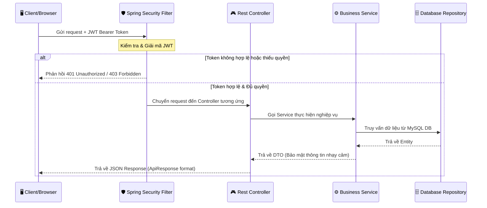
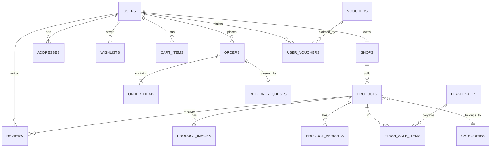
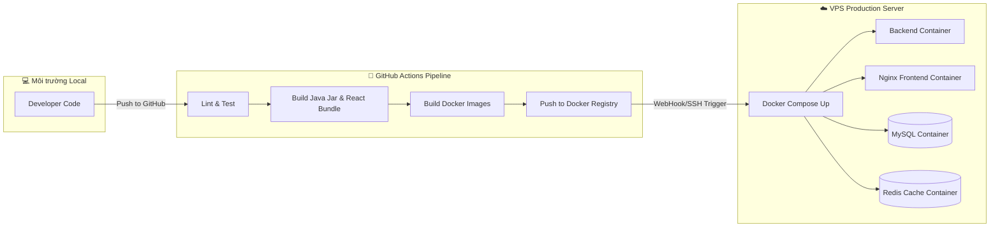

# 📦 E-Commerce Platform — Development Documentation & Continuation Plan

> **Project:** ecommerce-api + ecommerce-frontend  
> **Backend:** Spring Boot 4.1.0 · Java 17 · MySQL · JWT · Spring Security  
> **Frontend:** React 19 · React Router 7 · Context API  
> **Architecture:** Monolithic (hướng tới Modular Monolith)  
> **Cập nhật lần cuối:** 2026-07-04  
> **Trạng thái:** 🟡 Core MVP hoàn thành — Đang tiến hành Audit & Lên Kế hoạch Phase 10+

---

## 📑 Mục lục

1. [Phân Tích Hiện Trạng Hệ Thống](#1-phân-tích-hiện-trạng-hệ-thống)
2. [Báo Cáo Audit Code & Lỗ Hổng Bảo Mật](#2-báo-cáo-audit-code--lỗ-hổng-bảo-mật)
3. [Kiến Trúc Hệ Thống & Phân Quyền API](#3-kiến-trúc-hệ-thống--phân-quyền-api)
4. [Database Schema Mục Tiêu](#4-database-schema-mục-tiêu)
5. [Kế Hoạch Khắc Phục Lỗ Hổng (Phase 10A)](#5-kế-hoạch-khắc-phục-lỗ-hổng-phase-10a)
6. [Kế Hoạch Nâng Cấp Tính Năng (Phase 10B - 10D)](#6-kế-hoạch-nâng-cấp-tính-năng-phase-10b---10d)
7. [Kế Hoạch Triển Khai DevOps & Production (Phase 11)](#7-kế-hoạch-triển-khai-devops--production-phase-11)
8. [Cấu Trúc Thư Mục Chuẩn Hóa](#8-cấu-trúc-thư-mục-chuẩn-hóa)

---

## 1. Phân Tích Hiện Trạng Hệ Thống

Dự án đã trải qua các Phase phát triển từ 1 đến 9, xây dựng được bộ khung nghiệp vụ tương tự như mô hình Shopee. Dưới đây là bảng phân tích những gì thực tế đã có và hoạt động:

### ✅ Nghiệp vụ cốt lõi đã chạy (Phases 1–9)

| Nghiệp vụ | Backend (Spring Boot) | Frontend (React) | Trải nghiệm & Trạng thái |
|-----------|-----------------------|------------------|-------------------------|
| **Xác thực & Bảo mật** | JWT Filter, SecurityConfig, UserRoleConverter | AuthContext (lưu token, userId, username, userRole) | Đăng nhập/Đăng ký chạy tốt. Đã mã hóa mật khẩu. |
| **Sản phẩm & Danh mục** | CRUD API, cây danh mục cha-con, lọc & tìm kiếm | ProductList, ProductDetail, Categories | Hiển thị sản phẩm theo lưới, hỗ trợ phân trang & lọc theo sidebar. |
| **Giỏ hàng (Cart)** | CartItem entity, CartService, CartController | CartContext + Cart Page | Hỗ trợ dual-mode (LocalStorage cho khách vãng lai và DB cho user đã login). Tự động merge giỏ hàng khi login. |
| **Đơn hàng (Order)** | Order, OrderItem, OrderStatus, OrderService | Orders list, OrderDetail, Checkout | Tạo đơn hàng, tự động sinh mã code `ORD-YYYYMMDD-XXXX`, hủy đơn, quản lý trạng thái. |
| **Đánh giá (Review)** | Review, ReviewService | Review form tại trang chi tiết sản phẩm | Chỉ cho phép người dùng đã nhận hàng (DELIVERED) viết đánh giá. |
| **Thông tin cá nhân** | UserController, Profile update | Profile page, Change Password | Cập nhật thông tin cá nhân, đổi mật khẩu, upload ảnh đại diện. |
| **Admin Dashboard** | AdminDashboardController/Service | AdminDashboard page | Xem thống kê tổng quan (doanh thu, đơn hàng, user, sản phẩm), biểu đồ cột doanh thu ngày, quản lý thực thể. |
| **Thanh toán giả lập** | API giả lập MoMo & VNPay | PaymentSimulation page | Mô phỏng cổng thanh toán ngân hàng/ví điện tử, tự động cập nhật trạng thái đơn hàng. |
| **Seller Center** | Shop entity, ShopService, Seller controllers | SellerDashboard page | Đăng ký gian hàng (Shop), người bán CRUD sản phẩm riêng, quản lý đơn hàng của shop, xem báo cáo doanh thu riêng. |
| **Vouchers & Flash Sale**| Voucher, UserVoucher, FlashSale | FlashSale countdown, Voucher checkout | Tạo mã giảm giá (phần trăm/cố định/phí ship), thiết lập sự kiện Flash Sale đếm ngược. |
| **Chat Realtime** | ChatConversation, ChatMessage, ChatService | Messages page (conversation list + chat window) | Hỗ trợ chat buyer ↔ seller. |
| **Địa chỉ & Yêu thích** | Address, Wishlist entities & services | Addresses page, Wishlist page | Quản lý sổ địa chỉ (Address book), lưu sản phẩm yêu thích (Wishlist). |
| **Biến thể & Hoàn trả** | ProductVariant, ReturnRequest, ReturnService | Product Detail variant select, Returns page | Chọn màu/size với giá và tồn kho riêng; gửi yêu cầu trả hàng/hoàn tiền. |

---

## 2. Báo Cáo Audit Code & Lỗ Hổng Bảo Mật

Qua quá trình audit sâu cả codebase Backend và Frontend, chúng tôi đã phát hiện một số lỗ hổng bảo mật nghiêm trọng cùng các lỗi logic nghiệp vụ cần được xử lý ngay lập tức:

### 🔴 Lỗ hổng nghiêm trọng (Critical Vulnerabilities)

#### 2.1 Lỗ hổng phân quyền đăng ký (Privilege Escalation)
* **Vấn đề:** Trong file `AuthService.java` (phương thức `register()`), hệ thống kiểm tra `request.getRole() != null ? request.getRole() : UserRole.CUSTOMER`. File `RegisterRequest.java` cho phép truyền thuộc tính `role` từ client.
* **Hậu quả:** Kẻ tấn công có thể dễ dàng gửi request đăng ký kèm `"role": "ADMIN"` hoặc `"role": "SELLER"` để tự cấp quyền quản trị cao nhất mà không cần phê duyệt.
* **Biện pháp khắc phục:** Loại bỏ trường `role` khỏi `RegisterRequest`, ép buộc giá trị `UserRole.CUSTOMER` trong code xử lý đăng ký của `AuthService`. Muốn lên SELLER hoặc ADMIN phải qua endpoint nâng cấp riêng hoặc trang phê duyệt của Admin.

#### 2.2 Lỗi phục hồi kho hàng biến thể (Variant Stock Defect)
* **Vấn đề:** Trong `OrderService.java` (phương thức `returnStockForOrder()`), khi hủy đơn hàng, hệ thống chỉ hoàn trả lại số lượng kho cho sản phẩm cha (`Product`) mà hoàn toàn bỏ qua thực thể biến thể (`ProductVariant`).
* **Hậu quả:** Tồn kho của biến thể sản phẩm (SKU như Size M, Màu Đỏ) bị mất vĩnh viễn, trong khi số lượng tồn kho của sản phẩm cha lại bị tăng khống một cách vô lý.
* **Biện pháp khắc phục:** Kiểm tra nếu đơn hàng chứa `variantId` thì phải cộng lại tồn kho cho `ProductVariantRepository`, ngược lại mới cộng cho `ProductRepository`.

#### 2.3 JWT Secret Hardcoded trong Source Code
* **Vấn đề:** Trong `JwtProvider.java`, chuỗi ký tự bí mật dùng để ký token JWT (`"ChuoidebaoMatSieuCapVipProNhatDinhKhongDuocDeLo123456789"`) đang bị viết trực tiếp vào mã nguồn.
* **Hậu quả:** Nếu mã nguồn bị rò rỉ (ví dụ lộ repository trên GitHub), kẻ xấu có thể ký giả mạo bất kỳ JWT token nào để đăng nhập với tư cách ADMIN.
* **Biện pháp khắc phục:** Chuyển khóa bí mật này ra biến môi trường hoặc file cấu hình ẩn: `@Value("${jwt.secret}")` với cấu hình fallback an toàn.

#### 2.4 Lộ thông tin & Sai phân quyền Endpoint Đơn hàng (Security Bypass)
* **Vấn đề:** Trong `SecurityConfig.java`, endpoint `GET /api/orders/**` được cấu hình là `permitAll()`.
* **Hậu quả:** Mặc dù Service có lấy userId từ JWT để truy vấn dữ liệu, việc mở hoàn toàn endpoint này ở tầng filter bảo mật là một lỗ hổng thiết kế lớn. Đồng thời, `/api/admin/**` chưa được phân quyền tường minh ở SecurityConfig mà đang rơi vào catch-all `authenticated()`.
* **Biện pháp khắc phục:** Cấu hình lại SecurityConfig, chỉ cho phép các request đến `/api/orders/**` khi đã xác thực (`authenticated()`), và `/api/admin/**` phải yêu cầu `hasRole('ADMIN')`.

---

### 🟡 Lỗ hổng trung bình & Lỗi kiến trúc (Medium & Architecture Issues)

#### 2.5 Bỏ qua Axios Interceptor trên Frontend
* **Vấn đề:** Các trang quan trọng như `Login.jsx`, `Register.jsx`, `SellerDashboard.jsx`, và `Messages.jsx` đang sử dụng hàm `fetch()` thô hoặc instance `axios` mới tự định nghĩa với URL hardcode `http://localhost:8080`.
* **Hậu quả:** Bỏ qua hoàn toàn cấu hình Interceptor tập trung tại `services/api.js`. Khi token hết hạn, các trang này không thể tự động xử lý lỗi 401 hoặc đính kèm token JWT đúng cách. Đồng thời gây khó khăn khi triển khai dự án lên domain production.
* **Biện pháp khắc phục:** Thay thế toàn bộ bằng instance `api` từ `services/api.js`.

#### 2.6 File Monolith quá lớn (Chất lượng Code kém)
* **Vấn đề:** `AdminDashboard.jsx` (49KB, ~1500 dòng) và `SellerDashboard.jsx` (39KB, ~1200 dòng) đang là các file đơn cực lớn chứa toàn bộ UI, State, và logic gọi API của hàng chục tab chức năng khác nhau.
* **Hậu quả:** Code cực kỳ khó bảo trì, dễ phát sinh lỗi khi thay đổi giao diện, hiệu năng render bị ảnh hưởng nghiêm trọng.
* **Biện pháp khắc phục:** Tách các màn hình quản lý này thành các thư mục component con (Ví dụ: `admin/ProductsTable.jsx`, `admin/UsersTable.jsx`, v.v.) và dùng React Router sub-routes thay vì quản lý bằng tab state `activeTab`.

#### 2.7 Chat Realtime thực tế đang dùng Polling
* **Vấn đề:** Mặc dù backend đã tích hợp WebSocket STOMP, trang `Messages.jsx` ở frontend lại đang dùng hàm `setInterval` gọi API REST liên tục mỗi 3 giây để lấy tin nhắn mới (HTTP Polling).
* **Hậu quả:** Tạo ra lượng request cực lớn làm nghẽn server (nhiều user chat cùng lúc), không đạt được trải nghiệm chat tức thời (realtime) đúng nghĩa.
* **Biện pháp khắc phục:** Kết nối WebSocket STOMP client trên frontend và subscribe kênh `/topic/chat/{conversationId}` để nhận tin nhắn realtime.

#### 2.8 Lỗi logic điều hướng URL tìm kiếm
* **Vấn đề:** Trong `ProductList.jsx`, state `searchTerm` không nằm trong danh sách dependency của `useEffect` kích hoạt fetch sản phẩm.
* **Hậu quả:** Khi người dùng truy cập trực tiếp bằng đường dẫn URL dạng `/products?name=Laptop`, trang web sẽ không tự động kích hoạt tìm kiếm mà hiển thị toàn bộ sản phẩm cho tới khi họ click nút Tìm kiếm.
* **Biện pháp khắc phục:** Thêm logic phân tích `location.search` và đưa tham số URL vào dependency array của fetch API.

#### 2.9 Thiếu Repository và xử lý Cascade cho ProductImage
* **Vấn đề:** Entity `ProductImage` tồn tại nhưng không có `ProductImageRepository`. Các thao tác lưu ảnh phụ thuộc hoàn toàn vào cơ chế Cascade của `Product`.
* **Hậu quả:** Không thể xóa hoặc sắp xếp lại thứ tự hình ảnh (`sortOrder`) một cách linh hoạt mà phải cập nhật lại toàn bộ Product.
* **Biện pháp khắc phục:** Tạo `ProductImageRepository` và xây dựng API quản lý ảnh độc lập.

---

## 3. Kiến Trúc Hệ Thống & Phân Quyền API

Hệ thống E-Commerce hiện tại hoạt động theo luồng sau:



### Bản Đồ Phân Quyền API (API Security Map)

| Đường dẫn API | Phương thức | Quyền truy cập tối thiểu | Lý do / Chức năng |
|---|---|---|---|
| `/api/auth/**` | ALL | `permitAll()` | Đăng nhập, đăng ký tài khoản |
| `/api/products/**` | GET | `permitAll()` | Xem danh sách & chi tiết sản phẩm |
| `/api/categories/**` | GET | `permitAll()` | Xem danh sách danh mục sản phẩm |
| `/api/shops/{slug}/**` | GET | `permitAll()` | Xem thông tin gian hàng người bán |
| `/api/flash-sales/active` | GET | `permitAll()` | Xem sản phẩm đang chạy Flash Sale |
| `/uploads/**` | GET | `permitAll()` | Phục vụ file ảnh tĩnh từ ổ đĩa local |
| `/api/cart/**` | ALL | `authenticated()` | Thêm, sửa, xóa giỏ hàng cá nhân |
| `/api/orders/**` | ALL | `authenticated()` | Đặt hàng, xem đơn hàng cá nhân, hủy đơn |
| `/api/users/profile` | GET, PUT | `authenticated()` | Cập nhật thông tin profile cá nhân |
| `/api/wishlist/**` | ALL | `authenticated()` | Quản lý danh sách sản phẩm yêu thích |
| `/api/addresses/**` | ALL | `authenticated()` | Quản lý sổ địa chỉ giao hàng cá nhân |
| `/api/chat/**` | ALL | `authenticated()` | Gửi tin nhắn, load danh sách hội thoại |
| `/api/seller/**` | ALL | `hasRole('SELLER')` | Quản lý sản phẩm, đơn hàng của shop |
| `/api/admin/**` | ALL | `hasRole('ADMIN')` | Dashboard tổng quan hệ thống, duyệt shop |
| `/api/products/**` | POST, PUT, DELETE | `hasRole('ADMIN')` | Quản trị viên cập nhật danh mục hệ thống |

---

## 4. Database Schema Mục Tiêu

Hệ thống quản lý dữ liệu thông qua cơ sở dữ liệu quan hệ MySQL, lược đồ các bảng chính được liên kết như sau:



---

## 5. Kế Hoạch Khắc Phục Lỗ Hổng (Phase 10A)

> **Mục tiêu chính:** Vá triệt để các lỗ hổng bảo mật nghiêm trọng (Critical) và cấu trúc lại mã nguồn lỗi (Refactor) để đảm bảo hệ thống vận hành an toàn và ổn định.
> **Thời gian dự kiến:** 3 - 4 ngày.

### 🔖 Task 1: Vá lỗ hổng phân quyền & rò rỉ JWT Secret
* **Backend:**
  - Cập nhật `AuthService.register()` để ép cứng quyền `UserRole.CUSTOMER` cho mọi tài khoản đăng ký mới. Loại bỏ hoặc bỏ qua giá trị `role` từ request body của client.
  - Sửa đổi `JwtProvider.java` để nạp khóa bí mật bằng `@Value("${jwt.secret}")` thay vì hardcode chuỗi.
  - Thêm cấu hình JWT Secret an toàn vào file `application.properties`:
    ```properties
    jwt.secret=${JWT_SECRET:ChuoidebaoMatSieuCapVipProNhatDinhKhongDuocDeLo123456789}
    ```
* **Frontend:**
  - Sửa đổi `Login.jsx` và `Register.jsx`: Chuyển sang sử dụng `authService.js` (hoặc instance `api` dùng chung) thay thế cho hàm `fetch()` với URL tĩnh.
  - Đảm bảo logic login gọi qua `authContext.login(...)` để cập nhật đồng bộ React State thay vì ghi đè thô lên `localStorage`.

### 🔖 Task 2: Khắc phục lỗi Stock & Order Logic
* **Backend:**
  - Cập nhật phương thức hoàn kho `returnStockForOrder()` trong `OrderService.java`. Thêm logic kiểm tra xem sản phẩm được hủy có phải là biến thể (`ProductVariant`) hay không. Nếu có, cộng lại tồn kho cho biến thể; nếu không, mới cộng cho sản phẩm cha.
  - Cấu hình lại `SecurityConfig.java` để bảo vệ endpoint `/api/orders/**` (yêu cầu xác thực `authenticated()`).
  - Sửa lỗi logic so sánh chuỗi phân quyền ADMIN trong `OrderService.getOrderById` (chuyển `"Admin"` thành `"ADMIN"` khớp với tên Enum của `UserRole`).
  - Sử dụng khóa bi quan (Pessimistic Locking) bằng cách thêm `@Lock(LockModeType.PESSIMISTIC_WRITE)` vào phương thức truy vấn sản phẩm của repository để tránh lỗi Race Condition khi nhiều khách hàng cùng thanh toán một mặt hàng có số lượng tồn kho ít.

### 🔖 Task 3: Tách cấu trúc file Monolith khổng lồ
* **Frontend:**
  - Tách file `SellerDashboard.jsx` thành thư mục `src/pages/seller/` chứa các component nhỏ hơn:
    - `SellerOverview.jsx` (Thống kê doanh số, biểu đồ cột)
    - `SellerProducts.jsx` (Bảng quản lý sản phẩm, nút thêm/sửa/xóa sản phẩm)
    - `SellerOrders.jsx` (Bảng xác nhận & quản lý trạng thái đơn hàng của shop)
    - `SellerReturns.jsx` (Xử lý các yêu cầu hoàn trả hàng)
  - Tách file `AdminDashboard.jsx` thành thư mục `src/pages/admin/` chứa các component nhỏ tương tự cho quyền Admin hệ thống.
  - Cấu hình sub-routes trong React Router (React Router DOM v7) thay vì sử dụng state `activeTab` để thay đổi giao diện. Ví dụ: `/seller/products`, `/seller/orders`, `/admin/users`.
  - Thay thế toàn bộ các API call trực tiếp bằng instance `api.js` đã được cấu hình interceptor đính kèm JWT token.

### 🔖 Task 4: Chuyển đổi Chat sang WebSocket Realtime
* **Frontend:**
  - Thay thế cơ chế HTTP Polling (gọi API mỗi 3 giây một lần) trong `Messages.jsx` bằng kết nối WebSocket STOMP.
  - Tích hợp thư viện `@stomp/stompjs` và `sockjs-client`. Khi mở cửa sổ chat, tiến hành kết nối đến endpoint `/ws` và subscribe kênh `/topic/chat/{conversationId}` để nhận tin nhắn mới ngay lập tức.
  - Khắc phục lỗi hiển thị vòng xoay tải trang (loading spinner) trong `Messages.jsx` bằng cách đưa lệnh gọi API async vào block `await` trước khi tắt trạng thái tải trang.

---

## 6. Kế Hoạch Nâng Cấp Tính Năng (Phase 10B - 10D)

> **Mục tiêu:** Nâng cấp các tính năng phụ trợ quan trọng giúp hệ thống tiệm cận hơn với tiêu chuẩn trải nghiệm của các sàn TMĐT lớn.
> **Thời gian dự kiến:** 5 - 7 ngày.

### Phase 10B: Tìm kiếm nâng cao & Tối ưu hóa trải nghiệm tìm kiếm
* **Backend:**
  - Triển khai giải pháp MySQL Full-Text Search hoặc sử dụng `Specification` của JPA để hỗ trợ tìm kiếm nâng cao theo nhiều tiêu chí kết hợp (khoảng giá, danh mục con, đánh giá sao, nhãn sản phẩm).
  - Tạo bảng lưu lịch sử tìm kiếm của người dùng (`SearchHistory`) để phục vụ tính năng cá nhân hóa gợi ý sản phẩm.
* **Frontend:**
  - Thêm tính năng gợi ý từ khóa (Autocomplete) khi người dùng gõ trên thanh tìm kiếm của Navbar (áp dụng kỹ thuật `debounce` 300ms để tránh spam request lên server).
  - Xây dựng giao diện trang `/search` hiển thị kết quả kèm bộ lọc chi tiết dạng sidebar.

### Phase 10C: Xây dựng Design System & Thư viện Component dùng chung
* **Frontend:**
  - Tập hợp toàn bộ CSS Variables định nghĩa màu sắc chủ đạo, khoảng cách (spacing), font chữ, độ bo góc vào file `src/styles/tokens.css` để dễ dàng bảo trì hoặc chuyển đổi giao diện Dark/Light mode sau này.
  - Xây dựng thư mục component dùng chung `src/components/ui/` bao gồm:
    - `Button.jsx` (Hỗ trợ nhiều kiểu dáng: primary, secondary, danger, outline; tích hợp hiệu ứng loading spinner)
    - `Input.jsx` / `Select.jsx` (Giao diện chuẩn hóa, hiển thị thông báo validate lỗi)
    - `Modal.jsx` (Hộp thoại xác nhận hành động có hiệu ứng chuyển cảnh mượt mà)
    - `Toast.jsx` (Hệ thống thông báo đẩy góc màn hình thay thế cho hàm `alert()` mặc định của trình duyệt)

### Phase 10D: Tích hợp Token Refresh & Quy trình Vận chuyển Thực tế
* **Backend & Frontend:**
  - **Token Rotation:** Triển khai cơ chế Refresh Token lưu trữ trong database. Khi Token JWT hết hạn (24h), client sẽ tự động gọi API `/api/auth/refresh-token` gửi kèm Refresh Token để nhận cặp token mới một cách âm thầm (Silent Refresh) mà không cần bắt người dùng đăng nhập lại từ đầu.
  - **Trạng thái giao hàng:** Bổ sung thực thể `OrderStatusHistory` ghi lại mốc thời gian của từng bước giao nhận. Hiển thị thanh tiến trình (Stepper Timeline) trực quan trên giao diện chi tiết đơn hàng của người dùng.

---

## 7. Kế Hoạch Triển Khai DevOps & Production (Phase 11)

> **Mục tiêu:** Chuẩn bị môi trường sản xuất (Production Ready) cho toàn bộ hệ thống giúp quá trình vận hành lâu dài ổn định, an toàn và dễ bảo trì.
> **Thời gian dự kiến:** 5 ngày.



### 🐳 Container hóa với Docker
* Viết file `Dockerfile` tối ưu hóa đa giai đoạn (Multi-stage build) cho dự án backend (JDK 17 Maven) và frontend (sử dụng Nginx để phục vụ file React tĩnh và cấu hình proxy chuyển tiếp request).
* Tạo file `docker-compose.yml` định nghĩa toàn bộ hạ tầng gồm các dịch vụ liên kết:
  1. `ecommerce-api` (Spring Boot App)
  2. `ecommerce-frontend` (Nginx + React App)
  3. `mysql-db` (Cơ sở dữ liệu chính)
  4. `redis-cache` (Dùng để lưu phiên đăng nhập, bộ đếm số lượng Flash Sale và danh sách danh mục để tăng tốc độ phản hồi API)

### 🚀 Thiết lập CI/CD & Cấu hình Production
* Cài đặt GitHub Actions workflow tự động chạy kiểm thử đơn vị (Unit Tests), tự động đóng gói ứng dụng thành Docker Image và đẩy lên Docker Registry mỗi khi có commit mới merge vào nhánh `main`.
* Cấu hình phân tách môi trường phát triển (Development) và sản xuất (Production):
  - Chuyển `spring.jpa.hibernate.ddl-auto` sang chế độ `validate` trong file `application-prod.properties`.
  - Tắt logs câu lệnh SQL: `spring.jpa.show-sql=false`.
  - Thiết lập chứng chỉ bảo mật HTTPS SSL tự động gia hạn với Let's Encrypt trên VPS.

---

## 8. Cấu Trúc Thư Mục Chuẩn Hóa

Để hệ thống dễ quản lý và mở rộng theo mô hình Modular Monolith, chúng tôi sẽ tái cấu trúc thư mục dự án theo định dạng sau:

### Backend Structure
```
src/main/java/com/ecommerce/ecommerceapi/
├── EcommerceApiApplication.java
├── config/                  ← Các file cấu hình hệ thống
│   ├── WebConfig.java        ← Serve static uploads
│   ├── WebSocketConfig.java  ← WebSocket Broker
│   └── RateLimitConfig.java  ← Rate limiting
├── controller/              ← REST API controllers (được phân tách an toàn)
├── dto/                     ← Data Transfer Objects
├── entity/                  ← JPA Entities đại diện cho bảng DB
├── exception/               ← Xử lý lỗi toàn cục
├── repository/              ← Tương tác với cơ sở dữ liệu
├── security/                ← Xử lý bảo mật, bộ lọc JWT
└── service/                 ← Xử lý nghiệp vụ chính của các domain
```

### Frontend Structure
```
ecommerce-frontend/src/
├── App.js                   ← Định nghĩa routes và layouts chính
├── index.js                 ← Điểm khởi đầu ứng dụng
├── index.css                ← CSS toàn cục
├── components/
│   ├── ui/                  ← Thư viện component dùng chung (Button, Toast, Modal)
│   ├── layout/              ← Layouts (MainLayout, AuthLayout, UserLayout, SellerLayout)
│   └── common/              ← Component nghiệp vụ (ProductCard, Breadcrumb)
├── pages/
│   ├── home/                ← Trang chủ hiển thị Flash Sale & danh mục
│   ├── product/             ← Màn hình danh sách & chi tiết sản phẩm
│   ├── cart/                ← Quản lý giỏ hàng
│   ├── checkout/            ← Thanh toán đơn hàng & xác nhận
│   ├── auth/                ← Màn hình đăng nhập & đăng ký tài khoản
│   ├── user/                ← Profile, Sổ địa chỉ, Wishlist
│   ├── seller/              ← Thư mục chứa component con của Seller Dashboard
│   ├── admin/               ← Thư mục chứa component con của Admin Dashboard
│   └── chat/                ← Màn hình hội thoại buyer - seller
├── services/                ← API client services cho từng domain riêng biệt
│   ├── api.js               ← Axios client trung tâm với Interceptors
│   ├── authService.js
│   ├── productService.js
│   ├── sellerService.js     ← [MỚI] API tương tác cho người bán
│   ├── chatService.js       ← [MỚI] API tin nhắn chat
│   └── ...
├── context/                 ← Trạng thái toàn cục (Auth, Cart, Notification)
└── utils/                   ← Hàm bổ trợ dùng chung (VND formatter, date formatter)
```

---

> **Lưu ý triển khai:** Kế hoạch Phase 10A sẽ được tiến hành ngay lập tức. Đây là nền tảng cốt lõi giúp hệ thống của bạn an toàn trước các cuộc tấn công chiếm quyền quản trị và lỗi lệch dữ liệu tồn kho nghiêm trọng. Sau khi hoàn thành Phase 10A, chúng tôi sẽ lần lượt triển khai các Phase tiếp theo theo đúng lộ trình đã đề ra.
