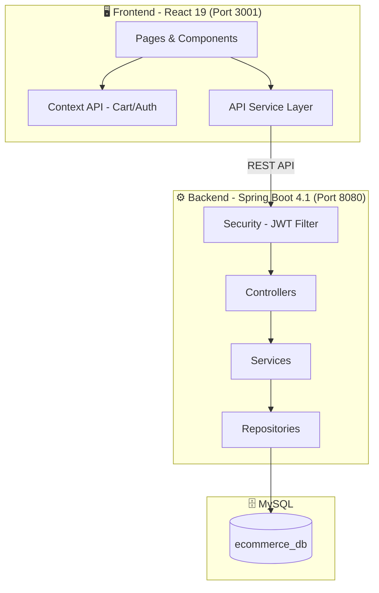
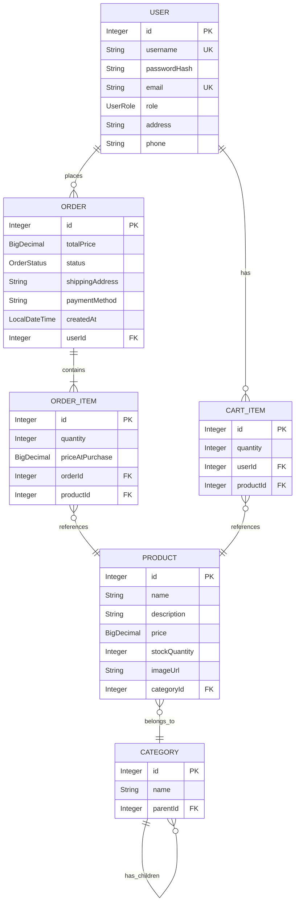
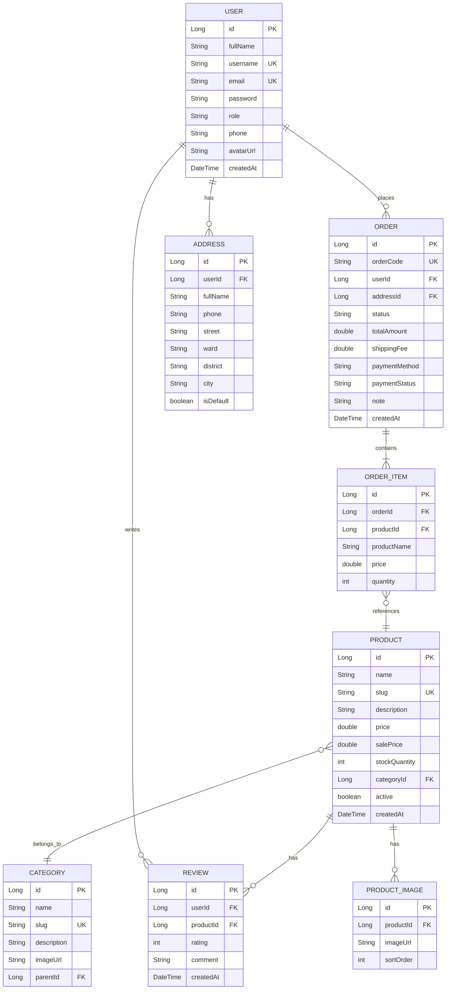
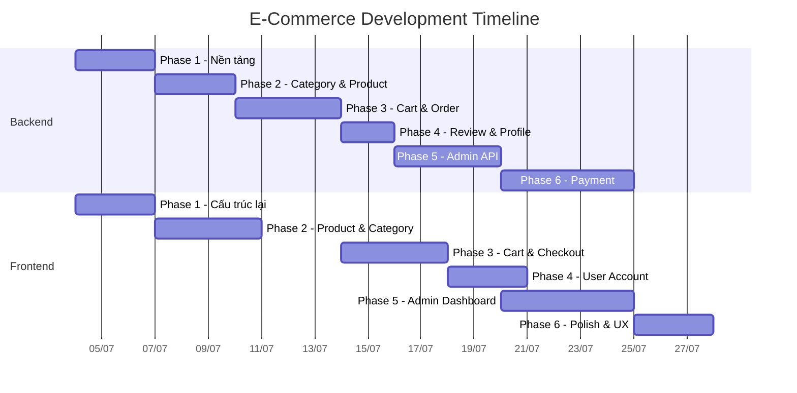

# 📦 E-Commerce Platform — Development Plan

> **Project:** ecommerce-api + ecommerce-frontend  
> **Backend:** Spring Boot 4.1.0 · Java 17 · MySQL · JWT · Spring Security  
> **Frontend:** React 19 · React Router 7 · Context API  
> **Ngày tạo:** 2026-07-03  
> **Trạng thái:** 🟡 Đang phát triển

---

## 📑 Mục lục

1. [Tổng quan hiện trạng](#1-tổng-quan-hiện-trạng)
2. [Kiến trúc hệ thống](#2-kiến-trúc-hệ-thống)
3. [Plan Backend (Spring Boot)](#3-plan-backend-spring-boot)
4. [Plan Frontend (React)](#4-plan-frontend-react)
5. [Tiến trình thực hiện](#5-tiến-trình-thực-hiện)

---

## 1. Tổng quan hiện trạng

### 🟢 Đã hoàn thành

| Tính năng | Backend | Frontend |
|-----------|---------|----------|
| Đăng ký tài khoản | ✅ `POST /api/auth/register` | ✅ Form (⚠️ gửi `passwordHash` thay vì `password`) |
| Đăng nhập | ✅ `POST /api/auth/login` + JWT | ✅ Form + lưu token localStorage |
| CRUD Sản phẩm | ✅ Full CRUD API | ✅ Xem danh sách + chi tiết |
| CRUD Danh mục | ✅ Full CRUD API + tree (cha-con) | ❌ Chưa có UI |
| Giỏ hàng (client) | ⚠️ Entity `CartItem` có nhưng chưa có Repo/Service/Controller | ✅ CartContext + localStorage (⚠️ cart API code là dead code) |
| CORS | ✅ `@CrossOrigin("*")` trên controllers | ✅ |

### 🟡 Có nhưng chưa hoàn chỉnh

| Tính năng | Backend | Ghi chú |
|-----------|---------|----------|
| JWT Authentication | ⚠️ `JwtProvider` tạo/validate token, **NHƯNG không có JWT Filter trong SecurityConfig** | Token được tạo nhưng không bao giờ được kiểm tra ở request đến |
| Order entities | ⚠️ Entity `Order`, `OrderItem`, `OrderStatus` đã có | **Chưa có Repository, Service, Controller** — chỉ là class rỗng |
| CartItem entity | ⚠️ Entity `CartItem` đã có | **Chưa có Repository, Service, Controller** |
| User role system | ⚠️ `UserRole` enum (ADMIN, CUSTOMER) + `UserRoleConverter` | Nhưng không có `@PreAuthorize`, tất cả endpoint đều public |

### 🔴 Chưa có

| Tính năng | Backend | Frontend |
|-----------|---------|----------|
| Trang giỏ hàng | — | ❌ (Navbar link `/cart` nhưng không có page!) |
| Checkout flow | ❌ | ❌ |
| Order API (create/list/detail) | ❌ (chỉ có entity) | ❌ |
| Thanh toán | ❌ | ❌ |
| Trang user profile | ❌ | ❌ |
| Auth Context | — | ❌ (không biết user đã login chưa) |
| Protected Routes | ❌ (tất cả public) | ❌ |
| Admin dashboard | ❌ | ❌ |
| Tìm kiếm / Lọc sản phẩm | ❌ | ❌ |
| Phân trang (Pagination) | ❌ | ❌ |
| Upload ảnh | ❌ | ❌ |
| Đánh giá sản phẩm (Review) | ❌ | ❌ |
| Xử lý lỗi tập trung | ❌ (không có `@ControllerAdvice`) | ❌ |
| DTOs | ❌ (expose entity trực tiếp, bao gồm `passwordHash`!) | — |
| API Documentation (Swagger) | ❌ | — |
| Trang 404 | — | ❌ |
| Logout | — | ❌ |

### 🐛 Bugs đã phát hiện

| File | Bug | Mức độ |
|------|-----|--------|
| `NavbarLogin.jsx` | Dùng `class` thay vì `className` trong JSX | 🔴 Lỗi React |
| `NavbarLogin.jsx` | Typo `classtar0="back-button"` thay vì `className` | 🔴 CSS không hoạt động |
| `Register.jsx` | Gửi `passwordHash` thay vì `password` trong request body | 🟡 Sai field name |
| `Login.jsx` | Language modal: nút English hiện cờ Vietnam thay vì US | 🟡 UI sai |
| `ProductList.jsx` | Debug border xanh `2px dashed green` và text debug | 🟡 Cần xóa |
| `CartContext.jsx` | Cart API cho logged-in user không bao giờ chạy vì `userId` không được lưu từ Login | 🔴 Dead code |
| `AuthService.java` | Check `findByUsername()` duplicate 2 lần | 🟡 Code thừa |
| `User.java` + `SecurityConfig` | `@Enumerated(STRING)` + `UserRoleConverter` cùng lúc, có thể xung đột | 🟡 Potential issue |

---

## 2. Kiến trúc hệ thống

### Database Schema hiện tại

> [!NOTE]
> Các entity `Order`, `OrderItem`, `CartItem` đã được define nhưng **chưa có Repository/Service/Controller**.
> `OrderStatus` enum: `PENDING`, `SHIPPING`, `DELIVERED`, `CANCELLED`

### Database Schema mục tiêu (bổ sung thêm)

---

## 3. Plan Backend (Spring Boot)

### Phase 1: 🔧 Sửa bugs & Hoàn thiện Security (ƯU TIÊN CAO NHẤT) [ĐÃ HOÀN THÀNH]
> **Ước lượng:** 2-3 ngày

- [x] **🔴 Hoàn thiện JWT Authentication**
  - [x] Tạo `JwtAuthFilter` extends `OncePerRequestFilter`
  - [x] Đăng ký filter vào `SecurityConfig` trước `UsernamePasswordAuthenticationFilter`
  - [x] Chỉ permit `/api/auth/**` public, các endpoint khác yêu cầu JWT
  - [x] Xóa `@CrossOrigin("*")` trên controllers, config CORS tập trung trong `SecurityConfig`

- [x] **🔴 Sửa bug `UserRoleConverter` xung đột**
  - [x] Xóa `@Enumerated(EnumType.STRING)` trong `User` entity
  - [x] Đảm bảo role mapping đồng bộ với DB

- [x] **🔴 Tạo DTOs — không expose entity trực tiếp**
  - [x] `UserDTO` (không bao gồm `passwordHash`)
  - [x] `LoginRequest`, `LoginResponse`, `RegisterRequest`, `RegisterResponse`
  - [x] `ProductDTO`, `CategoryDTO`, `OrderDTO`

- [x] **Global Exception Handling**
  - [x] Tạo `GlobalExceptionHandler` (`@RestControllerAdvice`)
  - [x] Custom exceptions: `ResourceNotFoundException`, `BadRequestException`, `DuplicateResourceException`
  - [x] Response format chuẩn: `ApiResponse<T>` với `success`, `message`, `data`, `errors`

- [x] **Input Validation**
  - [x] Thêm `spring-boot-starter-validation`
  - [x] Annotate DTOs: `@NotBlank`, `@Email`, `@Size`
  - [x] Sửa duplicate username check trong `AuthService.register()`

- [x] **Cấu hình bảo mật**
  - [x] Di chuyển JWT secret ra `application.properties` hoặc environment variable
  - [x] Phân quyền endpoint: ADMIN mới được tạo/sửa/xóa sản phẩm
  - [x] Thêm role-based access control (`@PreAuthorize`)

- [x] **API Documentation**
  - [x] Tích hợp `springdoc-openapi` (Swagger UI)
  - [x] Cấu hình các path Swagger trong SecurityConfig

- [x] **Cải thiện User entity**
  - [x] Thêm fields: `avatarUrl`, `createdAt`, `updatedAt`
  - [x] Thêm `@CreatedDate`, `@LastModifiedDate` (JPA Auditing) vầ kích hoạt ở Class Main

---

### Phase 2: 📦 Nâng cấp Category & Product [ĐÃ HOÀN THÀNH]
> **Ước lượng:** 2-3 ngày

- [x] **Nâng cấp Category** (đã có CRUD cơ bản)
  - [x] Thêm fields: `slug`, `description`, `imageUrl`
  - [x] Endpoint lấy tree structure (`/api/categories/tree`)
  - [x] Endpoint lấy sản phẩm theo category (`/api/products/category/{categoryId}`)

- [x] **Nâng cấp Product**
  - [x] Thêm fields: `slug`, `salePrice`, `active`, `createdAt`
  - [x] Entity `ProductImage` cho nhiều ảnh
  - [x] Tránh warning Lombok Builder bằng `@Builder.Default`

- [x] **Product Search & Filter**
  - [x] Tìm kiếm theo tên (`LIKE` case-insensitive)
  - [x] Lọc theo category, khoảng giá, trạng thái active
  - [x] Sắp xếp: giá tăng/giảm, mới nhất
  - [x] Phân trang với `Pageable` + `Page<Product>`

- [x] **Upload ảnh**
  - [x] Endpoint `POST /api/upload` nhận `MultipartFile`
  - [x] Lưu file vào thư mục local `uploads` và cấu hình phục vụ static trong `WebConfig`
  - [x] Phân quyền cho phép truy cập nặc danh vào `/uploads/**` để xem ảnh

---

### Phase 3: 🛒 Giỏ hàng & Đơn hàng [ĐÃ HOÀN THÀNH]
> **Ước lượng:** 3-4 ngày

- [x] **Cart API (Server-side)** — Entity `CartItem` đã có, cần tạo:
  - [x] Repository: `CartItemRepository`
  - [x] Service: `CartService`
  - [x] Controller: `CartController`
  - [x] Endpoints:
    - [x] `GET /api/cart` — Lấy giỏ hàng của user hiện tại (từ JWT)
    - [x] `POST /api/cart/items` — Thêm sản phẩm vào giỏ (đảm bảo kiểm tra tồn kho)
    - [x] `PUT /api/cart/items/{id}` — Cập nhật số lượng
    - [x] `DELETE /api/cart/items/{id}` — Xóa item
    - [x] `DELETE /api/cart` — Xóa toàn bộ giỏ
    - [x] `POST /api/cart/merge` — Đồng bộ giỏ hàng offline của khách vãng lai sau khi đăng nhập

- [x] **Address Module** (User entity đã có field `address` dạng TEXT)
  - [x] Giữ nguyên `shippingAddress` dạng TEXT trong bảng `orders` cho MVP của hệ thống

- [x] **Order API** — Entity `Order`, `OrderItem`, `OrderStatus` đã có, cần tạo:
  - [x] Repository: `OrderRepository`, `OrderItemRepository`
  - [x] Service: `OrderService`
  - [x] Controller: `OrderController`
  - [x] Endpoints:
    - [x] `POST /api/orders` — Tạo đơn từ giỏ hàng
    - [x] `GET /api/orders` — Lịch sử đơn hàng (user)
    - [x] `GET /api/orders/{id}` — Chi tiết đơn
    - [x] `PUT /api/orders/{id}/status` — Cập nhật trạng thái (ADMIN)
    - [x] `PUT /api/orders/{id}/cancel` — Hủy đơn (người dùng)
  - [x] Order status flow hiện tại: `PENDING → SHIPPING → DELIVERED` hoặc `CANCELLED`
  - [x] Auto generate `orderCode` (format: `ORD-YYYYMMDD-XXXX` thông qua hàm generate UUID 4 ký tự viết tắt)
  - [x] Trừ `stockQuantity` khi đặt hàng, tự động hoàn stock khi hủy đơn hàng (CANCELLED)

---

### Phase 4: ⭐ Review & User Profile [ĐÃ HOÀN THÀNH]
> **Ước lượng:** 2 ngày

- [x] **Review Module**
  - [x] Entity: `Review` (id, rating 1-5, comment, user, product, createdAt)
  - [x] Endpoints:
    - [x] `POST /api/products/{id}/reviews` — Viết đánh giá
    - [x] `GET /api/products/{id}/reviews` — Xem đánh giá của sản phẩm
  - [x] Chỉ cho đánh giá khi người dùng đã mua hàng (đơn hàng ở trạng thái `DELIVERED` chứa sản phẩm đó)
  - [x] Đã cấu hình cho phép người dùng bình thường viết review trong `SecurityConfig`

- [x] **User Profile**
  - [x] `GET /api/users/profile` — Lấy thông tin tài khoản hiện tại
  - [x] `PUT /api/users/profile` — Cập nhật thông tin (email, phone, address, avatarUrl)
  - [x] `PUT /api/users/change-password` — Đổi mật khẩu bảo mật (mã hóa kiểm tra bằng `PasswordEncoder`)
  - [x] Tích hợp Upload ảnh trực tiếp thông qua API `/api/upload` dùng chung cho avatar của user

---

### Phase 5: 👑 Admin Dashboard API
> **Ước lượng:** 3-4 ngày

- [ ] **Dashboard Statistics**
  - `GET /api/admin/dashboard` — Tổng quan: doanh thu, đơn hàng, user, sản phẩm
  - `GET /api/admin/dashboard/revenue` — Biểu đồ doanh thu theo ngày/tháng

- [ ] **User Management (Admin)**
  - `GET /api/admin/users` — Danh sách user (phân trang)
  - `PUT /api/admin/users/{id}/role` — Thay đổi role
  - `PUT /api/admin/users/{id}/status` — Khóa/mở tài khoản

- [ ] **Order Management (Admin)**
  - `GET /api/admin/orders` — Tất cả đơn hàng (filter theo status)
  - `PUT /api/admin/orders/{id}/status` — Cập nhật trạng thái đơn

- [ ] **Product Management (Admin)**
  - Tất cả CRUD đã có, thêm phân quyền `ADMIN`

---

### Phase 6: 💳 Thanh toán & Nâng cao
> **Ước lượng:** 3-5 ngày

- [ ] **Payment Integration**
  - Tích hợp VNPay hoặc Momo (sandbox)
  - Endpoint: `POST /api/payments/create`
  - Callback URL xử lý kết quả thanh toán
  - Cập nhật `paymentStatus` trên Order

- [ ] **Email Notification**
  - Gửi email xác nhận đăng ký
  - Gửi email xác nhận đơn hàng
  - Sử dụng `spring-boot-starter-mail`

- [ ] **Caching**
  - Redis cache cho danh sách sản phẩm, categories
  - `@Cacheable`, `@CacheEvict`

- [ ] **Rate Limiting**
  - Giới hạn số request/phút cho auth endpoints

---

## 4. Plan Frontend (React)

### Phase 1: 🏗️ Sửa bugs & Cấu trúc lại nền tảng [ĐÃ HOÀN THÀNH]
> **Ước lượng:** 2-3 ngày

- [x] **🔴 Sửa bugs hiện tại**
  - [x] `NavbarLogin.jsx`: Sửa `class` → `className`, sửa `classtar0` → `className`
  - [x] `Register.jsx`: Sửa field `passwordHash` → `password` trong request body
  - [x] `Login.jsx`: Sửa flag icon English (dùng `us.png` thay `vn.png`)
  - [x] `ProductList.jsx`: Xóa debug border xanh và debug text
  - [x] `CartContext.jsx`: Lưu `userId` sau khi login để cart API hoạt động

- [x] **API Service Layer**
  - [x] Tạo `src/services/api.js` — base config với `axios`
  - [x] Interceptor tự động gắn JWT token vào header `Authorization: Bearer <token>`
  - [x] Interceptor xử lý lỗi 401 (redirect login)
  - [x] Các service files: `authService.js`, `productService.js`
  - [x] Sử dụng biến môi trường `REACT_APP_API_URL` thay vì hardcode `http://localhost:8080`

- [x] **Auth Context**
  - [x] Tạo `src/context/AuthContext.jsx`
  - [x] Quản lý trạng thái đăng nhập: `user`, `token`, `isAuthenticated`, `isAdmin`
  - [x] `login()`, `logout()`, `register()` functions
  - [x] Lưu `userId` vào state để CartContext sử dụng

- [x] **Protected Routes**
  - [x] Component `PrivateRoute` — redirect tới `/login` nếu chưa đăng nhập
  - [x] Component `AdminRoute` — chỉ cho admin truy cập
  - [x] Áp dụng cho trang cart, checkout, profile, admin

- [x] **Layout System** (hiện có `MainLayout` + `NavbarLogin`)
  - [x] Cải thiện `MainLayout` — Navbar thay đổi theo trạng thái login
  - [x] Tạo `AuthLayout` — cho login/register (dùng `NavbarLogin` đã sửa bug)
  - Tạo `AdminLayout` — cho admin panel (sidebar + topbar)

- [ ] **Design System** (hiện tại: 99% inline styles, 1 CSS file `NavbarLogin.css`)
  - Chuyển sang CSS Modules cho từng component
  - Thiết kế color palette thống nhất (hiện dùng lẫn lộn `#3643ba`, `#3498db`, `#2c3e50`), typography, spacing tokens
  - Component library: Button, Input, Card, Modal, Toast, Spinner, Badge
  - Dark/Light mode toggle

---

### Phase 2: 🛍️ Sản phẩm & Danh mục [ĐÃ HOÀN THÀNH]
> **Ước lượng:** 3-4 ngày

- [x] **Trang danh sách sản phẩm nâng cao**
  - [x] Sidebar filter: danh mục, khoảng giá
  - [x] Sort: giá tăng/giảm, mới nhất
  - [x] Phân trang liên kết đồng bộ với API Pageable của Spring Boot
  - [x] Skeleton loading trong khi chờ kết quả API

- [x] **Trang chi tiết sản phẩm nâng cao**
  - [x] Image gallery hỗ trợ xem ảnh đại diện và danh sách thumbnail
  - [x] Zoom ảnh trên hover
  - [x] Thông tin: tên, giá, giá sale, mô tả, số lượng còn lại
  - [x] Chọn số lượng tăng giảm trước khi thêm vào giỏ
  - [x] Tab: Mô tả | Đánh giá (với dữ liệu mẫu chuẩn bị cho Phase 4)
  - [x] Khối sản phẩm liên quan (hiển thị sản phẩm cùng danh mục từ API)

- [x] **Trang danh mục**
  - [x] Hiển thị tất cả danh mục dạng grid qua trang Categories riêng biệt
  - [x] Click chọn danh mục để tự động lọc sản phẩm tương ứng qua URL `categoryId`

- [x] **Tìm kiếm**
  - [x] Tích hợp thanh tìm kiếm trực tiếp trên Navbar
  - [x] Tự động đồng bộ từ khóa tìm kiếm trên URL (`name` param) và lọc dữ liệu sản phẩm tương ứng

---

### Phase 3: 🛒 Giỏ hàng & Thanh toán [ĐÃ HOÀN THÀNH]
> **Ước lượng:** 3-4 ngày

- [x] **Trang giỏ hàng (`/cart`)**
  - [x] Danh sách items: ảnh, tên, giá bán/giá sale, số lượng (tăng/giảm), xóa
  - [x] Tính toán tổng tiền, phí vận chuyển (Free ship trên 500k), tổng cộng
  - [x] Nút "Tiến hành thanh toán" (yêu cầu login)
  - [x] Giỏ hàng rỗng → hiển thị thông báo xinh xắn và nút quay lại mua sắm

- [x] **Checkout Flow (`/checkout`)**
  - [x] Nhập địa chỉ nhận hàng chi tiết
  - [x] Chọn phương thức thanh toán linh hoạt: COD, VNPay, Momo
  - [x] Xem lại danh sách tóm tắt và giá trị của đơn hàng trước khi gửi
  - [x] Bấm nút "Xác nhận đặt hàng" gửi request lên API, giải phóng giỏ hàng và chuyển hướng

- [x] **Trang đặt hàng thành công**
  - [x] Hiển thị mã đơn hàng dạng ORD-YYYYMMDD-XXXX
  - [x] Cung cấp nút xem lịch sử đơn hàng và tiếp tục mua sắm

- [x] **Sync giỏ hàng**
  - [x] Trực tiếp merge giỏ hàng LocalStorage `tempCart` lên Server database thông qua API `/api/cart/merge` ngay sau khi đăng nhập thành công
  - [x] Reset LocalStorage sau khi merge thành công
  - [x] Hỗ trợ chuyển đổi trạng thái (dual-mode) cực kỳ chính xác giữa có tài khoản và khách vãng lai

---

### Phase 4: 👤 Tài khoản & Đánh giá sản phẩm [ĐÃ HOÀN THÀNH]
> **Ước lượng:** 2-3 ngày

- [x] **Trang Profile (`/profile`)**
  - [x] Xem chi tiết thông tin cá nhân: username, email, phone, avatar, ngày tạo
  - [x] Tích hợp Upload ảnh đại diện trực tiếp thông qua API và lưu vào database
  - [x] Thay đổi mật khẩu tài khoản trực tuyến (xác nhận mật khẩu mới, kiểm thử lỗi)

- [x] **Quản lý địa chỉ (`/profile/addresses`)**
  - [x] Tích hợp trực tiếp trường `address` mặc định của người dùng trên trang Profile chính

- [x] **Lịch sử đơn hàng**
  - [x] Đồng bộ các trang lịch sử đơn hàng `/orders` và chi tiết đơn hàng `/orders/:id` dưới luồng PrivateRoute an toàn

- [x] **Đánh giá sản phẩm**
  - [x] Hiển thị form đánh giá (chọn số sao từ 1 đến 5 và nhập bình luận chi tiết)
  - [x] Chỉ hiển thị form đánh giá khi kiểm tra tài khoản đã mua sản phẩm đó thành công (`canReview` API)
  - [x] Hiển thị danh sách đánh giá của khách hàng khác trực tiếp dưới Tab "Đánh giá & Bình luận" ở trang chi tiết sản phẩm

---

### Phase 5: 👑 Admin Dashboard
> **Ước lượng:** 4-5 ngày

- [ ] **Dashboard tổng quan (`/admin`)**
  - Cards: tổng doanh thu, đơn hàng, sản phẩm, user
  - Biểu đồ doanh thu (chart.js hoặc recharts)
  - Đơn hàng gần đây
  - Sản phẩm sắp hết hàng

- [ ] **Quản lý sản phẩm (`/admin/products`)**
  - Bảng danh sách (tìm kiếm, filter, phân trang)
  - Form thêm/sửa sản phẩm (upload nhiều ảnh, chọn danh mục)
  - Xóa sản phẩm (confirm dialog)
  - Toggle active/inactive

- [ ] **Quản lý danh mục (`/admin/categories`)**
  - CRUD danh mục
  - Hiển thị dạng tree (cha-con)

- [ ] **Quản lý đơn hàng (`/admin/orders`)**
  - Bảng đơn hàng (filter theo status, date range)
  - Chi tiết đơn hàng
  - Cập nhật trạng thái đơn

- [ ] **Quản lý người dùng (`/admin/users`)**
  - Danh sách user
  - Thay đổi role
  - Khóa/mở tài khoản

---

### Phase 6: ✨ Polish & UX
> **Ước lượng:** 2-3 ngày

- [ ] **Toast Notifications**
  - Thông báo thành công/lỗi cho mọi action
  - Custom toast component (không dùng thư viện)

- [ ] **Loading States**
  - Skeleton loading cho danh sách
  - Spinner cho form submit
  - Progress bar cho upload

- [ ] **Error Handling**
  - Error boundary component
  - 404 page
  - Network error page

- [ ] **Responsive Design**
  - Mobile-first approach
  - Hamburger menu cho mobile
  - Touch-friendly interactions

- [ ] **Animations**
  - Page transitions
  - Cart item add/remove animations
  - Hover effects trên product cards
  - Smooth scroll

---

## 5. Tiến trình thực hiện

### Thứ tự ưu tiên triển khai

### Tracking tiến trình

| Phase | Backend | Frontend | Trạng thái |
|-------|---------|----------|------------|
| Phase 1 | Nền tảng & Exception Handling | Cấu trúc lại & Auth Context | ⬜ Chưa bắt đầu |
| Phase 2 | Category & Product nâng cao | Product & Category pages | ⬜ Chưa bắt đầu |
| Phase 3 | Cart & Order API | Cart & Checkout pages | ⬜ Chưa bắt đầu |
| Phase 4 | Review & Profile API | User Account pages | ⬜ Chưa bắt đầu |
| Phase 5 | Admin Dashboard API | Admin Dashboard UI | ⬜ Chưa bắt đầu |
| Phase 6 | Payment & Advanced | Polish & UX | ⬜ Chưa bắt đầu |

### Quy ước trạng thái
- ⬜ Chưa bắt đầu
- 🔵 Đang làm
- 🟡 Đang review/test
- ✅ Hoàn thành
- ❌ Blocked

---

## 📝 Ghi chú kỹ thuật

### Backend Tech Stack
| Thành phần | Công nghệ | Version |
|------------|-----------|---------|
| Framework | Spring Boot | 4.1.0 |
| Language | Java | 17 |
| Database | MySQL | 8.x |
| ORM | Hibernate / JPA | — |
| Security | Spring Security + JWT (jjwt) | 0.11.5 |
| Build | Maven | — |
| Utility | Lombok | — |

### Frontend Tech Stack
| Thành phần | Công nghệ | Version |
|------------|-----------|---------|
| Library | React | 19.2.7 |
| Routing | React Router DOM | 7.18.0 |
| Icons | React Icons | 5.6.0 |
| HTTP Client | fetch → chuyển sang Axios | — |
| State | Context API | — |
| Styling | Inline CSS → CSS Modules | — |

### API Base URLs
| Environment | Backend | Frontend |
|-------------|---------|----------|
| Development | `http://localhost:8080` | `http://localhost:3001` |
| Production | TBD | TBD |

---

> **Cập nhật lần cuối:** 2026-07-03 18:20 (GMT+7)
