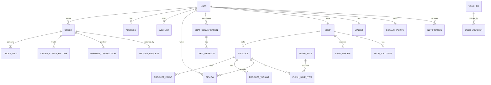
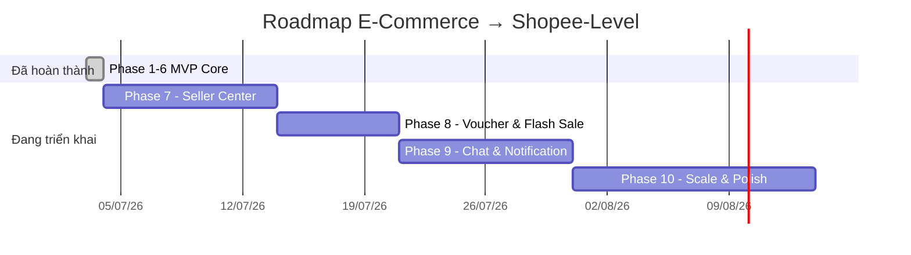

# 🛒 Kế Hoạch Cấu Trúc Website Bán Hàng (Chuẩn Shopee)

> **Cập nhật lần cuối:** 2026-07-04  
> **Trạng thái tổng thể:** 🟡 Core MVP hoàn thành — Đang phát triển tính năng nâng cao  
> **Tech Stack:** Spring Boot 4.1 · Java 17 · MySQL · React 19 · JWT · Spring Security

---

## 📋 Mục lục

1. [Phân Tích Hiện Trạng](#1-phân-tích-hiện-trạng)
2. [Kiến Trúc Nghiệp Vụ (Business Domains)](#2-kiến-trúc-nghiệp-vụ-business-domains)
3. [Cấu Trúc Database Mục Tiêu](#3-cấu-trúc-database-mục-tiêu)
4. [Kế Hoạch Triển Khai Tiếp Theo](#4-kế-hoạch-triển-khai-tiếp-theo)
5. [Lộ Trình Dài Hạn](#5-lộ-trình-dài-hạn)
6. [Cấu Trúc Thư Mục Mục Tiêu](#6-cấu-trúc-thư-mục-mục-tiêu)

---

## 1. Phân Tích Hiện Trạng

### ✅ Đã hoàn thành (MVP Core — Phases 1-6)

| Nghiệp vụ | Backend | Frontend | Ghi chú |
|-----------|---------|----------|---------|
| Xác thực & JWT | ✅ | ✅ | Filter, SecurityConfig, phân quyền |
| Sản phẩm & Danh mục | ✅ | ✅ | CRUD, search, filter, pagination |
| Giỏ hàng | ✅ | ✅ | Server-side + LocalStorage merge |
| Đơn hàng | ✅ | ✅ | CRUD, status flow, orderCode |
| Đánh giá sản phẩm | ✅ | ✅ | Chỉ mua mới review được |
| Tài khoản người dùng | ✅ | ✅ | Profile, avatar, change password |
| Admin Dashboard | ✅ | ✅ | Stats, products, orders, users |
| Thanh toán giả lập | ✅ | ✅ | MoMo, VNPay simulation |
| Upload ảnh | ✅ | ✅ | Local storage `/uploads/` |

### ❌ Còn thiếu để đạt chuẩn Shopee chuyên nghiệp

| Nghiệp vụ | Mức độ ưu tiên | Mô tả |
|-----------|----------------|-------|
| Seller Center (Gian hàng) | 🔴 Cao | Người bán quản lý shop riêng |
| Voucher & Flash Sale | 🔴 Cao | Mã giảm giá, khung giờ vàng |
| Sổ địa chỉ nhiều địa chỉ | 🟡 Trung bình | Quản lý nhiều địa chỉ giao hàng |
| Wishlist / Yêu thích | 🟡 Trung bình | Lưu sản phẩm yêu thích |
| Chat Realtime | 🟡 Trung bình | Buyer ↔ Seller chat trực tiếp |
| Notification System | 🟡 Trung bình | Push, Email, In-app |
| Biến thể sản phẩm (SKU) | 🟡 Trung bình | Màu sắc, size, giá riêng |
| Hoàn hàng / Trả hàng | 🟡 Trung bình | Return & Refund flow |
| So sánh sản phẩm | 🟢 Thấp | Xem cạnh nhau |
| Tích điểm (Loyalty) | 🟢 Thấp | Xu thưởng, hoàn xu |
| Tìm kiếm nâng cao | 🟢 Thấp | Elasticsearch, autocomplete |
| CI/CD & Docker | 🟢 Thấp | DevOps pipeline |

---

## 2. Kiến Trúc Nghiệp Vụ (Business Domains)

Hệ thống được tổ chức theo **Modular Monolith** — mỗi module có package riêng biệt, dễ tách thành Microservice sau này.

```
ecommerce-api/src/main/java/com/ecommerce/
├── module/
│   ├── auth/          ← 1. Identity & Access
│   ├── user/          ← 2. User Management
│   ├── product/       ← 3. Product Catalog
│   ├── seller/        ← 4. Seller Center      [MỚI - Phase 7]
│   ├── cart/          ← 5. Cart
│   ├── order/         ← 6. Order & Shipping
│   ├── payment/       ← 7. Payment
│   ├── promotion/     ← 8. Voucher & Flash Sale [MỚI - Phase 8]
│   ├── review/        ← 9. Review & Rating
│   ├── notification/  ← 10. Notification        [MỚI - Phase 9]
│   ├── chat/          ← 11. Realtime Chat        [MỚI - Phase 9]
│   └── admin/         ← 12. Admin Management
└── shared/            ← DTOs, Exceptions, Utils dùng chung
```

---

### Module 1 — Identity & Access Management (IAM)
> Xác thực và phân quyền người dùng

**Hiện tại:** JWT tạo/validate ✅, filter ✅, phân quyền `ADMIN/CUSTOMER` ✅

**Cần bổ sung:**
- `SELLER` role mới (ngoài `ADMIN`, `CUSTOMER`)
- Refresh Token (lưu DB, rotate sau mỗi lần dùng)
- Đăng nhập bằng Google OAuth2
- Rate limiting đăng nhập (chống brute force)
- Remember me (token dài hạn)

**API mới cần thêm:**
```
POST /api/auth/refresh-token    — Làm mới access token
POST /api/auth/google           — Đăng nhập Google
POST /api/auth/logout           — Invalidate refresh token
```

---

### Module 2 — User Management
> Quản lý hồ sơ và sổ địa chỉ người dùng

**Hiện tại:** Profile, avatar, change password ✅ (địa chỉ là TEXT đơn giản)

**Cần bổ sung:**
- Entity `Address` riêng biệt (nhiều địa chỉ/user)
- Entity `Wishlist` (danh sách yêu thích)
- Lịch sử tìm kiếm cá nhân
- Điểm thành viên (loyalty points)

**Database bổ sung:**
```sql
TABLE addresses (
  id, user_id FK, full_name, phone,
  street, ward, district, city, province,
  is_default, created_at
)

TABLE wishlists (
  id, user_id FK, product_id FK, created_at
)
```

**API mới cần thêm:**
```
GET    /api/users/addresses              — Danh sách địa chỉ
POST   /api/users/addresses              — Thêm địa chỉ mới
PUT    /api/users/addresses/{id}         — Sửa địa chỉ
DELETE /api/users/addresses/{id}         — Xóa địa chỉ
PUT    /api/users/addresses/{id}/default — Đặt làm mặc định
GET    /api/users/wishlist               — Danh sách yêu thích
POST   /api/users/wishlist/{productId}   — Thêm yêu thích
DELETE /api/users/wishlist/{productId}   — Bỏ yêu thích
```

---

### Module 3 — Product Catalog
> Quản lý sản phẩm, danh mục, biến thể

**Hiện tại:** CRUD, search, filter, image upload, review ✅

**Cần bổ sung:**
- `ProductVariant` — biến thể sản phẩm (size M/L/XL, màu đỏ/xanh)
- `ProductAttribute` — thuộc tính động (JSON)
- `ProductTag` — tag sản phẩm để tìm kiếm
- Video sản phẩm (URL YouTube/upload)
- Lượt xem sản phẩm (`viewCount`)
- Sản phẩm bán chạy, sản phẩm mới, sản phẩm nổi bật

**Database bổ sung:**
```sql
TABLE product_variants (
  id, product_id FK,
  sku UK, name, price, sale_price,
  stock_quantity, image_url,
  attributes JSON    -- {"color":"red","size":"M"}
)

TABLE product_tags (
  id, product_id FK, tag
)
```

**API mới cần thêm:**
```
GET  /api/products/{id}/variants   — Danh sách biến thể
POST /api/products/{id}/variants   — Thêm biến thể (Seller/Admin)
GET  /api/products/top-selling     — Sản phẩm bán chạy
GET  /api/products/new-arrivals    — Sản phẩm mới nhất
GET  /api/products/featured        — Sản phẩm nổi bật
```

---

### Module 4 — Seller Center ⭐ [NGHIỆP VỤ MỚI — Phase 7]
> Dành riêng cho người bán quản lý gian hàng

**Hiện tại:** Chưa có — người bán không phân biệt với CUSTOMER

**Database cần tạo:**
```sql
TABLE shops (
  id, user_id FK UK, name, slug UK,
  description, logo_url, banner_url,
  rating, review_count,
  is_verified, is_active,
  join_date, follower_count
)

TABLE shop_followers (
  id, user_id FK, shop_id FK, created_at
)
```

**API cần tạo:**
```
POST   /api/seller/register             — Đăng ký trở thành người bán
GET    /api/seller/shop                 — Thông tin gian hàng của tôi
PUT    /api/seller/shop                 — Cập nhật gian hàng
GET    /api/seller/products             — Sản phẩm của tôi (phân trang)
POST   /api/seller/products             — Đăng sản phẩm mới
PUT    /api/seller/products/{id}        — Sửa sản phẩm
DELETE /api/seller/products/{id}        — Xóa sản phẩm
GET    /api/seller/orders               — Đơn hàng nhận được
PUT    /api/seller/orders/{id}/confirm  — Xác nhận đơn
PUT    /api/seller/orders/{id}/ship     — Đánh dấu đang giao
GET    /api/seller/analytics            — Thống kê doanh thu & đơn hàng
GET    /api/seller/analytics/products   — Sản phẩm bán chạy của shop

GET    /api/shops/{slug}                — Trang gian hàng public
GET    /api/shops/{slug}/products       — Sản phẩm của shop
POST   /api/shops/{id}/follow           — Theo dõi shop
DELETE /api/shops/{id}/follow           — Bỏ theo dõi
```

---

### Module 5 — Cart (Giỏ hàng)
> Giỏ hàng đa shop

**Hiện tại:** CartItem liên kết với user + product ✅

**Cần bổ sung:**
- Nhóm giỏ hàng theo shop (`groupByShop`)
- Phí ship tính riêng cho từng shop
- Chọn biến thể sản phẩm khi thêm vào giỏ
- Kiểm tra tồn kho realtime khi checkout

---

### Module 6 — Order & Shipping
> Vòng đời đơn hàng từ đặt đến nhận

**Hiện tại:** Order, OrderItem, status flow (PENDING→SHIPPING→DELIVERED) ✅

**Cần bổ sung:**
- Tách đơn theo shop (1 checkout → nhiều sub-order)
- Tracking timeline (lịch sử trạng thái vận đơn)
- Đánh giá giao hàng sau khi nhận
- Yêu cầu hoàn hàng / trả hàng (Return & Refund)
- Tích hợp API vận chuyển thực tế (GHN/GHTK)

**Database bổ sung:**
```sql
TABLE order_status_history (
  id, order_id FK, status, note,
  updated_by, created_at
)

TABLE return_requests (
  id, order_id FK, user_id FK,
  reason, status, images JSON,
  created_at, resolved_at
)
```

**API mới cần thêm:**
```
GET  /api/orders/{id}/timeline        — Lịch sử trạng thái đơn
POST /api/orders/{id}/return          — Yêu cầu hoàn hàng
PUT  /api/orders/{id}/confirm-receipt — Xác nhận đã nhận hàng
```

---

### Module 7 — Payment (Thanh toán)
> Tích hợp cổng thanh toán thực tế

**Hiện tại:** Giả lập MoMo & VNPay ✅

**Cần bổ sung:**
- VNPay tích hợp thực tế (sandbox → production)
- MoMo tích hợp thực tế (sandbox)
- Ví nội bộ (Internal Wallet)
- Lịch sử giao dịch thanh toán
- Hoàn tiền tự động khi hủy đơn

**Database bổ sung:**
```sql
TABLE payment_transactions (
  id, order_id FK, user_id FK,
  method, amount, status,
  gateway_transaction_id,
  gateway_response JSON, created_at
)

TABLE wallets (
  id, user_id FK UK, balance, currency
)
```

---

### Module 8 — Promotion & Marketing ⭐ [NGHIỆP VỤ MỚI — Phase 8]
> Voucher, Flash Sale, Tích điểm

**Hiện tại:** Chưa có — không có bất kỳ hệ thống khuyến mãi nào

**Database cần tạo:**
```sql
TABLE vouchers (
  id, code UK, type,              -- PERCENT | FIXED | SHIPPING
  value, min_order_value,
  max_discount_value,
  usage_limit, used_count,
  scope,                           -- PLATFORM | SHOP
  shop_id FK nullable,
  start_date, end_date, is_active
)

TABLE user_vouchers (
  id, user_id FK, voucher_id FK,
  used_at, order_id FK nullable
)

TABLE flash_sales (
  id, name, start_time, end_time, is_active
)

TABLE flash_sale_items (
  id, flash_sale_id FK, product_id FK,
  sale_price, sale_quantity, sold_count
)

TABLE loyalty_points (
  id, user_id FK UK, points, total_earned, total_spent
)
```

**API cần tạo:**
```
POST /api/checkout/apply-voucher    — Kiểm tra & áp dụng voucher
GET  /api/vouchers/mine             — Voucher của tôi
GET  /api/flash-sales/active        — Flash sale đang chạy
GET  /api/flash-sales/{id}/products — Sản phẩm trong flash sale

GET  /api/admin/vouchers            — Quản lý voucher (Admin)
POST /api/admin/vouchers            — Tạo voucher
POST /api/admin/flash-sales         — Tạo flash sale
POST /api/admin/flash-sales/{id}/items — Thêm sản phẩm vào flash sale
```

---

### Module 9 — Review & Rating (nâng cao)
> Đánh giá sản phẩm và shop

**Hiện tại:** Review sản phẩm (rating + comment) ✅

**Cần bổ sung:**
- Upload ảnh/video kèm review
- Phản hồi của người bán (Seller reply)
- Đánh giá có ích (Helpful vote)
- Đánh giá shop (sau mỗi đơn hàng)

**Database bổ sung:**
```sql
TABLE review_media (
  id, review_id FK, url, type   -- IMAGE | VIDEO
)

TABLE review_replies (
  id, review_id FK, seller_id FK,
  content, created_at
)

TABLE shop_reviews (
  id, order_id FK UK, user_id FK, shop_id FK,
  rating, comment, created_at
)
```

---

### Module 10 — Notification System ⭐ [NGHIỆP VỤ MỚI — Phase 9]
> Thông báo đa kênh realtime

**Hiện tại:** Chưa có

**Kênh thông báo:**
- **In-App:** Thông báo trong ứng dụng (WebSocket/SSE)
- **Email:** Xác nhận đơn hàng, cập nhật trạng thái (Spring Mail)
- **Push:** (tương lai cho mobile app)

**Trigger thông báo:**
- Đặt hàng thành công → User + Seller
- Đơn hàng đang giao / đã giao → User
- Đơn hàng mới → Seller nhận thông báo ngay
- Flash Sale sắp bắt đầu → User đã đăng ký
- Voucher sắp hết hạn → User nhắc nhở

**Database cần tạo:**
```sql
TABLE notifications (
  id, user_id FK, type,
  title, body, image_url,
  action_url, is_read, created_at
)

TABLE notification_settings (
  id, user_id FK UK,
  order_updates BOOL, promotions BOOL,
  chat_messages BOOL, email_enabled BOOL
)
```

**API cần tạo:**
```
GET    /api/notifications           — Danh sách thông báo (phân trang)
PUT    /api/notifications/read-all  — Đánh dấu tất cả đã đọc
PUT    /api/notifications/{id}/read — Đánh dấu đã đọc
DELETE /api/notifications/{id}      — Xóa thông báo
GET    /api/notifications/settings  — Cài đặt thông báo
PUT    /api/notifications/settings  — Cập nhật cài đặt
```

---

### Module 11 — Realtime Chat ⭐ [NGHIỆP VỤ MỚI — Phase 9]
> Chat trực tiếp giữa Buyer và Seller

**Hiện tại:** Chưa có

**Công nghệ:** Spring WebSocket (STOMP) + SockJS

**Database cần tạo:**
```sql
TABLE chat_conversations (
  id, buyer_id FK, seller_id FK, shop_id FK,
  last_message, last_message_at,
  buyer_unread_count, seller_unread_count,
  created_at
)

TABLE chat_messages (
  id, conversation_id FK, sender_id FK,
  content, type,   -- TEXT | IMAGE | ORDER_CARD
  is_read, created_at
)
```

**WebSocket endpoints:**
```
SUBSCRIBE /topic/chat/{conversationId}  — Nhận tin nhắn mới
SEND      /app/chat/send               — Gửi tin nhắn
SEND      /app/chat/read               — Đánh dấu đã đọc
```

**REST API:**
```
GET  /api/chat/conversations            — Danh sách hội thoại
POST /api/chat/conversations/{sellerId} — Tạo hội thoại mới
GET  /api/chat/conversations/{id}/messages — Lịch sử tin nhắn
```

---

### Module 12 — Admin Management (nâng cao)
> Quản trị toàn hệ thống

**Hiện tại:** Dashboard stats, User/Product/Order management ✅

**Cần bổ sung:**
- Phê duyệt đơn đăng ký người bán (Shop approval)
- Quản lý Voucher & Flash Sale
- Quản lý Review (ẩn/xóa review vi phạm)
- Báo cáo nâng cao (doanh thu theo shop, theo danh mục)
- Quản lý Hoàn hàng (Return Requests)
- Log hoạt động hệ thống (Audit Log)

**API bổ sung:**
```
GET  /api/admin/shops                  — Danh sách shop
PUT  /api/admin/shops/{id}/approve     — Phê duyệt shop
PUT  /api/admin/shops/{id}/suspend     — Tạm khóa shop
GET  /api/admin/return-requests        — Quản lý hoàn hàng
PUT  /api/admin/return-requests/{id}   — Xử lý yêu cầu hoàn hàng
GET  /api/admin/reports/revenue        — Báo cáo doanh thu nâng cao
GET  /api/admin/reports/top-shops      — Shop bán chạy nhất
GET  /api/admin/audit-logs             — Log hoạt động
```

---

## 3. Cấu Trúc Database Mục Tiêu



---

## 4. Kế Hoạch Triển Khai Tiếp Theo

> **Lưu ý:** Phases 1–6 trong `doc.md` đã hoàn thành. Đây là các phase tiếp theo.

---

### Phase 7: 🏪 Seller Center — Gian Hàng Người Bán
> **Ưu tiên:** 🔴 Cao nhất | **Ước lượng:** 7–10 ngày

#### Backend
- [x] Thêm `SELLER` vào `UserRole` enum
- [x] Tạo entity `Shop` với đầy đủ fields (name, slug, logo, banner, is_verified)
- [x] `ShopRepository`, `ShopService`, `SellerController`, `ShopController`
- [x] Endpoint đăng ký trở thành Seller (user → seller + tạo shop)
- [x] CRUD sản phẩm riêng của Seller (kiểm tra shop ownership)
- [x] Quản lý đơn hàng phía Seller (xác nhận, đánh dấu giao hàng)
- [x] API thống kê doanh thu của shop (doanh thu, đơn hàng, sản phẩm bán chạy)
- [x] Endpoint public trang shop (`/api/shops/{slug}`)
- [x] Admin phê duyệt shop mới (`PUT /api/admin/shops/{id}/approve`)

#### Frontend
- [x] Route `/seller/*` với `SellerLayout` (sidebar riêng biệt)
- [x] Trang `/seller/dashboard` — Tổng quan shop (thống kê, đơn mới)
- [x] Trang `/seller/products` — Quản lý sản phẩm (CRUD với upload ảnh)
- [x] Trang `/seller/orders` — Đơn hàng nhận được + cập nhật trạng thái
- [x] Trang `/seller/analytics` — Biểu đồ doanh thu, top sản phẩm
- [x] Trang `/shop/:slug` — Trang gian hàng public (banner, logo, sản phẩm, đánh giá)
- [x] Nút "Theo dõi Shop" trên trang gian hàng
- [x] Nút "Liên hệ người bán" (mở chat từ trang chi tiết sản phẩm)

---

### Phase 8: 🎫 Promotion & Flash Sale — Khuyến Mãi
> **Ưu tiên:** 🔴 Cao | **Ước lượng:** 5–7 ngày

#### Backend
- [x] Entity `Voucher`, `UserVoucher` với đầy đủ loại (PERCENT, FIXED, SHIPPING)
- [x] Entity `FlashSale`, `FlashSaleItem`
- [x] `VoucherService` — validate, apply voucher khi checkout
- [x] `FlashSaleService` — kiểm tra thời gian, giới hạn số lượng (dùng Redis lock nếu có)
- [x] Tích hợp voucher vào `OrderService.createOrder()` → trừ tiền tự động
- [x] API lấy voucher có thể dùng cho đơn hàng hiện tại
- [x] Scheduled task tự động bật/tắt Flash Sale (`@Scheduled`)
- [x] Admin CRUD voucher và flash sale

#### Frontend
- [x] Banner Flash Sale nổi bật + countdown timer trên trang Home
- [x] Trang `/flash-sale` — Danh sách sản phẩm flash sale + đếm ngược
- [x] Modal chọn & áp dụng voucher trong Checkout (hiển thị voucher khả dụng)
- [x] Trang `/vouchers` — Kho voucher của tôi (thu thập, trạng thái)
- [x] Admin UI: Quản lý Voucher & Flash Sale trong `/admin`
- [x] Hiển thị tag "FLASH SALE" / "% OFF" trên card sản phẩm

---

### Phase 9: 🔔 Notification & Chat Realtime
> **Ưu tiên:** 🟡 Trung bình | **Ước lượng:** 7–10 ngày

#### Backend — Notification
- [x] Entity `Notification`, `NotificationSettings`
- [x] `NotificationService` — tạo & lưu thông báo
- [x] Trigger thông báo trong: `OrderService`, `PaymentService`, `FlashSaleService`
- [x] Server-Sent Events (SSE) endpoint để push realtime đến browser
- [x] Email notification dùng Spring Mail (JavaMailSender) — xác nhận đơn hàng

#### Backend — Chat
- [x] Cấu hình Spring WebSocket + STOMP
- [x] Entity `ChatConversation`, `ChatMessage`
- [x] `ChatController` xử lý WebSocket message (gửi, nhận, đánh dấu đọc)
- [x] REST API quản lý hội thoại (danh sách, lịch sử tin nhắn)
- [x] Upload ảnh trong chat (tái sử dụng `/api/upload`)

#### Frontend
- [x] Icon chuông 🔔 trên Navbar với badge đếm chưa đọc (realtime SSE)
- [x] Dropdown thông báo realtime (top 5 gần nhất)
- [x] Trang `/notifications` — Tất cả thông báo + phân trang
- [x] Icon chat 💬 nổi (floating) khi ở trang sản phẩm → liên hệ seller
- [x] Trang `/messages` — Danh sách hội thoại
- [x] Giao diện chat realtime (bubble messages, timestamp, trạng thái đã đọc)
- [x] Seller thấy thông báo chat mới trong dashboard

---

### Phase 10: 🚀 Nâng Cấp Chất Lượng & Scale
> **Ưu tiên:** 🟢 Dài hạn | **Ước lượng:** 10–14 ngày

#### Sổ địa chỉ (Address Book)
- [x] Entity `Address` riêng biệt (thay TEXT hiện tại trong User)
- [x] API CRUD địa chỉ + đặt mặc định
- [x] Checkout tự điền địa chỉ mặc định từ sổ địa chỉ
- [x] Gợi ý địa chỉ từ danh sách đã lưu khi checkout

#### Wishlist (Yêu thích)
- [x] Entity `Wishlist` (user + product)
- [x] Nút ❤️ trên card sản phẩm (toggle)
- [x] Trang `/wishlist` — Danh sách yêu thích
- [x] Gợi ý mua khi sản phẩm trong wishlist có Flash Sale

#### Biến Thể Sản Phẩm (Variants/SKU)
- [x] Entity `ProductVariant` (sku, màu, size, giá riêng, tồn kho riêng)
- [x] UI chọn variant trên trang chi tiết sản phẩm
- [x] Giỏ hàng lưu cả `variantId`
- [x] Kiểm soát tồn kho theo variant khi đặt hàng

#### Hoàn Hàng & Trả Hàng (Return & Refund)
- [ ] Entity `ReturnRequest` (reason, images, status)
- [ ] API tạo yêu cầu hoàn hàng (sau khi đơn DELIVERED)
- [ ] Seller xử lý yêu cầu hoàn hàng
- [ ] Admin duyệt hoàn tiền

#### Tìm Kiếm Nâng Cao
- [ ] Tích hợp MySQL Full-Text Index (tạm thời) hoặc Elasticsearch
- [ ] Autocomplete gợi ý tìm kiếm khi gõ
- [ ] Lịch sử tìm kiếm gần đây của user
- [ ] Trang kết quả tìm kiếm với faceted filter nâng cao

#### Tích Hợp Vận Chuyển Thực Tế
- [ ] Tích hợp GHN API (Giao Hàng Nhanh) — tính phí ship theo địa chỉ
- [ ] Tạo vận đơn tự động khi Seller xác nhận đơn
- [ ] Tracking realtime từ đơn vị vận chuyển trong trang OrderDetail

#### DevOps & Bảo Mật
- [ ] Dockerize Backend (Spring Boot) + Frontend (React)
- [ ] `docker-compose.yml` (app + mysql + redis)
- [ ] Redis cache: session, flash sale counter, cart, danh mục
- [ ] CI/CD với GitHub Actions (test → build → deploy)
- [ ] Refresh Token rotation (bảo mật JWT tốt hơn)
- [ ] API Rate Limiting toàn hệ thống (Spring Boot + Bucket4j)
- [ ] HTTPS / SSL (Let's Encrypt)

---

## 5. Lộ Trình Dài Hạn



### Tracking Tiến Trình

| Phase | Nội dung | Backend | Frontend | Trạng thái |
|-------|----------|---------|----------|------------|
| Phase 1–6 | MVP Core | ✅ | ✅ | ✅ Hoàn thành |
| **Phase 7** | **Seller Center & Gian hàng** | ✅ | ✅ | ✅ Hoàn thành |
| **Phase 8** | **Voucher & Flash Sale** | ✅ | ✅ | ✅ Hoàn thành |
| **Phase 9** | **Chat & Notification Realtime** | ✅ | ✅ | ✅ Hoàn thành |
| **Phase 10** | **Scale, Address, Variant, DevOps** | 🔵 | 🔵 | 🔵 Đang làm |

### Quy ước trạng thái
- ⬜ Chưa bắt đầu
- 🔵 Đang làm
- 🟡 Đang review/test
- ✅ Hoàn thành
- ❌ Blocked

---

## 6. Cấu Trúc Thư Mục Mục Tiêu

### Backend — Modular Structure
```
src/main/java/com/ecommerce/
├── module/
│   ├── auth/
│   │   ├── controller/AuthController.java
│   │   ├── service/AuthService.java
│   │   ├── dto/LoginRequest.java, RegisterRequest.java ...
│   │   └── filter/JwtAuthFilter.java
│   ├── user/
│   │   ├── controller/UserController.java, AddressController.java
│   │   ├── service/UserService.java, AddressService.java, WishlistService.java
│   │   ├── model/User.java, Address.java, Wishlist.java
│   │   └── repository/UserRepository.java, AddressRepository.java
│   ├── product/
│   │   ├── controller/ProductController.java
│   │   ├── service/ProductService.java
│   │   ├── model/Product.java, ProductImage.java, ProductVariant.java
│   │   └── repository/...
│   ├── seller/                    ← MỚI (Phase 7)
│   │   ├── controller/SellerController.java, ShopController.java
│   │   ├── service/SellerService.java, ShopService.java
│   │   ├── model/Shop.java, ShopFollower.java
│   │   └── repository/ShopRepository.java
│   ├── cart/
│   │   └── ...
│   ├── order/
│   │   ├── model/Order.java, OrderItem.java, ReturnRequest.java
│   │   └── ...
│   ├── payment/
│   │   ├── model/PaymentTransaction.java, Wallet.java
│   │   └── ...
│   ├── promotion/                 ← MỚI (Phase 8)
│   │   ├── controller/VoucherController.java, FlashSaleController.java
│   │   ├── service/VoucherService.java, FlashSaleService.java
│   │   ├── model/Voucher.java, FlashSale.java, FlashSaleItem.java
│   │   └── repository/...
│   ├── review/
│   │   └── ...
│   ├── notification/              ← MỚI (Phase 9)
│   │   ├── service/NotificationService.java, EmailService.java
│   │   ├── model/Notification.java
│   │   └── ...
│   ├── chat/                      ← MỚI (Phase 9)
│   │   ├── controller/ChatController.java (WebSocket + REST)
│   │   ├── model/ChatConversation.java, ChatMessage.java
│   │   └── ...
│   └── admin/
│       └── ...
└── shared/
    ├── dto/ApiResponse.java, PageResponse.java
    ├── exception/GlobalExceptionHandler.java
    ├── security/JwtProvider.java, SecurityConfig.java
    └── util/SlugUtil.java, DateUtil.java
```

### Frontend — Feature-based Structure
```
ecommerce-frontend/src/
├── components/
│   ├── ui/          ← Button, Input, Modal, Badge, Spinner, Toast
│   ├── layout/      ← MainLayout, AuthLayout, AdminLayout, SellerLayout
│   └── common/      ← ProductCard, Pagination, StarRating, Countdown
├── pages/
│   ├── home/        ← Home.jsx (Banner FlashSale, Danh mục nổi bật)
│   ├── product/     ← ProductList.jsx, ProductDetail.jsx
│   ├── cart/        ← Cart.jsx
│   ├── checkout/    ← Checkout.jsx, OrderSuccess.jsx
│   ├── order/       ← Orders.jsx, OrderDetail.jsx
│   ├── auth/        ← Login.jsx, Register.jsx
│   ├── user/        ← Profile.jsx, Addresses.jsx, Wishlist.jsx
│   ├── seller/      ← Dashboard, Products, Orders, Analytics  [MỚI]
│   ├── shop/        ← ShopPage.jsx (trang gian hàng public)   [MỚI]
│   ├── promotion/   ← FlashSale.jsx, Vouchers.jsx             [MỚI]
│   ├── notification/← Notifications.jsx                       [MỚI]
│   ├── chat/        ← Messages.jsx, ChatWindow.jsx            [MỚI]
│   └── admin/       ← AdminDashboard + sub-pages
├── services/        ← API service files theo từng module
├── context/         ← AuthContext, CartContext, NotificationContext
└── hooks/           ← useAuth, useCart, useNotification, useWebSocket
```

---

> **Ghi chú kỹ thuật:**  
> - Plan được xây dựng dựa trên **hiện trạng thực tế** (Phases 1–6 đã hoàn thành trong `doc.md`)  
> - Mỗi Phase mới đều kế thừa và mở rộng từ code hiện có, **không phá vỡ cấu trúc cũ**  
> - Ưu tiên **Phase 7 (Seller Center)** và **Phase 8 (Voucher & Flash Sale)** trước vì đây là nghiệp vụ cốt lõi Shopee còn thiếu hoàn toàn  
> - Tham khảo chi tiết tiến trình hoàn thành các Phase 1–6 trong file `doc.md`

---

## 7. Kế Hoạch Triển Khai Chi Tiết Các Phần Còn Lại (Phase 10)

### 🔖 Task 1: Wishlist — Gợi Ý Flash Sale (0.5 ngày)
* **Backend:**
  - Thêm endpoint `GET /api/wishlist/flash-sale-suggestions` tìm sản phẩm trong wishlist đang chạy Flash Sale.
* **Frontend:**
  - Hiển thị banner/badge "🔥 Đang Flash Sale!" trên trang `/wishlist`.

### 🔖 Task 2: Hoàn Hàng & Trả Hàng — Return & Refund (2–3 ngày)
* **Backend:**
  - `ReturnStatus` enum (`PENDING`, `APPROVED`, `REJECTED`, `REFUNDED`, `CLOSED`).
  - Entity `ReturnRequest` (lý do, hình ảnh minh chứng, trạng thái, order_id).
  - APIs cho Buyer (`POST /api/orders/{id}/return`), Seller (`PUT /api/seller/returns/{id}/respond`), Admin (`PUT /api/admin/returns/{id}/resolve`).
* **Frontend:**
  - Nút "Yêu cầu hoàn hàng" trên trang chi tiết đơn hàng.
  - Trang `/returns` quản lý danh sách yêu cầu hoàn hàng.
  - Tích hợp giao diện xử lý của Seller và Admin.

### 🔖 Task 3: Tìm Kiếm Nâng Cao (2–3 ngày)
* **Backend:**
  - MySQL Full-Text Search hoặc Specification-based advanced filters.
  - Entity `SearchHistory` lưu lịch sử tìm kiếm gần đây.
  - Endpoint gợi ý autocomplete.
* **Frontend:**
  - Dropdown Autocomplete và lịch sử tìm kiếm trên thanh Navbar.
  - Trang `/search` với bộ lọc nâng cao (khoảng giá, danh mục, xếp hạng).

### 🔖 Task 4: Tích Hợp Vận Chuyển Thực Tế (2–3 ngày)
* **Backend & Frontend:**
  - Tích hợp tính phí giao hàng động dựa trên địa chỉ (GHN API giả lập hoặc sandbox).
  - Trạng thái vận chuyển chi tiết dạng stepper timeline tại trang chi tiết đơn hàng.

### 🔖 Task 5: DevOps & Bảo Mật (3–4 ngày)
* **Docker:** Multi-stage `Dockerfile` cho Backend, Frontend, và file `docker-compose.yml`.
* **CI/CD:** GitHub Actions test, build, push Docker images.
* **Bảo mật:** Entity `RefreshToken` & rotation logic; API Rate Limiting (Bucket4j).
